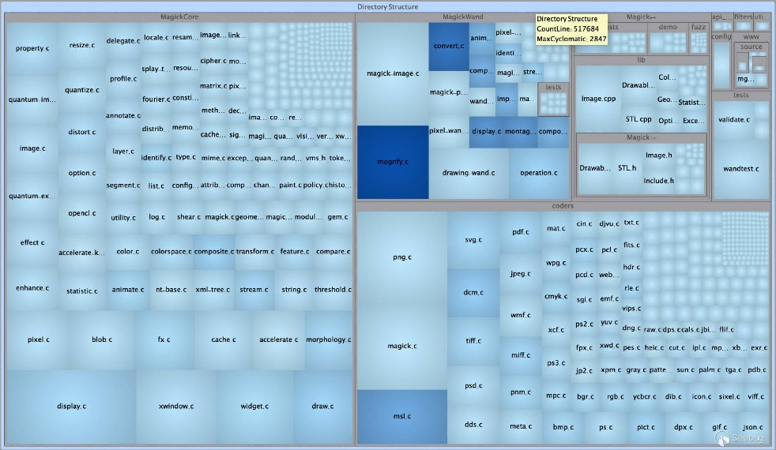

项目规模 Understand
某些程序规模很大，会被分为好几个模块，为了提高Fuzz效率，在Fuzzing前，需要定义Fuzzing部分。这里推荐一下源码阅读工具Understand，它treemap功能，可以直观地看到项目结构和规模。比如下面ImageMagick的源码中，灰框代表一个文件夹，蓝色方块代表了一个文件，其大小和颜色分别反映了行数和文件复杂度。

*来自 \<<https://paper.seebug.org/841/>\>*

