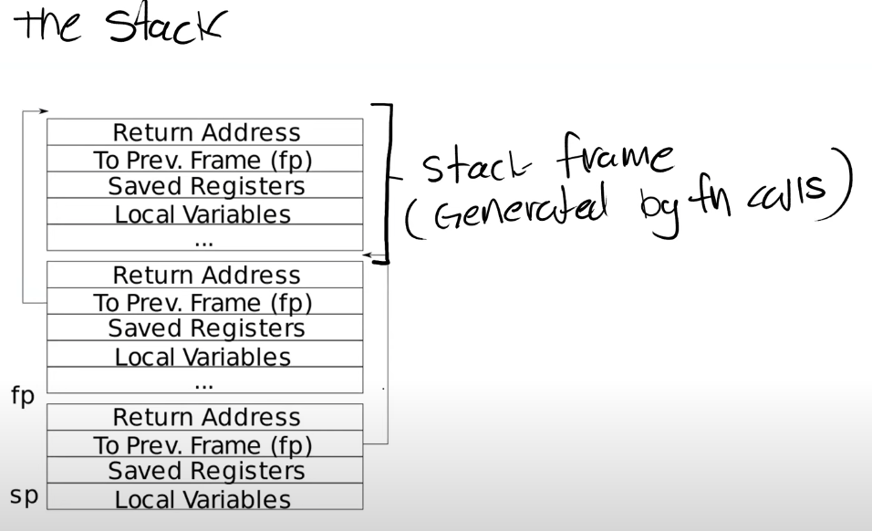
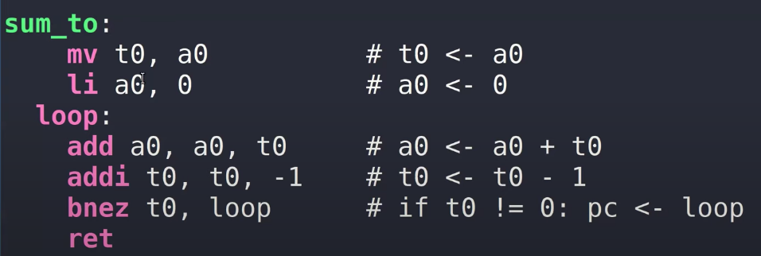
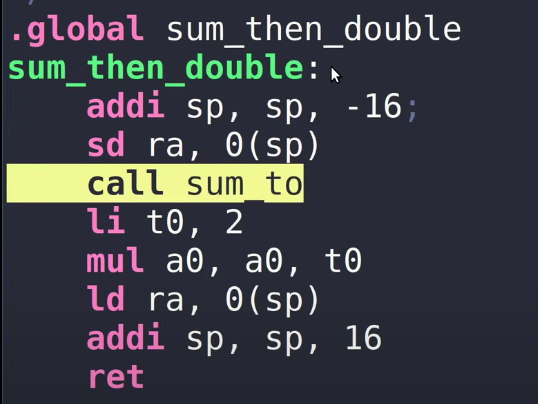

[(45条消息) RISC-V 指令格式和6种基本整数指令_耐心的小黑的博客-CSDN博客_riscv sd指令](https://blog.csdn.net/qq_39507748/article/details/120150936)
# 汇编
## 寄存器
## 数据类型
## 指令编码
## 指令
### 运算指令
### 内存交互指令
### 内存交互顺序
### 程序流控制指令
### 系统指令
## 栈帧

叶子函数

## 非叶子

## 例子
int g(int x) {

0:1141 addisp,sp,-16

2:e422 sds0,8(sp)

4:0800 addis0,sp,16

return x+3;

}

6:250d addiwa0,a0,3

8:6422 lds0,8(sp)

a:0141 addisp,sp,16

c:8082 ret

000000000000000e \<f\>:

int f(int x) {

e:1141 addisp,sp,-16

10:e422 sds0,8(sp)

12:0800 addis0,sp,16

return g(x);

}

14:250d addiwa0,a0,3

16:6422 lds0,8(sp)

18:0141 addisp,sp,16

1a:8082 ret

000000000000001c \<main\>:

void main(void) {

1c:1141 addisp,sp,-16

1e:e406 sdra,8(sp)

20:e022 sds0,0(sp)

22:0800 addis0,sp,16

printf("%d %d\n", f(8)+1, 13);

24:4635 lia2,13

26:45b1 lia1,12

28:00000517 auipca0,0x0

2c:7a850513 addia0,a0,1960 \# 7d0 \<malloc+0xea\>

30:00000097 auipcra,0x0 \#ra=0x30

34:5f8080e7 jalr1528(ra) \# 628 \<printf\>

\# jmp to ra+1528

\# ra=pc+4=0x38

exit(0);

38:4501 lia0,0

3a:00000097 auipcra,0x0

3e:276080e7 jalr630(ra) \# 2b0 \<exit\>

## 异常和中断
[RISC-V异常与中断机制概述 \| SunnyChen的小窝](http://www.sunnychen.top/2019/07/06/RISC-V%E5%BC%82%E5%B8%B8%E4%B8%8E%E4%B8%AD%E6%96%AD%E6%9C%BA%E5%88%B6%E6%A6%82%E8%BF%B0/)
