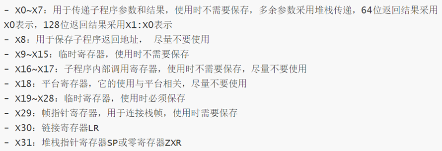
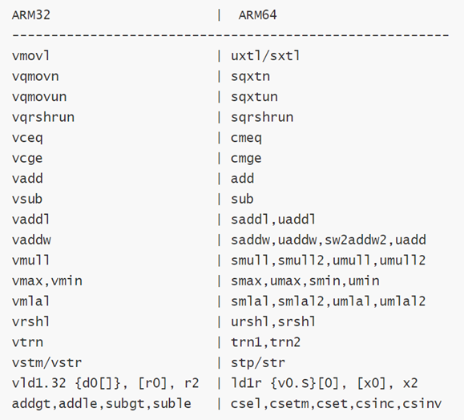

# 汇编（待看）
AArch64架构并不是ARM-32架构的简单扩展，他是在ARMv8引入的一种全新架构。
## 寄存器
AArch拥有31个通用寄存器，系统运行在64位状态下的时候名字叫Xn，运行在32位的时候就叫Wn。
| **寄存器** | **别名** | **意义**                                                                |
|------------|----------|-------------------------------------------------------------------------|
| SP         | –        | Stack Pointer:栈指针                                                    |
| R30        | LR       | Link Register:在调用函数时候，保存下一条要执行指令的地址。              |
| R29        | FP       | Frame Pointer:保存函数栈的基地址。                                      |
| R19-R28    | –        | Callee-saved registers（含义见上面术语解释）                            |
| R18        | –        | 平台寄存器，有特定平台解释其用法。                                      |
| R17        | IP1      | The second intra-procedure-call temporary register……                    |
| R16        | IP0      | The first intra-procedure-call temporary register……                     |
| R9-R15     | –        | 临时寄存器                                                              |
| R8         | –        | 在一些情况下，返回值是通过R8返回的                                      |
| R0-R7      | –        | 在函数调用过程中传递参数和返回值                                        |
| NZCV       | –        | 状态寄存器：N（Negative）负数 Z(Zero) 零 C(Carry) 进位 V(Overflow) 溢出 |

子程序调用时必须要保存的寄存器：X19\~X29和SP(X31)

不需要保存的寄存器：X0\~X7,X9\~X15
## 指令
ARM指令在32位下和在64位下并不是完全一致的，但大部分指令是通用的，特别的，” mov r2, r1, lsl \#2”仅在ARM32下支持，它等同于ARM64的” lslr2, r1, \#2”

还有一些32位存在的指令在64位下是不存在的，比如vswp指令，条件执行指令subgt,addle等

在分析AArch64架构程序时，会发现我们找不到ARM中常见的STMFD/LDMFD命令，取而代之的是STP/LDP命令。

在ARM-v8指令集中，程序支持以下五种寻址方式：
1.  Base register only (no offset) ：基址寄存器无偏移。形如:\[ base { , \#0 } \]。
2.  Base plus offset：基址寄存器加偏移。形如:\[ base { , \#imm } \]。
3.  Pre-indexed：事先更新寻址，先变化后操作。形如:\[ base , \#imm \]!。⚠️：!符号表示则当数据传送完毕之后，将最后的地址写入基址寄存器，否则基址寄存器的内容不改变。
4.  Post-indexed：事后更新寻址，先操作后变化。形如:\[ base \] , \#imm。
5.  Literal (PC-relative): PC相对寻址。

*来自 \<<https://www.anquanke.com/post/id/199112>\>*
## 栈帧
引用： <https://blog.csdn.net/seaaseesa/article/details/105281585>

栈布局上和 amd 有比较大区别，这样一个程序：

void fun(){

char buf\[0x20\];

}

int main(){

fun();

return 0;

}

从 main 进入 fun 时，栈分布如下：
| 内存地址 | 内存中的数据 | 备注                         | 所有者 |
|----------|--------------|------------------------------|--------|
| 低       | X29 value    | main 调用 fun 时的寄存器值   | fun    |
|         | X30 value    | 同上                         | fun    |
|         | buf          | fun 的局部变量               | fun    |
|         | X29 value    | 上层函数调用main时的寄存器值 | main   |
| 高       | X30 value    | 同上                         | main   |
**x86 架构下的 rbp、rip 保存在栈低，aarch64 架构下保存在栈顶。**

**如果存在栈溢出，修改的上层函数的 rbp 和 rip（x29、x30）。**

*来自 \<<https://wiki.mrskye.cn/Pwn/arm/arm/#_8>\>*
