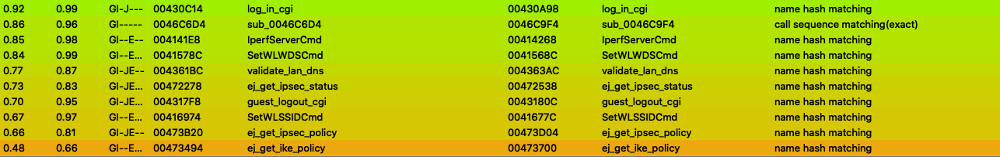
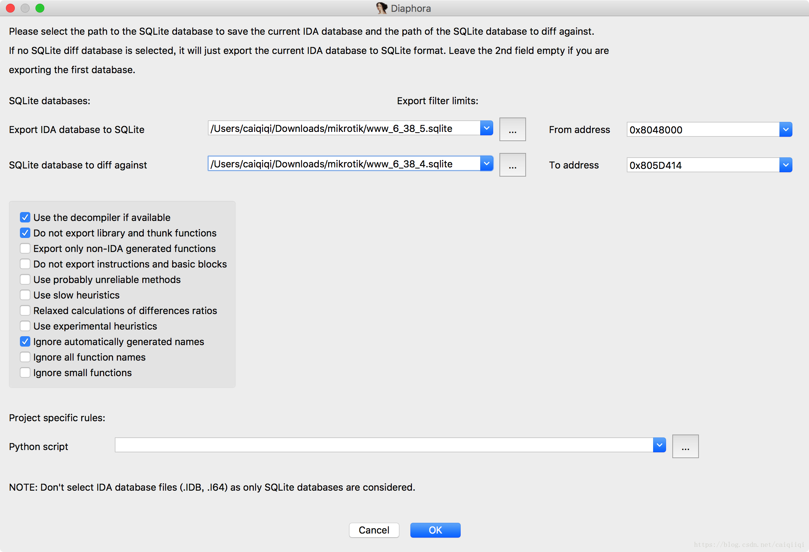
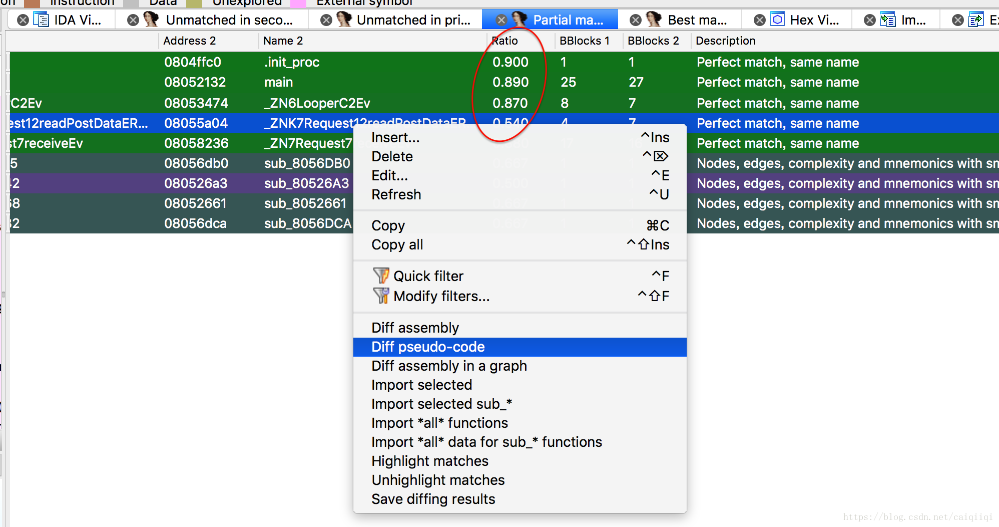

可以用ghidra或者IDA高版本反汇编MIPS目标程序，不过真实固件程序分析起来还是很复杂的，除了从main函数硬看还有很多取巧一点的经验办法：
1.  看符号，程序日志log，等有含义的字符串信息
2.  和已经修复漏洞的固件进行对比
3.  找和已知漏洞类似的模式，因为同一款产品很有可能犯同一种错误

*来自 \<<https://xuanxuanblingbling.github.io/iot/2020/10/26/rv110w/>\>*
## 
## bindiff
这个工具是可以集成在IDA或ghidra中的插件，不过单独有自己的界面，介绍：[ida又一神器插件复活了bindiff](https://blog.csdn.net/fjh658/article/details/77646526)
- 下载： <https://www.zynamics.com/software.html>
- 文档： <https://www.zynamics.com/bindiff/manual/index.html>
这个工具在安装过程中需要指明IDA的目录，安装完之后就可以在IDA工具栏的File菜单看到这个工具。由于对比肯定是需要两个文件，先要用IDA分析一个程序并保存成idb，然后再用IDA开另一个程序，然后使用这个插件进行对比。然后即可在Matched Functions界面看到如下，越往下是越不匹配的函数，越可疑：

因为是目标是前台getshell，所以目标guest_logout_cgi很可疑，右键点击这个函数，使用View flow graphs功能打开bindiff本体，进入图形化的函数对比界面：
- 绿色：相同的基本块
- 黄色：修改的基本块
- 红色：删掉的基本块
- 灰色：新加的基本块

*来自 \<<https://xuanxuanblingbling.github.io/iot/2020/10/26/rv110w/>\>*
## diaphora
另外固件对比也可以使用 <https://github.com/joxeankoret/diaphora/>， 缺点是速度太慢，优点是找到差异函数后可以直接对比c的伪码，效果和bindiff差别不大。入门参考：[二进制文件比较工具bindiff/diaphora初体验](https://blog.csdn.net/caiqiiqi/article/details/80890226)

分别打开两个二进制文件，然后载入脚本diaphora.py（File-\> Script file然后选中即可）。

然后载入脚本进行比较

得到各种匹配度的界面（函数hash值完全匹配，函数名完全匹配，函数部分匹配等）

然后找到某个部分匹配且匹配度较低的函数

再看另外一个只有函数名（其实是代码片段名sub\_）不一样（因为地址不一样），但是内容是一样的。不管是伪代码还是汇编代码。

## karta 用不了
