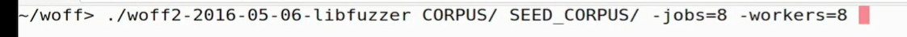
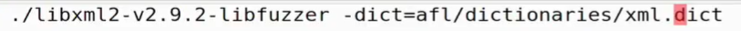
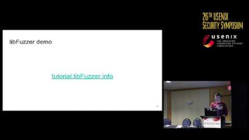

文章汇总：
[Fuzzing技术总结（Brief Surveys on Fuzz Testing） - 知乎 (zhihu.com)](https://zhuanlan.zhihu.com/p/43432370)

[Introduction · GitBook (scubsrgroup.github.io)](https://scubsrgroup.github.io/BinaryDatabase/)

入门文章：
[The Human Machine Interface (h0mbre.github.io)](https://h0mbre.github.io/)

[从零开始学习fuzzing-安全客 - 安全资讯平台 (anquanke.com)](https://www.anquanke.com/post/id/202982)

ASan（地址消毒）分析崩溃类型：为了使用ASan，我按照[这个教程](https://fuzzing-project.org/tutorial2.html)，使用cc -fsanitize=address -ggdb -o exifsan sample_main.c exif.c重新编译了exif。

[Fuzzingbook学习指南 Lv1-安全客 - 安全资讯平台 (anquanke.com)](https://www.anquanke.com/post/id/238224)

[USENIX Security '17 - OSS-Fuzz - Google's continuous fuzzing service for open source software](https://www.youtube.com/watch?v=n6kP-CWO_0Q)

libfuzzer

[tutorial.libfuzzer.info](http://tutorial.libfuzzer.info) 教程

字典

教程
[模糊之书 (fuzzingbook.org)](https://www.fuzzingbook.org/)

[模糊项目 - 背景 (fuzzing-project.org)](https://fuzzing-project.org/)

[1. 软件测试导论 — SWEN90006 软件与安全测试](https://swen90006.github.io/notes/Introduction-to-Testing.html)

[Fuzz Week Day 1: An Intro](https://www.youtube.com/watch?v=2xXt_q3Fex8&list=PLSkhUfcCXvqH2sgJa8_gnB41_hO485Lsl&index=10)

[Gamozo Labs Blog \| I blog about random things security, everything is broken, nothing scales, shared memory models are flawed.](https://gamozolabs.github.io/)

