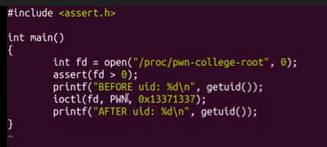

# exp
## 驱动模块

## 编译
\# 静态编译 exp

gcc exp.c -static -o rootfs/exp
## 

远程设置了120s关机，glibc 编译出来的可执行文件会比较大没法传完，这里笔者选择使用 musl

musl-gcc exp.c -o exp -static -masm=intel

*来自 \<<https://www.anquanke.com/post/id/260055#h2-1>\>*

# pwntools
## base64传输程序并运行
from pwn import \*

import base64

\# context.log_level = "debug"

\# <https://www.anquanke.com/post/id/260055#h2-1>

\#读取exp文件，并base64加密

with open("./exp", "rb") as f:

exp = base64.b64encode(f.read())

\# p = remote("39.107.137.85", 35071)

p = process("./start.sh")

try_count = 0

chunkaddr = 0

while True:

p.sendline()

p.recvuntil("/ \$")

\# echo传输程序并保存

count = 0

for i in range(0, len(exp), 0x200):

p.sendline("echo -n \\"" + exp\[i:i + 0x200\].decode() + "\\" \>\> /tmp/b64_exp")

count += 1

log.info("count: " + str(count))

for i in range(count):

p.recvuntil("/ \$")

\# 解密并运行

p.sendline("cat /tmp/b64_exp \| base64 -d \> /tmp/exploit")

p.sendline("chmod +x /tmp/exploit")

p.sendline("/tmp/exploit "+str(chunkaddr+0x10\*try_count))

try_count=try_count+0x1000

break

p.interactive()

