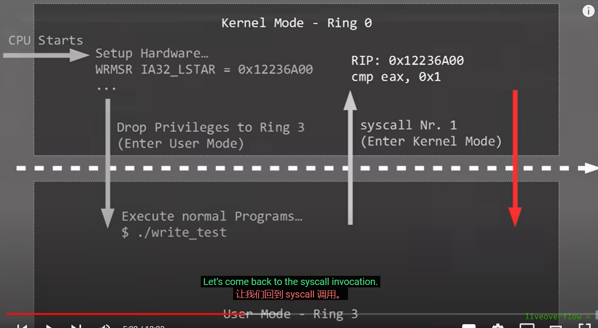
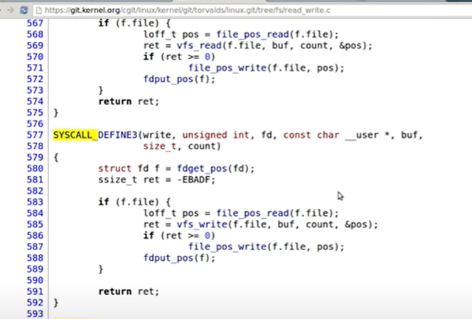
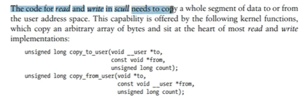
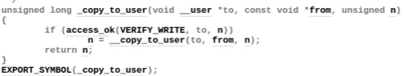
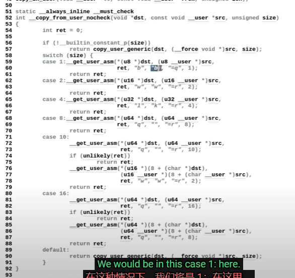
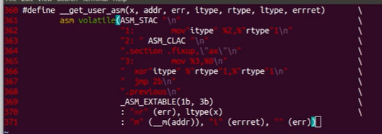
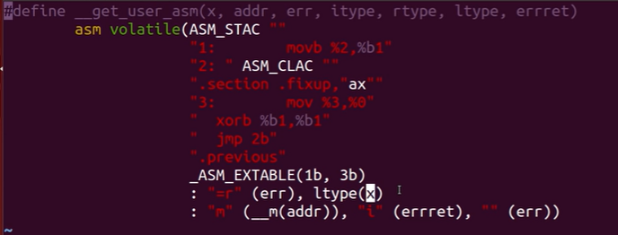

strace追钟syscall
radare2 -d ./file \#调试

## SYSCALL—Fast System Call
[Intel® 64 and IA-32 Architectures Software Developer's Manual (jaist.ac.jp)](http://www.jaist.ac.jp/iscenter-new/mpc/altix/altixdata/opt/intel/vtune/doc/IA_32_Instructions_2B.pdf) p362

SYSCALL saves the RIP of the instruction following SYSCALL to RCX and loads a new RIP from the IA32_LSTAR (64-bit mode).
从IA32_LSTAR （一种MSR模型特定寄存器）加载RIP

## WRMSR ——写入MSR寄存器
在booting时使用该指令，需要权限ring0

## syscall调用过程（write为例）
cpu启动时设置好IA32_LSTAR；进入用户态；用户调用write；返回地址放入rcx中

syscall里比较系统调用号eax，跳转到write函数

read和write会用到下面两个函数，将任意内存拷贝到用户空间

copy_to_user的代码

switch不同的size选择不同的方法

美化一下

1：把addr mov到 x ，%2指第2个参数(\_\_m(addr))

ASM_STAC和ASM_CLAC设置和清理ac寄存器

section fixup 和extable 是硬件异常处理（搜搜exception tables的文档

这里不会将虚拟地址转成物理地址啥的，

而是1执行时会发生访问虚拟地址的中断错误，然后MMU执行剩下的东西
