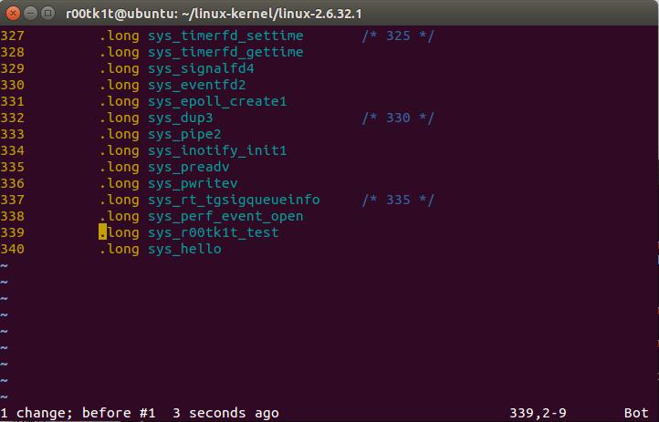
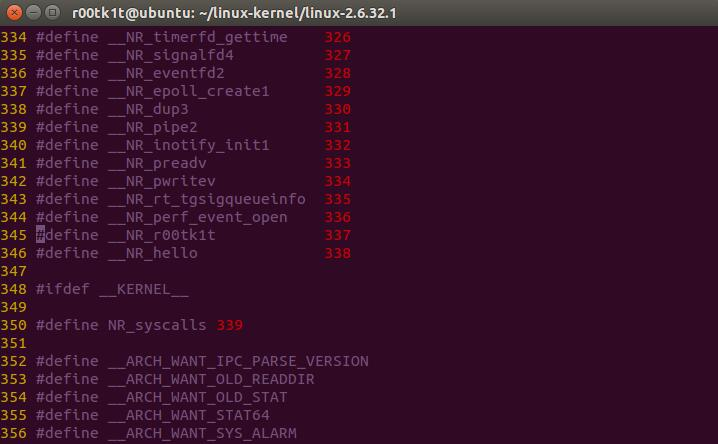
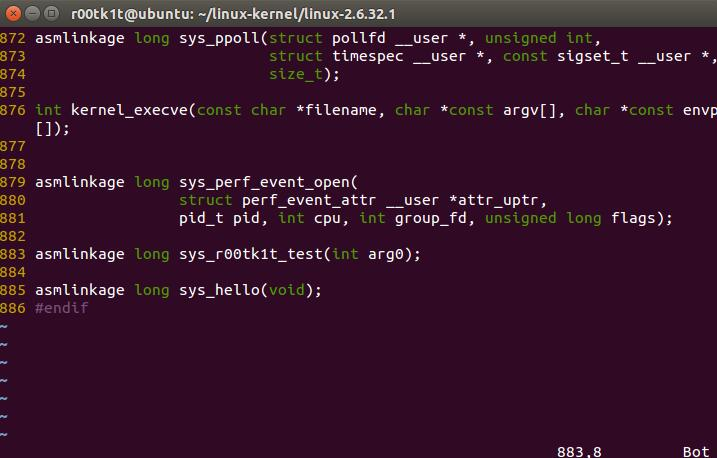
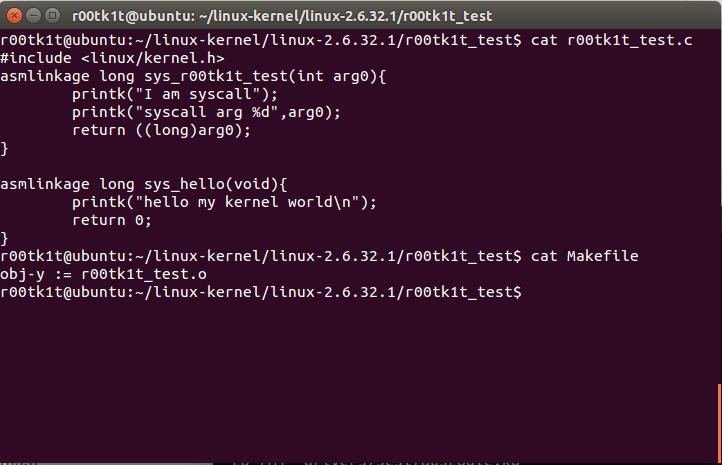
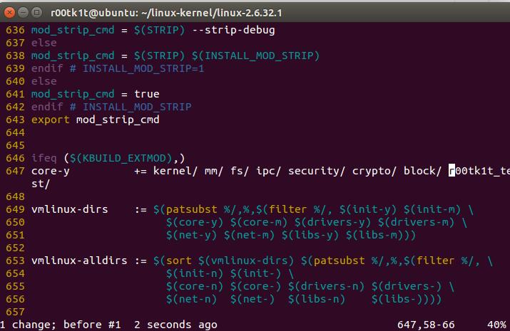

[Linux Syscall Reference (paolostivanin.com)](https://syscalls64.paolostivanin.com/)
[Chromium OS Docs - Linux System Call Table (googlesource.com)](https://chromium.googlesource.com/chromiumos/docs/+/master/constants/syscalls.md#x86-32_bit)

[Linux syscall过程分析（万字长文） - 腾讯云开发者社区-腾讯云 (tencent.com)](https://cloud.tencent.com/developer/article/1492374)
[系统调用 - Dive Into Linux (gitbook.io)](https://tianyuch.gitbook.io/dive-into-linux/system-call)

## syscall实现全过程

## 增加自定义syscall
[(55条消息) linux系统调用追踪及调试_LuckY_chh的博客-CSDN博客_调试linux系统调用](https://blog.csdn.net/m0_37797953/article/details/107769953)

对于linux内核来说，添加系统调用有3个位置需要处理：
1.  arch/x86/kernel/syscall_table_32.S 在系统调用表中添加序号索引

增加两个新的系统调用，序号顺延。
2.  arch/x86/include/asm/unistd_32.h 在unistd的32位库中添加系统调用序列号的宏

定义新系统调用宏，其值为在syscall_table.S中的索引号。注意要相应递增下面的NR_syscalls宏。
3.  include/linux/syscalls.h 在syscalls.h中给出系统调用的声明

声明这两个新的系统调用。
4.  定义自己的系统调用，修改主Makefile，在linux根目录下增加r00tk1t_test目录，建r00tk1t_test.c文件以及Makefile：

重新Make内核。

*来自 \<<https://cloudker.github.io/bin-security/2017/05/30/Linux-kernel-beginners-syscall>\>*
## 调用syscall
[(55条消息) linux系统调用追踪及调试_LuckY_chh的博客-CSDN博客_调试linux系统调用](https://blog.csdn.net/m0_37797953/article/details/107769953)
