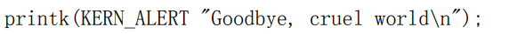

# 头文件
| \#include \<linux/sched.h\> | 最重要的头文件中的一个. 这个文件包含很多驱动使用的内核 API 的定义, 包括睡 眠函数和许多变量声明 |
|-----------------------------|------------------------------------------------------------------------------------------------|
# 
# 注意事项
内核堆栈很小！没有虚拟内存，可能只有4096字节，不要申请大变量

\_\_开头的函数一般很底层？，小心使用
# printk

# 缺乏浮点的支持？

# \_fentry\_\_
# copy_from_user copy_to_user
# 读写文件 filp
# 内存分配
## kmalloc

