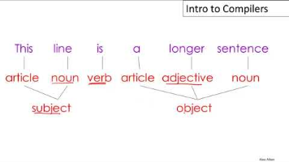

[1 Introduction](https://www.youtube.com/watch?v=9p_s457RSQE&list=PLTsf9UeqkRebOYdw4uqSN0ugRShSmHrzH)

- 课程网站： <http://web.stanford.edu/class/cs143/>

环境搭建

[课程 \| Compilers \| edX](https://learning.edx.org/course/course-v1:StanfordOnline+SOE.YCSCS1+2T2020/home)

[CS143：编译原理 \| 环境搭建HelloWorld - 知乎 (zhihu.com)](https://zhuanlan.zhihu.com/p/226190284)

- 课程视频： <https://www.bilibili.com/video/BV17K4y147Bz>
- 课程教材：龙书
- 课程作业：5 个书面作业 + 5 个编程作业带你实现一个编译器

*来自 \<<https://csdiy.wiki/%E7%BC%96%E8%AF%91%E5%8E%9F%E7%90%86/CS143/>\>*

