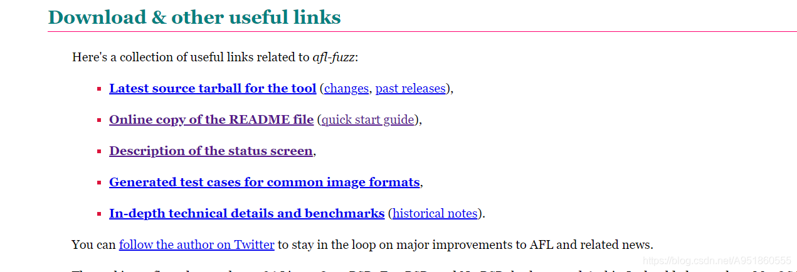
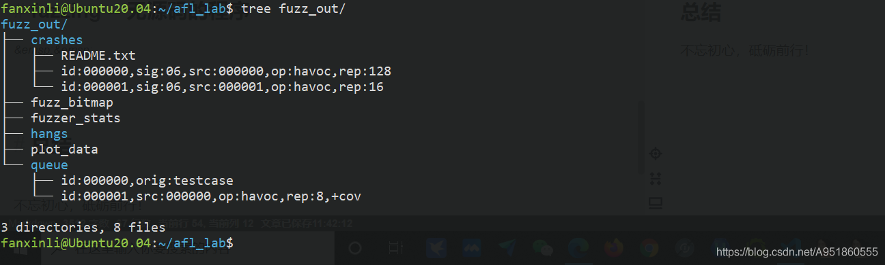

# 参考
[(45条消息) 模糊测试_hollk的博客-CSDN博客](https://blog.csdn.net/qq_41202237/category_11470526.html)
# AFL安装
## 源码
[american fuzzy lop (coredump.cx)](https://lcamtuf.coredump.cx/afl/)

  安装的话从上面的官方链接点进去，如下截图所示，点击最新源代码打包工具的链接即可获得最新的源代码安装包。下载并解压成功后，进入到该文件夹中，使用make命令进行安装，如果安装过程中出现问题，可以查阅docs/INSTALL获得一些提示，看看是否有帮助，要不就百度一下。

## 软件源
同时，我再ubuntu软件源中搜索了一下，其中已经包含了AFL的二进制deb包了（其实debian软件源中也有），所以直接apt install afl才是真正方便的方法。

除了afl包外，ubuntu仓库中还收录了afl-clang以及afl-cov包，后两者相对与前者只是一个补充，提供了更多的命令。

*来自 \<<https://i-m.dev/posts/20191001-225746.html>\>*
## AFL++
<https://mundi-xu.github.io/2021/03/12/AFL++%E5%AD%A6%E4%B9%A0%E6%97%A5%E5%BF%97%EF%BC%88%E4%B8%80%EF%BC%89%E5%BC%80%E5%A7%8BFuzz%E4%B8%8Ecrashes%E5%88%86%E6%9E%90/#AFL-%E7%9A%84%E5%AE%89%E8%A3%85>
# 
# 语料库
## 来源
## 修剪 
## 格式
命令行输入，直接输入文本即可，文件夹可有多个文件

echo "aaaaaaaaaaaaa" \> fuzz_in/example

# 构建测试程序
# fuzzing
AFL运行界面介绍
*来自 \<<https://blog.csdn.net/A951860555/article/details/119666269>\>*

AFL执行阶段介绍
*来自 \<<https://blog.csdn.net/A951860555/article/details/119666269>\>*

## 命令
/afl-fuzz -i fuzzin_dir -o fuzzout_dir /path/to/program

-i 指明测试用例的目录

-o 指明测试结果的存放目录。

对于直接从终端获取输入的程序来说，我们需要在fuzzin_dir目录下新建一个文件，文件的内容就是程序的输入，文件命名不唯一

对于以文件作为输入的程序，可以使用下面的命令，直接在程序参数位置处使用@@，AFL将会自动将其替换为测试用例中的文件名。

*来自 \<<https://blog.csdn.net/A951860555/article/details/119666269>\>*
## 报错
但是不出意外命令会报错，

echo core \| sudo tee /proc/sys/kernel/core_pattern

echo performance \| sudo tee /sys/devices/system/cpu/cpu\*/cpufreq/scaling_governor

*来自 \<<https://i-m.dev/posts/20191001-225746.html>\>*

# 结果
## 文件树
tree fuzzout_dir

- queue – 存放fuzzer生成的所有不同执行路径的测试用例+我们自己一开始构造的测试用例；
- crashes – 存放造成程序崩溃的测试用例，根据产生的信号不同进行分类；
- hangs – 存放造成程序超时的测试用例;
- 剩下的文件记录了fuzzer工作时的一些信息。

*来自 \<<https://blog.csdn.net/A951860555/article/details/119666269>\>*
## 修剪结果
afl-tmin -i afl_out/crashes/\<crash\> -o test.min ./vuln_afl

*来自 \<<https://ctf.harrisongreen.me/2019/hxpctf/flag_concat/>\>*

# 无源码构建

