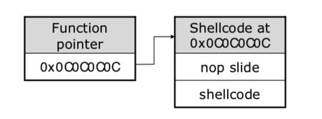
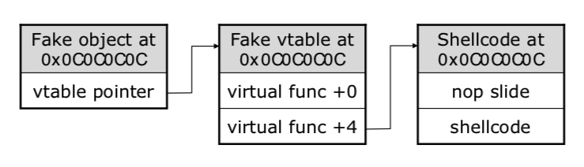

[Heap Spray（堆喷射）简介 \| v1cky'blog (v1ckydxp.github.io)](https://v1ckydxp.github.io/2019/07/22/2019-07-22-%E5%A0%86%E5%96%B7%E5%B0%84&%E5%A0%86%E9%A3%8E%E6%B0%B4/)

# 实现
## slide code
常见的有NOP指令，还有一些类NOP指令，比如0x0c,0x0d等。它们的共同特点都是不会影响shellcode的执行。
## 覆盖函数指针地址
a\. 申请200M内存，以sildecode+shellcode填充。

b\. 覆盖函数指针地址为0x0c0c0c0c

c\. 调用该函数的时候就会跳转到0x0c0c0c0c地址处，最后执行shellocde

## 
## 覆盖虚函数指针
a\. 申请200M内存，以sildecode+shellcode填充。这个时候选择的slidecode不能是0x90。如果用0x90来填充，则虚表里面全是0X90909090，程序会跳转到0X90909090处执行，会导致crash。

b\. 覆盖函数指针地址为0x0c0c0c0c

c\. 调用该函数的时候就会跳转到0x0c0c0c0c地址处，最后执行shellocde 。

