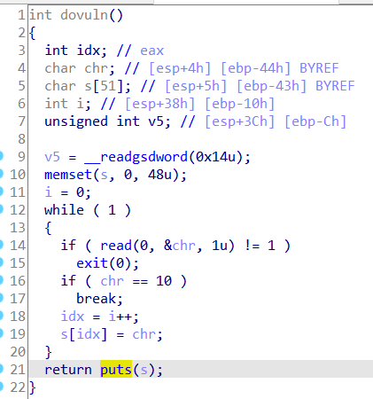

## 栈溢出，改写下标i

这里s溢出会改写i，于是s\[i\]就可跳到return处

[两个栈溢出小题 \| Clang裁缝店 (xuanxuanblingbling.github.io)](https://xuanxuanblingbling.github.io/ctf/pwn/2019/10/18/pwn/)

[writeup (xctf.org.cn)](https://adworld.xctf.org.cn/task/writeup?type=pwn&id=4611&number=2&grade=1&page=1) 这个题会写入notes\[idx\]，但对idx没有限制
