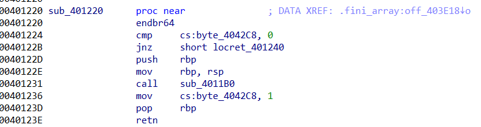
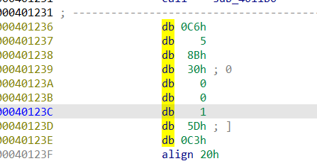
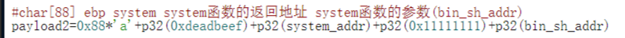
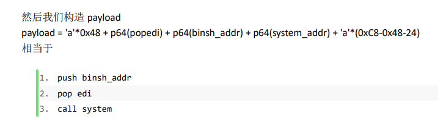
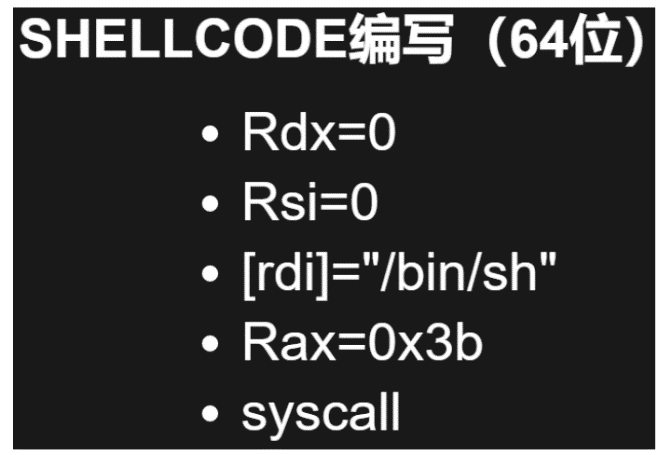
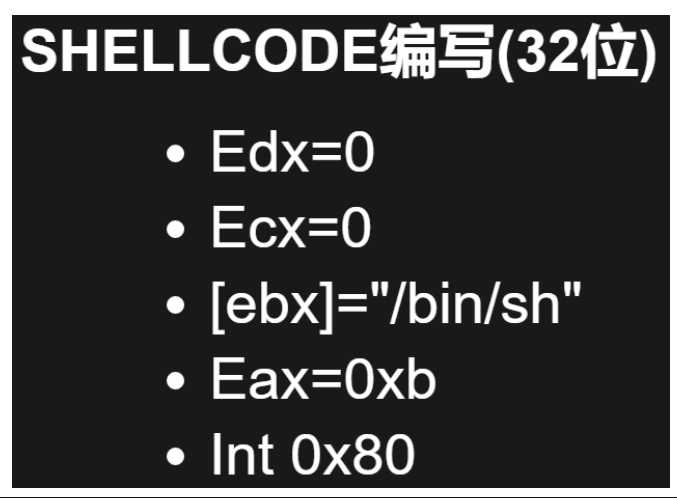

# 寄存器传参顺序
[x86 calling conventions - Wikipedia](https://en.wikipedia.org/wiki/X86_calling_conventions)

rax 放系统调用号

linux参数前6个参数依次放到rdi，rsi，rdx，rcx，r8，r9中；

Windows前四个参数对应rcx, rdx, r8, r9

# 搜索gadget
ROPgadget

ROPgadget --binary 文件名 --only "pop\|ret" \| grep rdi

ROPgadget --binary libc.so.6 --only "pop\|call" \| grep rdi

ropper

ropper --file ./ret2libc --search "% ?di"

--search "pop\|ret"

找到pop %rdi; ret;的地址0x0000004006a3。

交互模式：

file 加载文件

jmp rax

search pop rdi

search mov r?x, rsp;

[(45条消息) ropper简单使用_TTYflag的博客-CSDN博客_ropper使用](https://blog.csdn.net/qq_45595732/article/details/114834116)
# 常用gadget
## \_\_libc_csu_init
## 控制eax（系统调用号）
### 利用返回值rax控制系统调用号rax
### xchg eax, edi （交换寄存器内容）
### mov/add
## 改写内存数据
### add \[rbp-0x3d\], ebx fini_array的函数，编译自带

### 在 mov cs那里uncode，再再40123c处code即可

### mov或者add
ropper -f /lib/x86_64-linux-gnu/libc-2.31.so --search 'mov rdx'

# pwntools编写rop
## ROP
## flat(\[pop_1, arg1, pop_2, arg2, arg3, call_addr\])
# 实例
rax 放系统调用号

linux参数前6个参数依次放到rdi，rsi，rdx，rcx，r8，r9中；

32位 \[call_addr, ret_addr, arg1\]

64位 \[pop_arg1, arg1, call_addr\]

## system("/bin/sh")
32位 \[system_addr, ret_addr, binsh_addr\]

64位 \[popedi, binsh_addr, system_addr\]

## 
[pwn中system调用失败分析 \| skysider's blog](https://blog.skysider.top/2017/04/20/pwn%E4%B8%ADsystem%E8%B0%83%E7%94%A8%E5%A4%B1%E8%B4%A5%E5%88%86%E6%9E%90/)

system函数的调用流程：system -\> do_system-\>execve，execve函数执行时，会有三个参数:
| 1   | \_\_execve (SHELL_PATH, (char \*const \*) new_argv, \_\_environ); |
|-----|-------------------------------------------------------------------|
其中，
<table>
<colgroup>
<col style="width: 22%" />
<col style="width: 77%" />
</colgroup>
<thead>
<tr class="header">
<th>
1

2

3

4

5

6

7

8
</th>
<th>
SHELL_PATH = "/bin/bash";

const char *new_argv[4];

new_argv[0] = SHELL_NAME; // "sh"

new_argv[1] = "-c";

new_argv[2] = line;

new_argv[3] = NULL;

environ="HOME=skysider" // or ""
</th>
</tr>
</thead>
<tbody>
</tbody>
</table>

当environ指向的栈数据被无效数据覆盖时，就会调用失败。因此可以采用gdb动态调试的方法，若发现system函数能够执行到execve函数，可以观察此时execve的几个参数值是否正常，若异常，就可以去寻找对应的原因

## puts_plt(puts_got)
32位

puts_plt, ret_addr, puts_got

64位

pop_edi, puts_got, puts_plt, ret_addr
## execve("/bin/sh",NULL,NULL)
系统调用号：32位：0xb；64位：0x3b
## syscall(64位)

## int80 (32位)

64位系统运行32位程序？？

这里之前有个疑问，我现在是64位的ubuntu下执行32位的程序，execve的系统调用的只在32位下是11号啊？我应该用64位的系统调用号才对啊。而且我执行的原理是因为安装了相应的库，不过系统调用这个功能应该在linux 内核中呀，怎么可能通过安装一个库就达到了两种系统调用号的兼容呢？

后来找到了答案，是因为64位的系统调用正常应该是通过syscall指令执行的，而不是int 0x80指令，但是64位的ubuntu中保留了通过int 0x80进行系统调用的途径，所以可以执行成功。

*来自 \<<https://xuanxuanblingbling.github.io/ctf/pwn/2020/02/01/calc/>\>*

