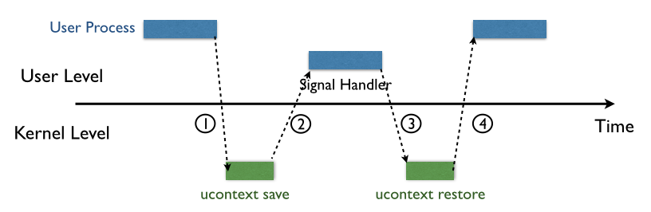
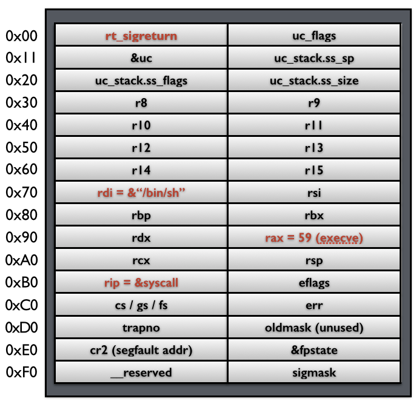
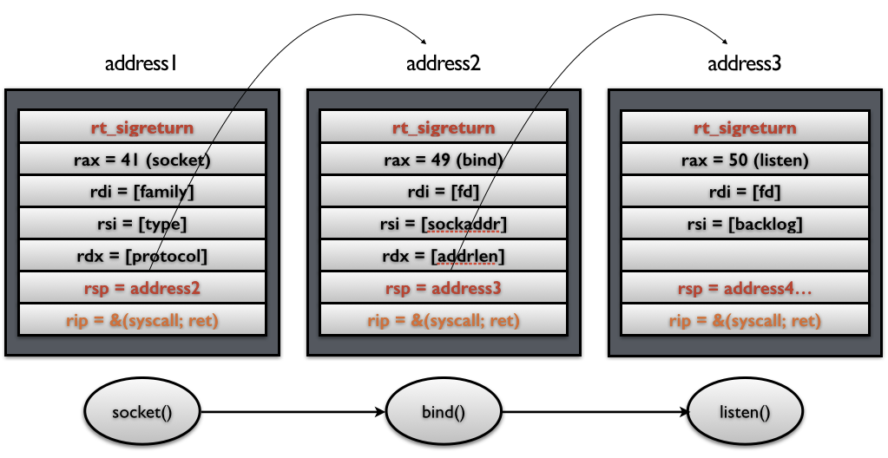

[SROP 小记 « 平凡路上 (ray-cp.github.io)](https://ray-cp.github.io/archivers/srop-analysis)
## 条件
可以通过栈溢出来控制栈的内容

需要知道相应的地址

"/bin/sh"

Signal Frame

syscall

sigreturn

需要有够大的空间来塞下整个 sigal frame
# 原理

图中的软中断会将进程的上下文信息保存到栈中。srop就是篡改这个信息。

可以不用任何gadget实现rop！
## Signal Frame

## ucontext_t结构体定义
## sigcontext结构体（x86）
## sigcontext结构体定义（x64）
# 利用
rt_sigreturn 系统调用号 32位：173（0xad) 64位：15（0xf）
## get_shell
或者rip指向system、rdi指向binsh也行

## rop链（控制栈指针）

# 实现（pwntools）
## srop+mprotect+shellcode：构造srop链，用mprotect函数将栈改为可执行，在栈中写入shellcode并执行
[RCTF2019 pwn syscall_interface writeup (eonew.cn)](http://blog.eonew.cn/2019-05-30.RCTF2019%20pwn%20syscall_interface%20writeup.html)
