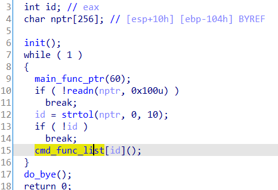
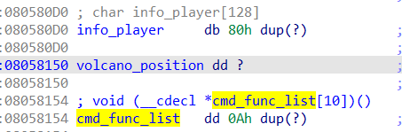
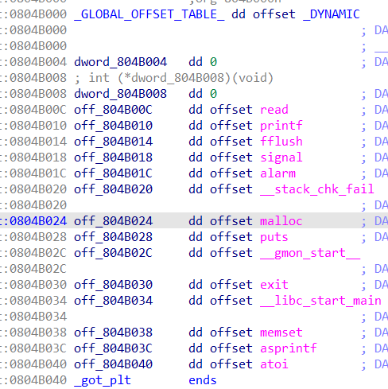
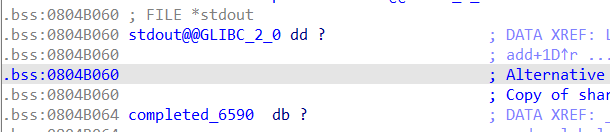
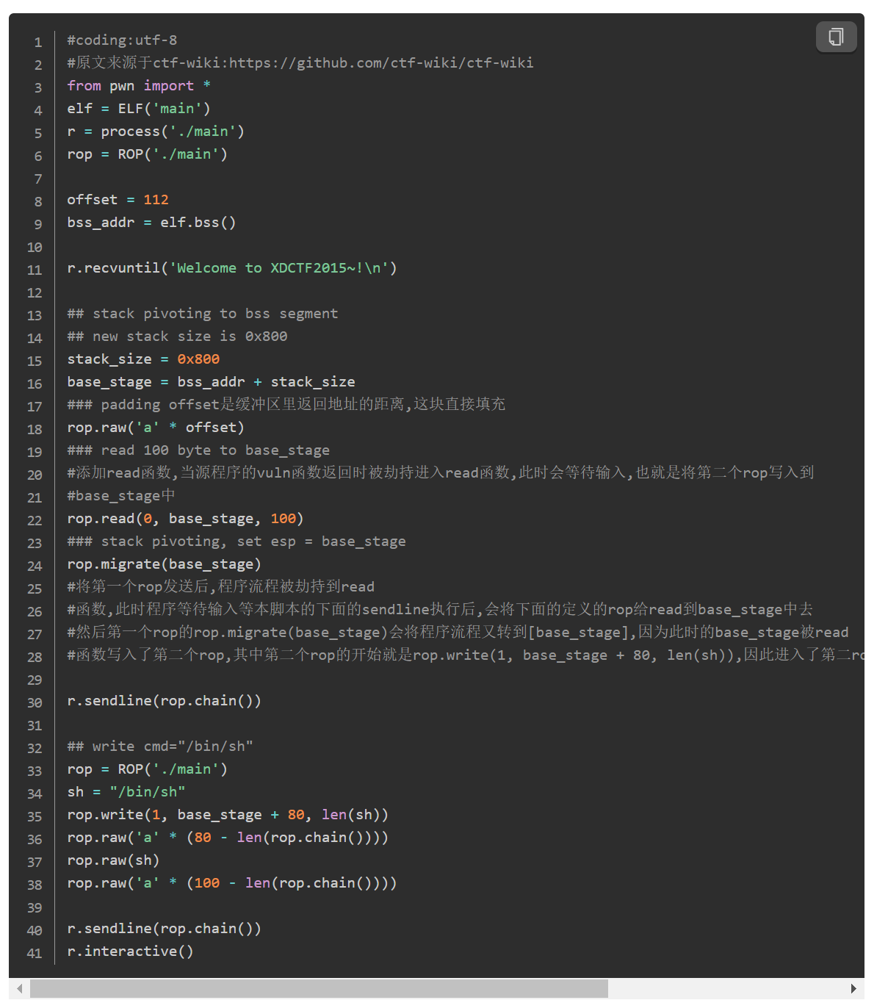

[花式栈溢出技巧 - CTF Wiki (ctf-wiki.org)](https://ctf-wiki.org/pwn/linux/user-mode/stackoverflow/x86/fancy-rop/#stack-pivoting)
# 调整栈空间
## 控制程序跳转到 add esp ; retn ，迁移栈到可控的局部变量
[pwnable.tw之starbound \| blingbling's blog (blingblingxuanxuan.github.io)](https://blingblingxuanxuan.github.io/2021/10/02/starbound/)

一个接收数字id，调用函数 func_list\[id\]的程序，对id没有检查

# 而func_list附近的全局变量info_player，我们可以read改写

# 于是改写info_player，使id = info_player - func_list ,即可控制运行
可是程序：
- 没有后门函数
- 没有system或execve函数
- 没有int 80或syscall指令
- 没有“/bin/sh”字符串
- 没有给libc
如果想调用函数，就需要控制参数，而本程序32位，靠栈传参，又有大量局部变量可控。只需在局部变量中布置栈帧，跳转到 add esp ; retn重新定位栈，即可控制变量和运行。

# payload ='id\x00' + 'aaaa' + ret_addr + arg1 +arg2
# 劫持ebp
## 改写栈中的old_ebp为GOT表上方，popebp后可用局部变量改写got
[和媳妇一起学Pwn 之 applestore \| Clang裁缝店 (xuanxuanblingbling.github.io)](https://xuanxuanblingbling.github.io/ctf/pwn/2020/03/06/applestore/)

程序中有一次有约束的地址写

fd-\>bk=fd\[3\]=bk

bk-\>fd=bk\[2\]=fd

其中fd和bk完全为我们控制。

而且已经泄露完libc、heap、stack基址。

利用方法：

（1）改写函数指针为某个one_gadget。完全不可能，因为这样也会改写函数代码段，引发段错误。

（2）改写ebp、got两个变量的值。

栈帧如下

0xee0: ret, old_ebp2, 不写, 不写, canary, choice(0x16)\[ebp-0x22\],(0x2), num, 传参(0x10) \| 该函数会让用户写入choice，并让num=atoi(choice)

0xea0: ret, old_ebp, 不写, 不写, canary, (没用，prev, next, money, name ^(0xe78), '27'+(0x2) ), prev, next, device, cart, i \| 括号内时我们可操作的fd和bk

got如下

令

fd = old_ebp-0xc

bk = atoi_got+0x22-0x10

于是 old_ebp=atoi_got+0x22-0x10 , atoi_got+0x22-0x10+0x8=old_ebp-0xc

当用户输入choice时，输入'/bin/sh\x00'+8\*'/x00' +system,

atoi(choice)时即可system(/bin/sh)

为啥要多写8\*'/x00'，因为改写bk-\>fd也就是后面的bss段后，运行printf会报错，所以要抬高位置

# 栈迁移（劫持esp）（劫持ebp后再 mov rsp，rbp 或 leave（=mov rsp，rbp；pop rbp）改写rsp）（用于执行ROP）
## 3x17
[和媳妇一起学Pwn 之 3x17 \| Clang裁缝店 (xuanxuanblingbling.github.io)](https://xuanxuanblingbling.github.io/ctf/pwn/2019/09/06/317/)
## rop.migrate
rop.migrate(2)

print rop.dump()

0x0000: 'aaaa' 'aaaaaaaaaa'

0x0004: 'aaaa'

0x0008: 'aaaa'

0x000c: 0x80483a0 read(1, 2, 3)

0x0010: 0x8048376 \<adjust @0x20\> add esp, 8; pop ebx; ret

0x0014: 0x1 arg0

0x0018: 0x2 arg1

0x001c: 0x3 arg2

0x0020: 0x80483a0 read(1, 2, 3)

0x0024: 0x8048376 \<adjust @0x34\> add esp, 8; pop ebx; ret

0x0028: 0x1 arg0

0x002c: 0x2 arg1

0x0030: 0x3 arg2

0x0034: 0x804861b pop ebp; ret

0x0038: -0x2

0x003c: 0x8048458 leave; ret
#### 

