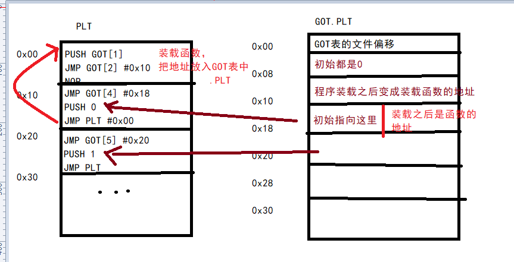
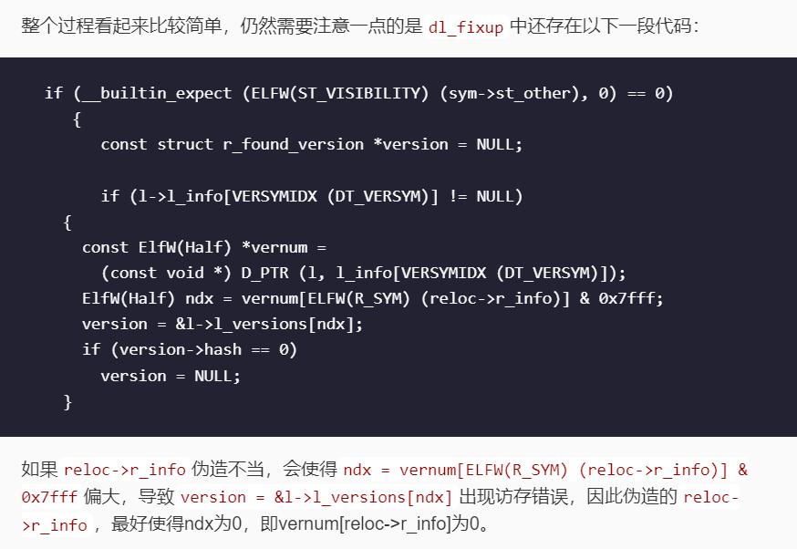

[ret2dl_resolve解析 « 平凡路上 (ray-cp.github.io)](https://ray-cp.github.io/archivers/ret2dl_resolve_analysis)
## 条件
当完全泄露不了libc地址，且内存中有大量位置可以写入时
- 没开 PIE
- NO RELRO 或者 PARTIAL RELRO
# 原理
[动态链接+延迟绑定全解析](onenote:知识.one#动态链接+延迟绑定全解析&section-id={D3F076F7-022D-4217-B6C5-C4C1FF682253}&page-id={D366B268-E282-4B4A-8501-80B256731D55}&end&base-path=https://d.docs.live.net/8d1582069e7b0b95/文档/pwn)

复习一下：

## call plt\[\] -\> jmp got\[\] -\> push 函数序号; jmp plt -\> push got\[1\]; jmp got\[2\]
## got\[2\]是_dl_runtime_resolve，调用了_dl_fixup(eax = got\[1\], edx = 函数序号)
## \_dl_fixup (struct link_map \*l, ElfW(Word) reloc_arg)
<https://code.woboq.org/userspace/glibc/elf/dl-runtime.c.html#59>

1.  程序先从第一个参数link_map获取字符串表.dynstr、符号表.dynsym以及重定位表.rel.plt的地址，
2.  通过第二个参数n即.rel.plt表中的偏移reloc_arg加上.rel.plt的地址获取函数对应的重定位结构的位置，从而获取函数对应的r_offset以及在符号表中的下标r_info\>\>8。
3.  根据符号表地址以及下标获取符号结构体，获得了函数符号表中的st_name，即函数名相对于字符串表.dynstr的偏移。
4.  最后可得到函数名的字符串，然后去libc中匹配函数名，找到相应的函数并将地址填回到r_offset即函数got表中，延迟绑定完成。

*来自 \<<https://ray-cp.github.io/archivers/ret2dl_resolve_analysis#%E5%BB%B6%E8%BF%9F%E7%BB%91%E5%AE%9A%E6%8A%80%E6%9C%AF>\>*

# 32位利用（伪造reloc_arg）
[pwn初学者的进阶（二）：ret2dlresolve学习记录 - zyleo's blog (1iu2y.github.io)](https://1iu2y.github.io/posts/2021-09-02-ret2dlresolve%E5%AD%A6%E4%B9%A0%E8%AE%B0%E5%BD%95/)

1.  伪造reloc_arg，使得reloc_arg加上.rel.plt的地址指向可控的地址，在该地址可伪造恶意的Elf32_Rel结构体。
2.  伪造Elf32_Rel结构体中的r_offset指向某一可写地址，最终函数地址会写入该地址处；伪造r_info&0xff为0x7，因为类型需为ELF_MACHINE_JMP_SLOT以绕过类型验证；伪造r_info\>\>8，使得r_info\>\>8加上.dynsym地址指向可控的地址，并在该地址伪造符号表结构体Elf32_Sym。
3.  伪造Elf32_Sym结构体中的st_name，使得.dynstr的地址加上该值指向可控地址，并在该地址处写入特定函数的函数名入system。
4.  最终系统通过函数名匹配，定位到特定函数地址，获取该地址并写入到伪造的r_offset中，实现了函数地址的获取。

*来自 \<<https://ray-cp.github.io/archivers/ret2dl_resolve_analysis#%E5%BB%B6%E8%BF%9F%E7%BB%91%E5%AE%9A%E6%8A%80%E6%9C%AF>\>*

# 64位利用
[64 位 ret2dl_resolve 总结 \| V1me's Blog](https://blog.v1me.cn/2021/04/15/ret2dl_resolve/)
