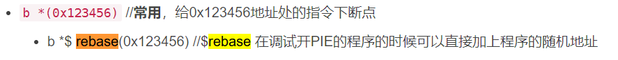

# 怎么有BUG！
## pwntools中使用tmux和gdb attach时Waiting for debugger无限等待的解决方案
首先使用pwn version确认你的pwntools版本。如果是4.6.0及之前的版本，都存在这个问题。若如此，找个目录下载一下最新的版本：git clone --depth 1 git://github.com/Gallopsled/pwntools，然后不需要cd切换目录，直接使用pip install --upgrade --editable ./pwntools。这条语句会自动卸载当前pwntools并安装开发版本。Waiting for debugger无限等待的问题在这篇博客发表4天前（2021-7-15）刚被修复……

*来自 \<<https://blog.csdn.net/weixin_43483799/article/details/118885208>\>*
# gdb.attach
**gdb.attach(*target***,***gdbscript = None***,***exe = None***,***arch = None***,***ssh = None*)**→ None
# gdb.debug
If you need to attach to a process very early, and debug it from the very first instruction (or even the start ofmain), you instead should use[**debug()**](https://pwntools-docs-zh.readthedocs.io/zh_CN/dev/gdb.html#pwnlib.gdb.debug).

When you use[**debug()**](https://pwntools-docs-zh.readthedocs.io/zh_CN/dev/gdb.html#pwnlib.gdb.debug), the return value is a[**tube**](https://pwntools-docs-zh.readthedocs.io/zh_CN/dev/tubes.html#pwnlib.tubes.tube.tube)object that you interact with exactly like normal.

*来自 \<<https://pwntools-docs-zh.readthedocs.io/zh_CN/dev/gdb.html>\>*
# gdb.debug技巧

主要针对上述的debug()函数里面的一些技巧：

def debug(cmd=""):

gdb.attach(p, cmd)  
pause()

cmd里可以下任何gdb的命令，一般都是下一些断点命令，还有设置一些变量来方便查看内存。

下断点命令时，用上述process中的获取程序基地址的方式，然后就可以对开了PIE的程序下断点了。

一般构造方式：

cmd= "b \*%d\n"%(proc_base+breakaddr)

breakaddr为想要下断点的地址，从IDA里可以很容易找到，IDA里的可是16进制，不要忘了0x前缀。

设置某些变量时，一般都会用set \$a=...这种，然后在gdb里查看内存可以用x/(numbs)(type) \$a这种:

x/32gx \$a

x/24wx \$a

x/16b \$a

x/8c \$a... ...

（使用时也要加\$）（变量的大小只有char？？！！）

正常的堆题目，会把堆块指针，也许还有其他信息存放到bss段上的，假设IDA显示为0x202010，那么我们可以设置：

cmd= '''set \$a=%d'''%(proc_base+0x202010)

稍复杂一点的堆题目，可能会在初始化的时候开辟一块存储堆块指针的空间，然后把指向这个空间的指针存到bss，这个时候可以采用这种方式来设置：

cmd= '''set \$a=\*(long\*)(%s)'''% hex(proc_base+0x202110)

*来自 \<<https://tianstcht.github.io/pwntools%E7%9A%84%E4%BD%BF%E7%94%A8%E6%8A%80%E5%B7%A7/>\>*
