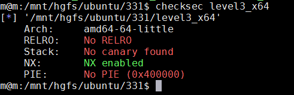

**1.检查程序开了哪些安全机制**

checksec检查保护机制
Arch:amd64-64-little
RELRO:NoRELRO
Stack:Nocanaryfound金丝雀
NX:NXenabled栈不可执行Windows平台上称其为DEP
PIE:NoPIE(0x8048000)内存地址随机化机制,Windows平台上称其为ASLR

*来自 \<<https://www.cnblogs.com/jazm/p/10749895.html>\>*
\[原创\]Linux 二进制程序保护机制详解

*来自 \<<https://bbs.pediy.com/thread-262639.htm>\>*
PWN——GCC编译中几种保护打开和关闭的参数

NX：-z execstack / -z noexecstack (关闭 / 开启) 不让执行栈上的数据，于是JMP ESP就不能用了

Canary：-fno-stack-protector /-fstack-protector / -fstack-protector-all (关闭 / 开启 / 全开启) 栈里插入cookie信息

PIE：-no-pie / -pie (关闭 / 开启) 地址随机化，另外打开后会有get_pc_thunk

RELRO：-z norelro / -z lazy / -z now (关闭 / 部分开启 / 完全开启) 对GOT表具有写权限

*来自 \<<https://blog.csdn.net/lonyliu/article/details/90341012>\>*

CANARY
重新打开会不会一样？

这题不会：
- [pwnable.tw](https://pwnable.tw/challenge/#4)（dubblesort）
同一个程序不同函数的canary会不会一样？

这题是一样的：
- [pwnable.tw](https://pwnable.tw/challenge/#4)（dubblesort）
PIE
而PIE（Position Independent Executables）是编译器（gcc，..）功能选项（-fPIE），作用于excutable编译过程，可将其理解为特殊的PIC（so专用，Position Independent Code），加了PIE选项编译出来的ELF用file命令查看会显示其为so，其随机化了ELF装载内存的基址（代码段、plt、got、data等共同的基址）。

*来自 \<<https://www.cnblogs.com/rec0rd/p/7646857.html>\>*
ASLR
（1）ASLR（Address Space Layout Randomization）：地址随机化，通常用来防御return2libc攻击，有以下3种配置：

​ 0 - 表示关闭进程地址空间随机化。

​ 1 - 表示将mmap的基址，stack和vdso页面随机化。

​ 2 - 表示在1的基础上增加堆（heap）的随机化。

liunx下关闭PIE的命令如下：

sudo -s echo 0 \> /proc/sys/kernel/randomize_va_space
*来自 \<<https://www.mi1k7ea.com/2019/02/09/ELF%E5%AE%89%E5%85%A8%E9%98%B2%E5%BE%A1%E6%9C%BA%E5%88%B6%E5%B0%8F%E7%BB%93/>\>*
但是地址随机化不是对所有模块和内存区都进行随机化，虽然libc、栈、堆的加载位置被随机化，但主镜像不会，这也是绕过的关键手段。

*来自 \<<https://www.cnblogs.com/Max-hhg/articles/14267147.html>\>*
## 0x01 查看ASLR设置
查看当前操作系统的ASLR配置情况，两种命令任你选择

\$ cat /proc/sys/kernel/randomize_va_space

2

\$ sysctl -a --pattern randomize

kernel.randomize_va_space = 2
## 0x04 关闭ASLR
**方法一： 手动修改randomize_va_space文件**

诚如上面介绍的randomize_va_space文件的枚举值含义，设置的值不同，linux内核加载程序的地址空间的策略就会不同。比较简单明了。这里0代表关闭ASLR。

\# echo 0 \> /proc/sys/kernel/randomize_va_space

注意，这里是先进root权限，后执行。不要问为什么sudo echo 0 \> /proc/sys/kernel/randomize_va_space为什么会报错

**方法二： 使用sysctl控制ASLR**

\$ sysctl -w kernel.randomize_va_space=0

这是一种临时改变随机策略的方法，重启之后将恢复默认。如果需要永久保存配置，需要在配置文件 /etc/sysctl.conf 中增加这个选项。

**方法三： 使用setarch控制单个程序的随机化**

如果你想历史关闭单个程序的ASLR，使用setarch是很好的选择。setarch命令如其名，改变程序的运行架构环境，并可以自定义环境flag。

setarch \`uname -m\` -R ./your_program

-R参数代表关闭地址空间随机化（开启ADDR_NO_RANDOMIZE)

**方法四： 在GDB场景下，使用set disable-randomization off**
在调试特定程序时，可以通过set disable-randomization命令开启或者关闭地址空间随机化。默认是关闭随机化的，也就是on状态。

当然，这里开启，关闭和查看的方法看起来就比较正规了。

关闭ASLR：

set disable-randomization on

开启ASLR：

set disable-randomization off

查看ASLR状态：

show disable-randomization

<https://blog.csdn.net/counsellor/article/details/81543197>
**
RELRO
重定位表只读，重定位表即为.got和.plt两个表。此项技术针对对GOT（Global Offset Table）的攻击。linux下RELRO有Partial RELRO和Full RELRO两种模式 。区别于：Partial RELRO模式下，GOT的非plt部分是只读的，而got.plt可写；Full RELRO模式下 ，整个GOT被标记为只读。
*来自 \<<https://www.cnblogs.com/Max-hhg/articles/14267147.html>\>*
动态函数在第一次懒加载过程中，会使用到重定位表格进行符号搜索，并将搜索到的函数信息保存到重定位项中，第二次直接跳转到重定位项中。而攻击者可以修改重定位表格或重定位项来实现hijack GOT表攻击。

可通过ROP绕过。
*来自 \<<https://www.mi1k7ea.com/2019/02/09/ELF%E5%AE%89%E5%85%A8%E9%98%B2%E5%BE%A1%E6%9C%BA%E5%88%B6%E5%B0%8F%E7%BB%93/>\>*
**
FORTIFY
用于检测对内存和字符串执行操作的各种函数中的缓冲区溢出。加了这个保护之后,一些敏感函数如read, fgets,memcpy, printf等等可能导致漏洞出现的函数都会被替换成 \_read_chk，\_fgets_chk_memcpy_chk，\_printf_chk等。

这些带了chk的函数会检查读取/复制的字节长度是否超过缓冲区长度，通过检查诸如%n之类的字符串位置是否位于可能被用户修改的可写地址，避免了格式化字符串跳过某些参数（如直接%7\$x）等方式来避免漏洞出现。

提供保护的函数还有memcpy, mempcpy, memmove, memset, strcpy, stpcpy, strncpy, strcat, strncat, sprintf, vsprintf, snprintf, vsnprintf, gets。

*来自 \<<https://www.cnblogs.com/Max-hhg/articles/14267147.html>\>*

fortify 技术是GCC在编译源码时判断程序的哪些buffer会存在可能的溢出，在buffer大小已知的情况下，GCC会把 strcpy、memcpy,、memset等函数自动替换成相应的 \_\_strcpy_chk(dst, src, dstlen)等函数，达到防止缓冲区溢出的作用。

FORTIFY_SOURCE机制对格式化字符串有两个限制：

​ (1)包含%n的格式化字符串不能位于程序内存中的可写地址；

​ (2)当使用位置参数时，必须使用范围内的所有参数。例如要使用%4\$x，则必须同时使用1、2、3。

GCC中-D_FORTIFY_SOURCE=2是默认开启的，但是只有开启O2或以上优化的时候，这个选项才会被真正激活。

如果指定-D_FORTIFY_SOURCE=1，那同样也要开启O1或以上优化，这个选项才会被真正激活。

可以使用-U_FORTIFY_SOURCE或者-D_FORTIFY_SOURCE=0来禁用。

如果开启了-D_FORTIFY_SOURCE=2，那么调用\_\_printf_chk函数的时候会检查format string中是否存在%n，如果存在%n 而且format string是在一个可写的segment中的（不是在read-only内存段中），那么程序会报错并终止。如果是开启-D_FORTIFY_SOURCE=1，那么就不会报错。
*来自 \<<https://www.mi1k7ea.com/2019/02/09/ELF%E5%AE%89%E5%85%A8%E9%98%B2%E5%BE%A1%E6%9C%BA%E5%88%B6%E5%B0%8F%E7%BB%93/>\>*
