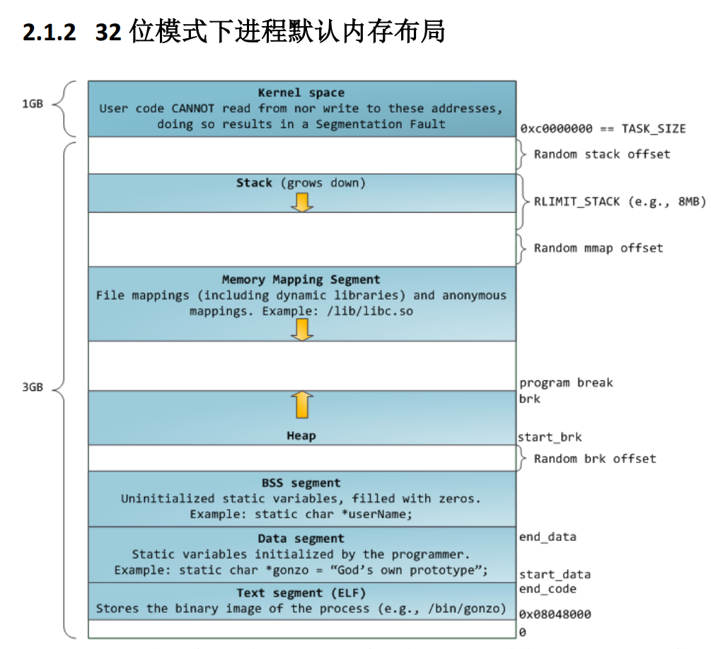
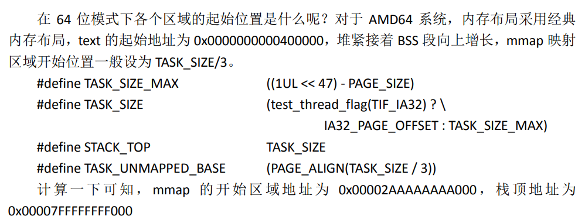
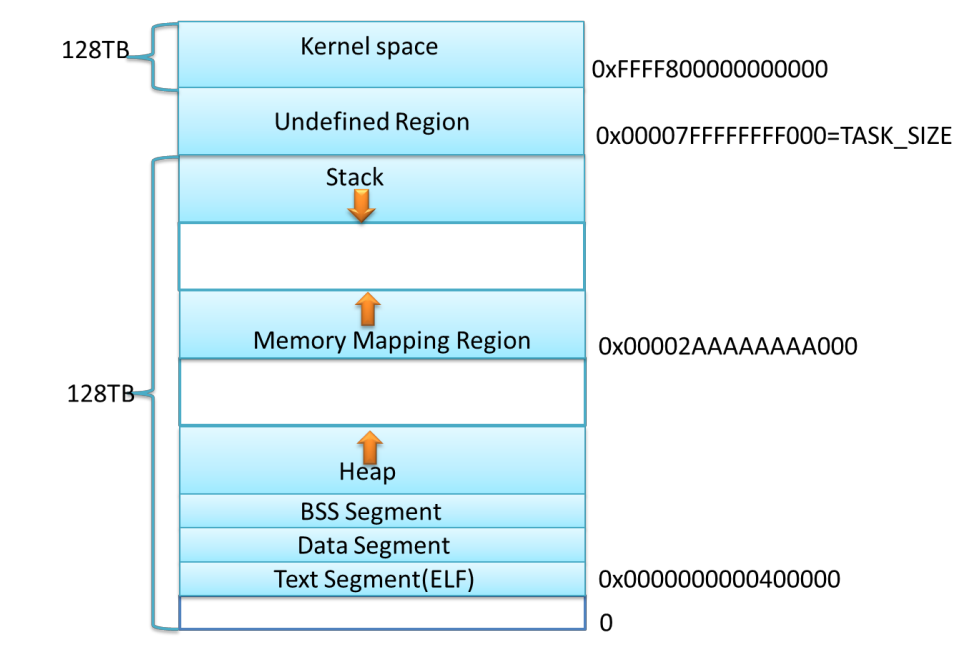

# 堆内存分配函数
## brk
### 分配函数 brk
\#include \<unistd.h\>

int brk(void \*addr);

void \*sbrk(intptr_t increment);

参数 \*addr 是进程数据段的结束地址，brk() 通过改变该地址来改变数据段的大小，当结束地址向高地址移动，进程内存空间增大，当结束地址向低地址移动，进程内存空间减小。brk()调用成功时返回 0，失败时返回 -1。 sbrk() 与 brk() 类似，但是参数 increment 表示增量，即增加或减少的空间大小，调用成功时返回增加后减小前数据段的结束地址，失败时返回 -1。

### 大小限制
main_arena

默认情况下top_pad定义为

\#ifndef DEFAULT_TOP_PAD# define DEFAULT_TOP_PAD 131072#endif

即 131072 字节，0x20000 字节。

## mmap
malloc大于0x21000就用mmap？
### 分配函数 mmap, munmap
[mmap(2) - Linux manual page (man7.org)](https://man7.org/linux/man-pages/man2/mmap.2.html)

[mman.h (uclouvain.be)](https://sites.uclouvain.be/SystInfo/usr/include/bits/mman.h.html)

[(45条消息) Linux 内存映射函数 mmap（）函数详解_yangle4695的博客-CSDN博客_mmap函数](https://blog.csdn.net/yangle4695/article/details/52139585)

\#include \<sys/mman.h\>

void \*mmap(void \*addr, size_t len, int prot, int flags,

int fildes, off_t off);

mmap() 函数用于创建新的虚拟内存区域，并将对象映射到这些区域中，当它不将地址空间映射到某个文件时，我们称这块空间为匿名（Anonymous）空间，匿名空间可以用来作为堆空间。

mmap() 函数要求内核创建一个从地址 addr 开始的新虚拟内存区域，

并将文件描述符 fildes 指定的对象的一个连续的片（chunk）映射到这个新区域。

连续的对象片大小为 len 字节，

从距文件开始处偏移量为 off 字节的地方开始。

prot 描述虚拟内存区域的访问权限位，

flags 0x20匿名块

munmap() 则用于删除虚拟内存区域：

\#include \<sys/mman.h\>

int munmap(void \*addr, size_t len);
### 大小限制
### 内存地址

[堆概述 - CTF Wiki (ctf-wiki.org)](https://ctf-wiki.org/pwn/linux/user-mode/heap/ptmalloc2/heap-overview/) cat /proc/pid/maps

可以在这看brk和mmap和malloc和free分配的内存在哪

多线程 main用brk，线程用mmap

# 内存布局 mmap和glibc的位置

