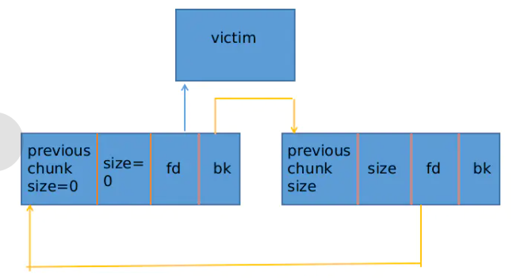

为啥小于2.31？？？？
伪造smallbin的链，得到位于栈上的伪造块，改写栈上内容
条件
smallchunk

(largechunk)

可以在栈上伪造chunk_header

知道栈上chunk的地址，知道堆上chunk的地址

UAF：free之后的块可以改写bk指针
实现
malloc 非fast的smallchunk （100）作为victim

【TCACHE】连续malloc7次，耗尽tcache

栈上fake_chunk头布局

因为small_bin的检查，fd和bk要顺序正确，其余无要求

【TCACHE】在栈上创建大小为7的fake_freelist，fake_chunk2-\>bk=fake_freelist\[0\]

malloc largechunk 避免和top合并

【TCACHE】连续free7次

free(victim)

malloc largechunk 让victim进入smallbin

漏洞：改写victim-\>bk=fakechunk1

【TCACHE】连续malloc7次

malloc(100)

检查 victim(也就是bin-\>bk)-\>bk-\>fd ==victim

small bin是FIFO结构，从队尾出队，得到victim

队尾出队：bin-\>bk=last-\>bk; last-\>bk-\>fd = bin

bin-\>bk=fake_chunk1

fake_chunk1-\>fd=bin

malloc(100)

同理，得到fake_chunk1

队尾出队：

bin-\>bk=fake_chunk2

fake_chunk2-\>fd=bin

利用
读写得到的fake_chunk1，就是读写栈内容，栈从高到低增长，甚至可以改写返回地址
