IDA基础功能总结 \| Leeyuxun の note
星期六, 四月 9, 2022
3:43 下午

已剪辑自: <https://leeyuxun.github.io/IDA%E5%9F%BA%E7%A1%80%E5%8A%9F%E8%83%BD%E6%80%BB%E7%BB%93.html>
# 前言
IDA 是一种交互式、可编程的反汇编工具；
支持数十种常见处理器平台的指令集，包括 Intel x86，x64，MIPS，PowerPC，ARM， Z80，68000，c8051等；
IDA支持的文件类型也非常丰富，包括常 见PE格式和Windows，DOS，UNIX，Mac， Java，.NET等平台的文件格式；
漏洞分析时，通常先用IDA先对可执行文件进行静态分析，下面将介绍IDA V7.0用于静态分析的基础功能；
# 顶部菜单栏
## File
功能：
- New Instance：创建新实例
- Open：打开文件
- Load file：加载文件
可以加载文件类型有：重新加载输入文件、附加二进制文件、IDS/IDT、PDB、DBG、TDS、FLIRT结构文件、解析C头文件；

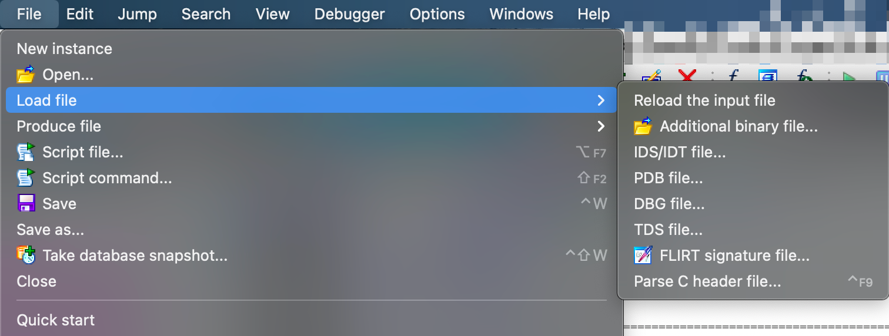
- Produce file：创建文件
可以创建的文件的类型有：MAP、ASM、INC、LST、EXE、DIF、C、HTML、利用函数调用创建GDL、利用流程图创建GDL、C头文件、将数据库转储到IDC文件、将typeinfo转储到IDC文件中；

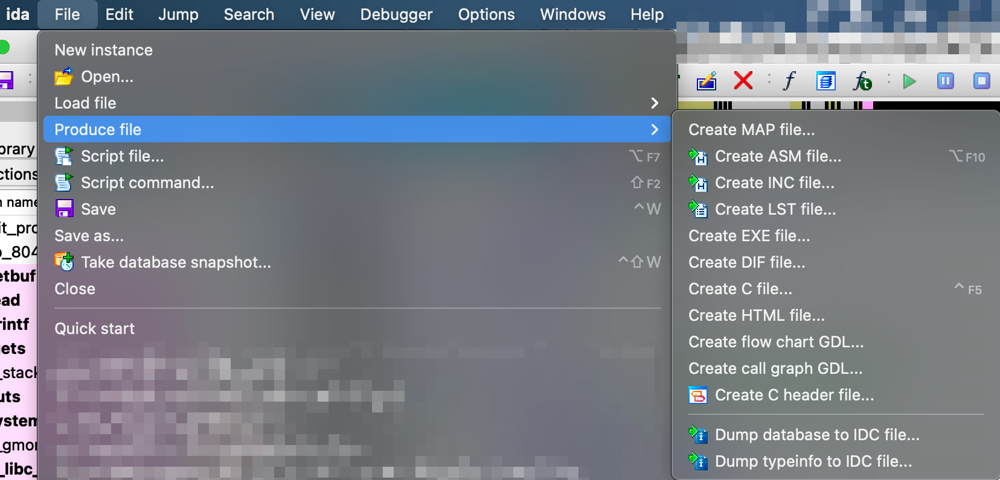
- Script file：加载用户自定义的IDC或IDA python脚本，实现用户定制功能，快捷键：opt+F7；
- Script command：输入并执行以内置IDC语言或任何其他注册的extlang编写的脚本，快捷键：shift+F2；
- Save：保存，快捷键：ctrl+W；
- Save as：另存为；
- Take database snapshot：拍摄数据库快照，保存IDA Pro当前工作信息，快捷键：ctrl+shift+W；
- cloes：关闭项目；
- Quick start：快速开始新的项目；
## Edit
功能：
- Copy：复制，快捷键：cmd+C；
- Begin selection：从光标处开始选择，快捷键：opt+L；
- select all：选择全部；
- Select identifier：选择光标所在的标识符；
- Export data：将二进制数据导出为不同的格式数据，快捷键：shift+E；
- Code：转换为code，快捷键：C；
- Data：转换为data，快捷键：D；
- Struct var：转换为结构体，快捷键：opt+Q；
- Strings：转换为字符串，快捷键：A，同时也可转换不同类型的字符串如C、DOS、Pascal、Wide pascal、Delphi、Unicode、Unicode pascal、Unicode wide pascal；
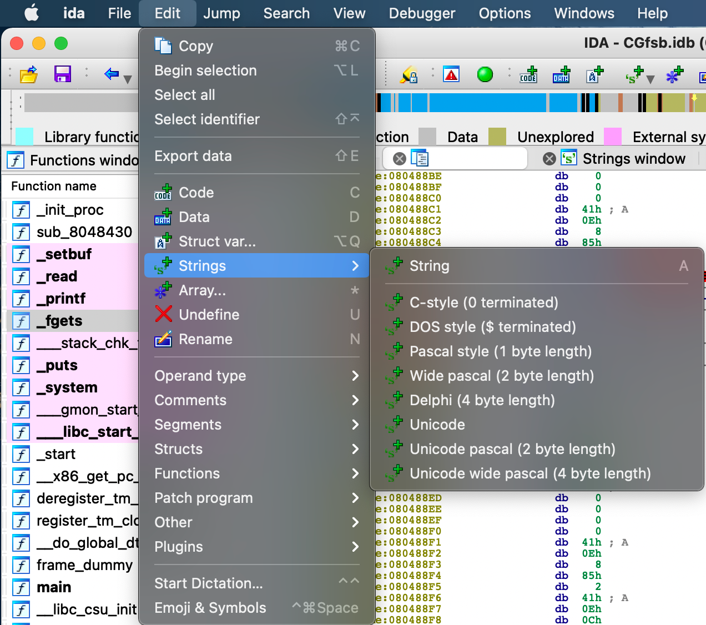
- Array：转换为数组，快捷键：shift+Fn+\*；
- Undefine：取消当前定义，主要用于函数，快捷键：U；
- Rename：重命名，快捷键：N；
- Operand type：操作数类型

- Offset：偏移

- Offset(data segment)：将当前指令/数据的立即数转换为当前数据段（DS）的偏移量，如果当前的DS值未知（或等于0xFFFF），则IDA会发出哔声警告，因此必须为当前字节定义DS寄存器值，快捷键：O；
- Offset(surrent segment)：将当前指令/数据的立即数转换为当前段（CS）的偏移量，快捷键：ctrl+O；
- Offset by(any segment)：将当前指令/数据的立即数转换为任何段的偏移量，IDA会要求选择偏移量的基础段，快捷键：opt+R；
- Offset(user-defined)：将当前指令/数据的立即数操作数转换为复数偏移量表达式，快捷键：ctrl+R；
- Offset(struct)：将范围选择中的所有指令立即数转换为通过结构及其可能的子联合的偏移路径，快捷键：T
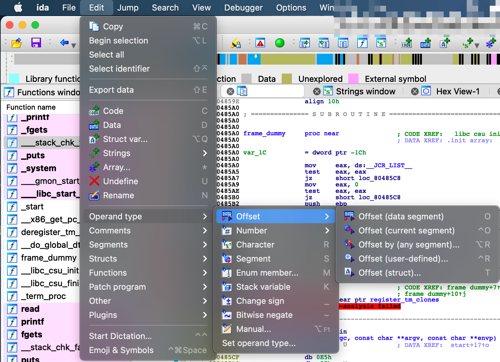
- Number：数字

- Number(default)：将当前指令/数据的立即操作数类型转换为数字，快捷键：shift+Fn+#；
- Hexadecimal：将当前指令/数据的立即操作数类型转换为十六进制数：快捷键：Q；
- Decimal：将当前指令/数据的立即操作数类型转换为十进制数：快捷键：H；
- Octal：将当前指令/数据的立即操作数类型转换为八进制数；
- Binary：将当前指令/数据的立即操作数类型转换为二进制数：快捷键：B；
- Floating point：将当前操作数类型转换为浮点数；
- Toggle leading zeroes：显示或隐藏当前操作数的前导零；
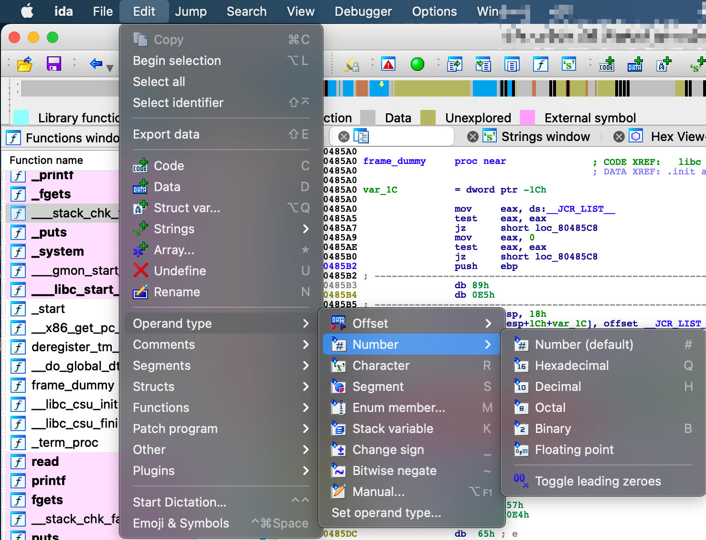
- Character：将当前指令/数据的立即操作数类型转换为字符，快捷键：R；
- Segment：将当前指令/数据的立即操作数类型转换为段基，快捷键：S；
- Enmu member：将当前指令/数据的立即操作数类型转换为枚举成员，快捷键：M；
- Stack variable：将当前指令的立即操作数类型转换为堆栈变量的偏移量，即堆栈中的局部变量或函数参数，快捷键：K；
- Change sign：更改当前操作数的符号，并非所有操作数都可以更改其符号；
- Bitwise negate：将当前操作数按位取反，并非所有类型的操作数都可以取反，不能同时取反和更改操作数的符号，快捷键：shift+Fn+\~；
- Manual：自定义操作数，快捷键：opt+F1；
- Set operand type：设置光标下的操作数的类型；
- Comments：注释

- Enter comment：创建常规注释，快捷键：shift+Fn+:；
- Enter repeatable comment：创建交叉注释，快捷键：ctrl+;；
- Enter anterior lines：创建行前注释；
- Enter anterior lines：创建行后注释；

- Segment：段操作

- Create segment：创建新段；
- Edit segment：更改除段基础以外的所有段属性，快捷键：opt+S；
- Delete segment：删除段；
- Move current segment：将段移动到另一个地址；
- Rebase program：将整个程序按存储器中指定的字节数移动；
- Change segment translation：更改段翻译，段翻译是在解析对当前段指令的引用时要使用的其他段序列，只有代码引用受段翻译的影响，通过修改数据段寄存器，可以将数据引用重定向到所需的地址；
- Change segment register value：创建或更改段寄存器值，快捷键：opt+G；
- Set default segment register value：设置默认段寄存器值；
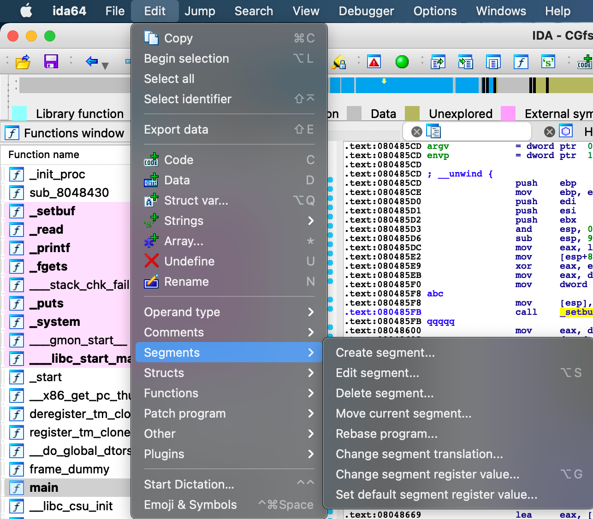
- Structs：结构体操作

- Add struct type：定义新的结构体或联合；
- Copy struct type：复制当前结构体；
- Edit struct type：编辑结构体，包括将当前结构体定义移动到结构体窗口中的另一个位置、更改结构对齐方式；
- Delete struct type：删除当前结构体，快捷键：Fn+删除按钮；
- Expand struct type：通过插入未定义字节来扩展当前结构体；
- Shrink struct type：删除光标位置处的未定义字节来缩小当前结构体；
- Struct var：声明结构体，快捷键：opt+Q；
- Force zero offset filed：强制零偏移，即使结构体成员的偏移量等于零，也会强制IDA显示完整的结构体成员名称，快捷键：ctrl+Z；
- Select union member：选取联合成员，从当前光标位置显示对联合的引用，快捷键：opt+Y；
- Create struct from selection：根据已经定义的结构体定义新的结构体；
- Copy field into pointers：扫描当前的结构体，并重置偏移量表达式所指向的位置；
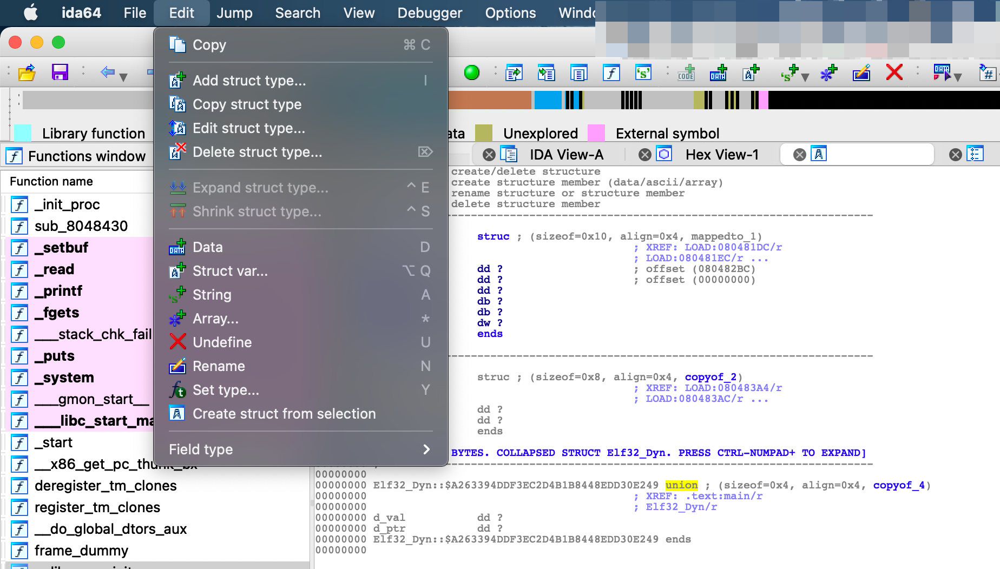

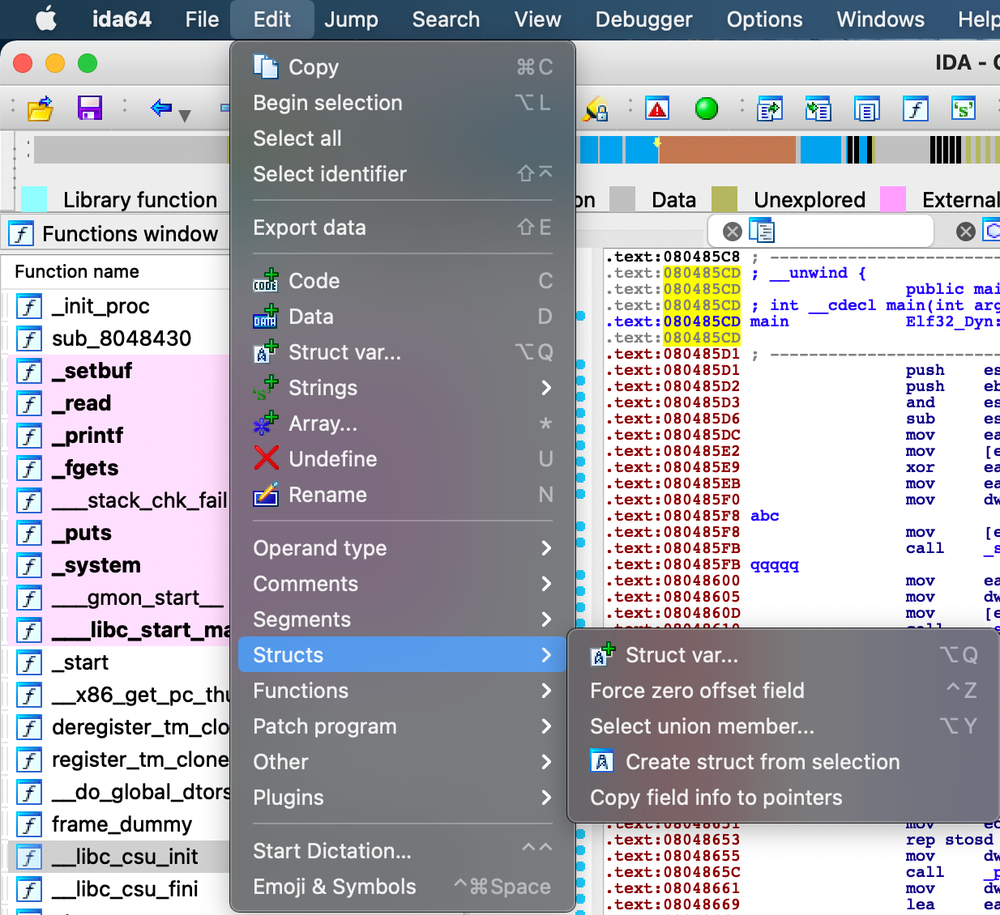
- Functions：函数操作

- Create function：创建函数；
- Edit function：编辑函数，快捷键：opt+P；
- Append function tail：将程序的任意范围附加到函数定义中；
- Remove function tail：从函数定义中删除光标处的函数尾部；
- Delete function：删除函数；
- Set function end：更改当前或先前的函数范围，将其结尾设置在光标处，快捷键：E；
- Stack variables：打开当前函数的堆栈变量窗口，快捷键：ctrl+K；
- Change stack pointer：指定当前指令如何修改堆栈指针（SP），快捷键：opt+K；
- Rename register：将常规寄存器重命名为一些有意义的名称，快捷键：V；
- Set type：指定当前函数的命名，快捷键：Y；
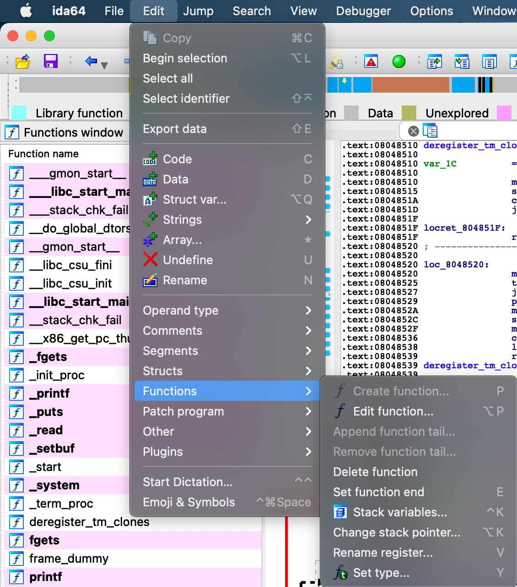
- Patch program：修补程序

- Change byte：通过修改字节来修改程序；
- Change word：通过修改字来修改程序；
- Assemble：将指令汇编；
- Pached bytes：查看修改的字节，快捷键：ctrl+opt+P；
- Apply patches to input file：将之前修补的字节应用回输入文件；
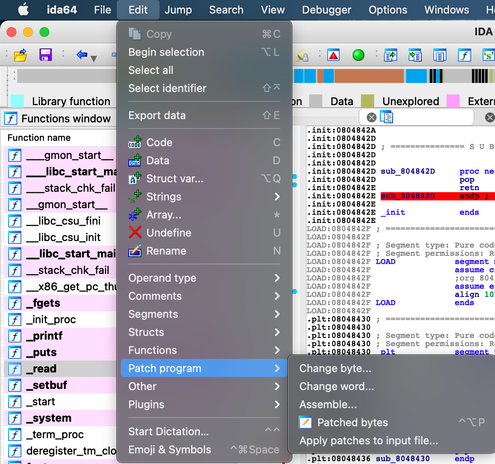
- Other

- Create alignment directive：创建对齐指令，对齐指令将替换链接器插入的许多无用字节，用于将代码和数据对齐到段落边界或等于2的幂的任何其他地址，快捷键：L；
- Manual instruction：指定程序中指令或数据的表示形式，快捷键：opt+F2；
- Color instruction：指定当前指令或数据项的背景颜色；
- Toggle border：隐藏/显示指令和数据之间的边界；
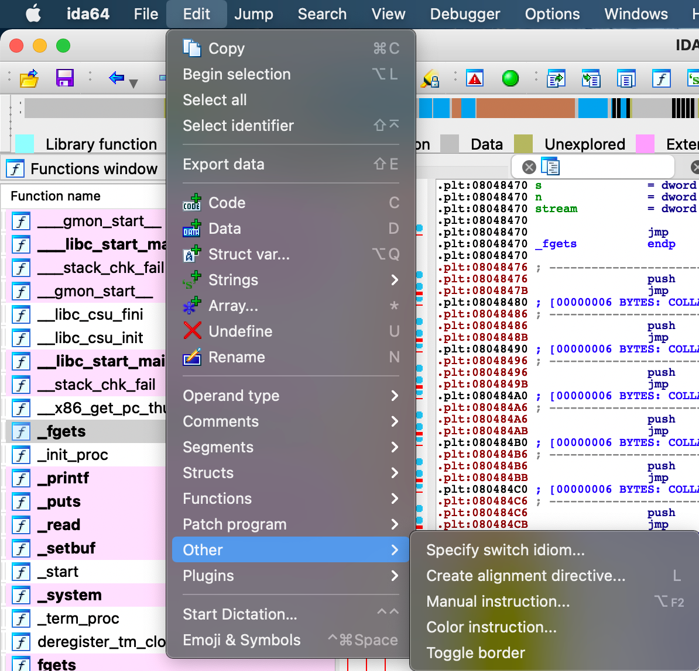
- Plugins：插件模块是用C++编写的模块，可为IDA提供其他功能；
- Emoji & Symbols：字符检视器，用于字符和代码之间的转换，快捷键：ctrl+cmd+Space；
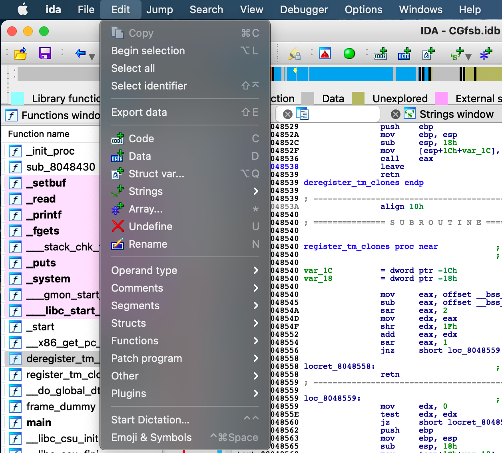
## Jump
功能：
- Jump to operand：即name register，重命名寄存器；
- Jump in a new window：打开一个与现在窗口类型相同的新窗口；
- Jump to previous position：跳转到前一个位置；
- Jump to next position：跳转到后一个位置；
- Empty navigation stack：清除跳转堆栈；
- Jump to pseudocode：在反汇编视图和伪代码视图之间切换，快捷键：Tab；
- Jump to address：跳转到程序中指定的地址，快捷键：G；
- Jump by name：跳转到指定命名位置处，快捷键：ctrl+L；
- Jump to function：跳转到选定的函数处，快捷键：ctrl+P；
- Jump to segment：跳转到指定段的段头，快捷键：ctrl+S；
- Jump to segment register：跳转到指定寄存器，快捷键：ctrl+G；
- Jump to problem：跳转到有问题的位置，快捷键：ctrl+Q；
- List cross references to：列出光标位置到达的交叉引用，快捷键：ctrl+X；
- List cross references from：列出到光标位置的交叉引用，快捷键：ctrl+J；
- Jump to xref to operand：显示当前操作数的交叉引用列表，方便跳转，快捷键：X；
- Jump to entry point：显示入口点列表，方便跳到所选入口点，快捷键：ctrl+E；
- Jump to file offset：指定文件偏移相对应的地址并跳转；
- Marked position，添加标签，快捷键：opt+M；
- Jump to marked position：选择一个标签并跳转，快捷键：ctrl+M；
- Clear mark：删除标记位置；
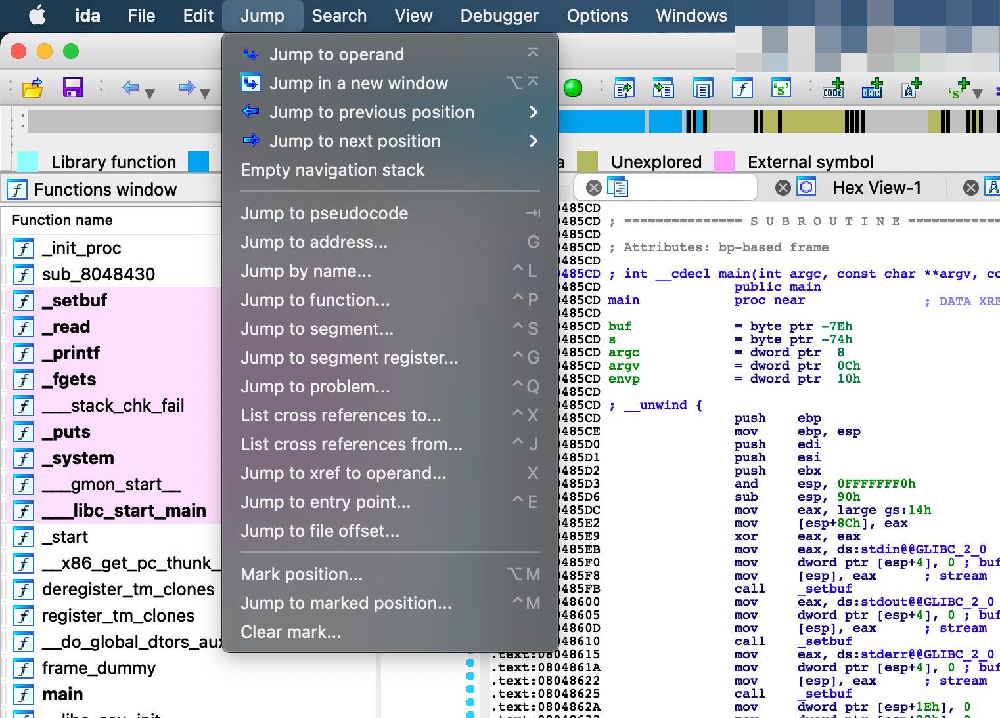
## Search
功能：
- next code：查找下一条指令，快捷键：opt+C；
- next data：查找下一条数据，快捷键：ctrl+D；
- next explored：查找下一个定义的字节序列，快捷键：ctrl+A；
- next unexplored：查找下一个未定义字节序列，快捷键：ctrl+U；
- immediate value：搜索立即数，快捷键：opt+I；
- next immediate value：查找下一个立即数，快捷键：ctrl+I；
- text：搜索字符串，快捷键：opt+T；
- next text：查找下一个字符串，快捷键：ctrl+T；
- sequence of bytes：搜索字节序列，快捷键：opt+B；
- next sequence of bytes：查找下一个字节序列，快捷键：ctrl+B；
- not fuction：搜索不属于任何函数的第一个字节；
- next void：搜索下一个无效的位置，快捷键：ctrl+V；
- error operand：搜索错误操作数，快捷键：ctrl+F；
- all void operands：搜索所有的无效操作数，并显示它们的列表；
- all error operands：搜索包含任何出现错误的操作数，并显示它们的列表；
- search direction：切换搜索方向；
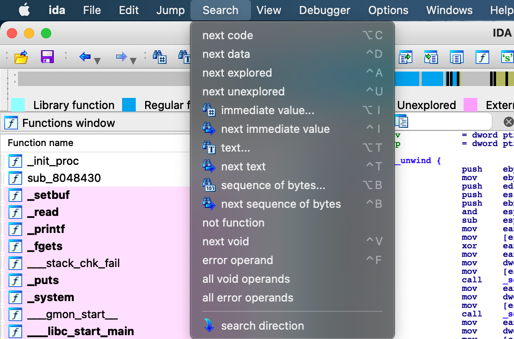
## View
功能：
- Open subviews：打开子窗口；

- Quick view：查看窗口列表，快捷键：ctrl+1；
- Functions：打开函数窗口；
- Disassembly：打开反汇编窗口；
- Hex dump：打开十六进制窗口；
- Structures：打开结构体窗口，快捷键：shift+F9；
- Enumerations：打开枚举窗口,快捷键：shift+F10；
- Export：打开导出窗口；
- Import：打开导入窗口；
- Proximity browser：打开函数级别的窗体结构信息，查看邻近函数；
- Generate pseudocode：生成反汇编窗口中的函数对应的伪代码，快捷键：F5；
- Names：打开名称窗口,显示函数和参数的命名列表，快捷键：shift+F4；
- Strings：打开字符串窗口，显示出现的字符串列表，快捷键：shift+F12；
- Segments：打开段窗口，显示所有段列表，快捷键：shift+F7；
- Segment. registers：打开寄存器窗口，显示所有段的寄存器信息，快捷键：shift+F8；
- Selectors：打开选择器窗口；
- Signatures：打开签名窗口，包括签名文件、签名状态、签名函数、签名说明，快捷键：shift+F5；
- Type libraries：打开类库窗口，用于加载/卸载标准类库，快捷键：shift+F11；
- Local Types：打开本地类库窗口，用于修改/删除现有类库，添加新类库；
- Cross references：打开交叉引用窗口，显示对当前位置的所有引用；
- Function calls：打开函数调用窗口，显示调用当前函数的所有函数；
- Notepad：打开记事本窗口，获取有关当前数据库的常规注释；
- Problems：打开问题窗口，查看在拆卸程序期间遇到的所有问题；
- Patched bytes：打开修改字节窗口，显示修改的字节列表，快捷键：ctrl+opt+P；
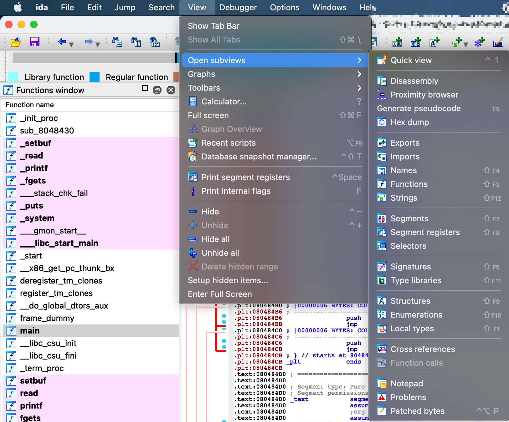
- Graphs：绘制各种图形；

- Flow chat：绘制当前函数的流程图，彩色箭头表示条件跳转指令的结果，快捷键：F12；
- Print flow chat labels：函数流程图中显示标签；
- Function calls：绘制程序中所有的函数调用流程图，快捷键：ctrl+F12；
- Xrefs to：绘制 **到** 程序的当前地址/选定地址范围的参照图；
- Xrefs from：绘制 **来自** 程序的当前地址/选定地址范围的参照图；
- User xrefs chart：绘制用户自定义的外部参照图，该图 **来自/至** 程序的当前地址/选定地址范围；
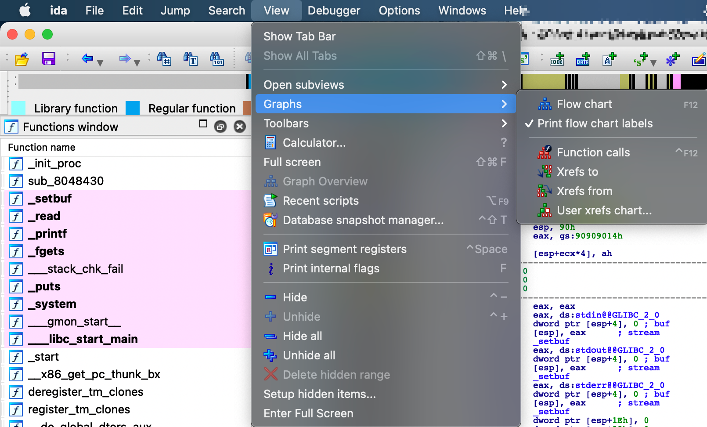
- Toolbars：工具栏

- Basic mode：切换为基本UI模式;

- Advanced mode：切换为高级UI模式；

- Navigator：用于查看被加载文件地址空间的线性视图，不同位置代表功能如下，可根据需要快速跳转到相关代码处；

- Library function：库函数
- Regular function：规则函数
- Instruction：指令
- Data：数据
- Unexplored：未查询区域
- External symbol：外部符号
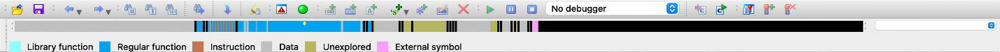
- Address details：显示地址详情；
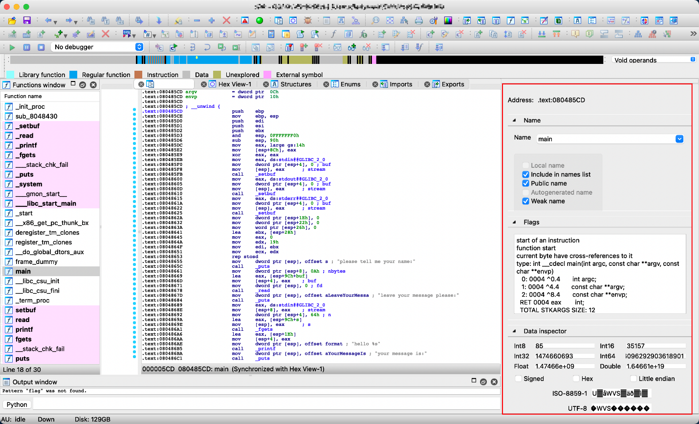
- File：打开和保存文件；

- Jump：跳转命令；

- search：搜索；

- Hide/Unhide：切换隐藏、删除；

- Analysis：分析，打开问题窗口；

- Views：打开反汇编窗口、十六进制窗口、Debug窗口；
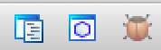
- Graph view：切换图形视图/文本视图，切换到函数级别的窗体结构信息，设置图形大小、颜色及其它信息，打印图形；

- Lists：显示导入、导出、名称、函数、字符串窗口；

- Signatures/Types：显示签名窗口、类窗口；

- Structures/Enumerations：显示字符串窗口、枚举窗口；

- Cross references：显示交叉引用窗口、函数调用窗口；

- Segments：显示段窗口、段寄存器窗口、选择器窗口；

- Edit：转换为指令，转换为数据，声明结构体变量，转换为字符串，转换为数组，重命名当前位置，转换为未定义类型；

- Operand type：数据段操作数偏移，操作数转换为数字，操作数转换为字符串，操作数转换为段基，操作数转换为符号常量，操作数转换为堆栈变量的偏移量，更改当前操作数的符号，对当前操作数执行位求反，手动输入当前操作数；

- Utilities：打开计算器，打开记事本对数据库做注释，执行脚本命令，执行脚本文件；

- Functions：创建新函数或编辑函数属性，打开当前函数的堆栈变量窗口，指定当前函数的命名；

- Enumerations：定义新的枚举类型，编辑选中的枚举类型，删除选中的枚举类型，为枚举类型添加符号常量，编辑符号常量，删除符号常量；

- Structures：声明新的结构体/枚举类型，复制选中的结构体/枚举类型，编辑结构体类型，删除结构体/枚举类型，向结构体中插入未定义的字符序列，从结构体中删除未定义的字符串；

- Comments：创建常规注释，创建交互注释，创建行前注释，创建行后注释；

- Graphs：绘制当前函数流程图，绘制函数调用流程图，绘制**到**程序的当前地址/选定地址范围的参照图，绘制**来自**程序的当前地址/选定地址范围的参照图，绘制用户自定义的外部参照图、该图**来自/至**程序的当前地址/选定地址范围；

- Calculator：简单的计算器，输入常量C样式的表达式，语法与IDC表达式的语法相同，结果以十六进制、十进制、八进制、二进制和字符，快捷键：shift+Fn+?；
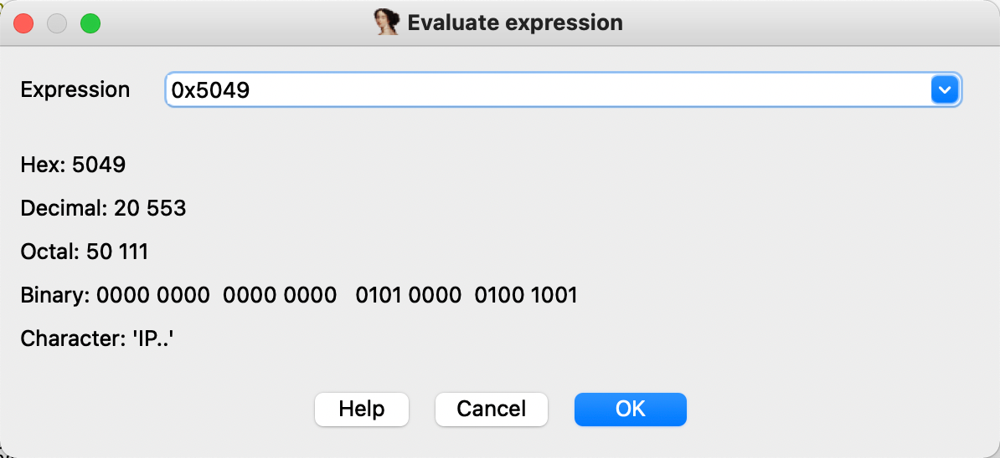
- Full screen：切换独立窗口显示，快捷键：shift+cmd+F；
- Graph Overview：查看概览图；
- Recent scripts：查看添加的脚本，快捷键：opt+F9；
- Database snapshot manager：显示数据库快照管理器，可以还原、重命名或删除快照；
- Print segment register：显示段寄存器；
- Print internal flags：显示内部标志位；
- Hide：隐藏反汇编代码，可以是函数、段、自定义隐藏范围，快捷键：ctrl + -；
- Unhide：显示隐藏的反汇编代码，快捷键：ctrl + +；
- Hide all：隐藏所有可隐藏的反汇编代码；
- Unhide all：显示所有隐藏的反汇编代码；
- Delete hidden range：删除隐藏的自定义反汇编范围；
- Setup hidden items：您切换隐藏内容的显示；
- Enter Full Screen：进入全屏；
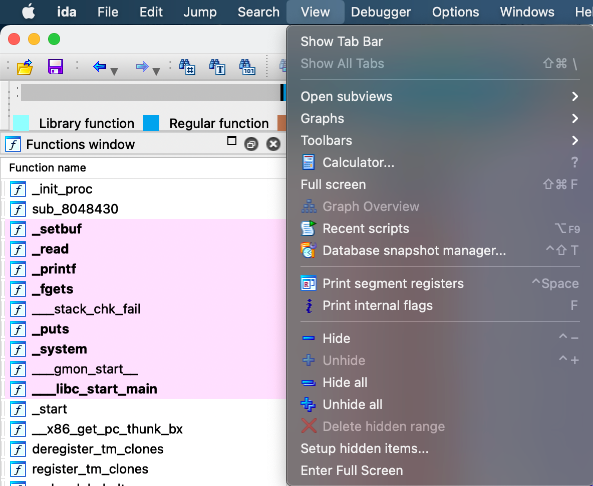
## Debugger
动态调试不做介绍；
## options
功能：
- General：打开常规设置，包括反汇编、分析、交叉引用、字符串、图形视图等；
- Colors：颜色设置；
- Font：字体设置；
- Shortcuts：快捷键设置；
- Show command palette：展示命令面板，快捷键：ctrl+shift+P；
- Repeat last palette command：重复上一个面板的命令，快捷键：ctrl+shift+R；
- Assembler directives：设置汇编程序指令；
- Name representation：设置名称表示；
- Demangled names：设置不符合标准的名称；
- Compiler：设置编译器；
- String literals：设置字符串编码，快捷键：opt+A；
- Setup data type设置数据类型，快捷键：opt+D；
- Source paths：设置源路径；
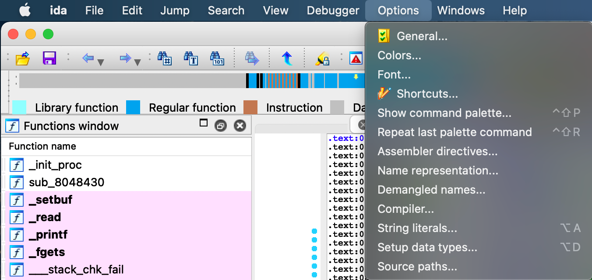
## Window
功能
- Load desktop：迅速打开之前保存的桌面布局；
- Save desktop：保存当前的桌面布局；
- Delete desktop：删除之前保存的桌面布局；
- Reset desktop：重置当前桌面布局；
- Reset hidden messages：通过选中“不再显示此消息”复选框来重置用户隐藏的所有问题和消息的状态；
- Windows list：列出当前打开的所有窗口，可以通过快捷键：opt+数字 进行选择切换；
- Next window：显示下一个打开的窗口，快捷键：F6；
- Previous window：显示上一个打开的窗口，快捷键：shift+F6；
- Close window：关闭当前打开的窗口，快捷键：opt+F3；
- Foucs command line：将光标放置在Output window中的命令行输入上，快捷键：opt+.；
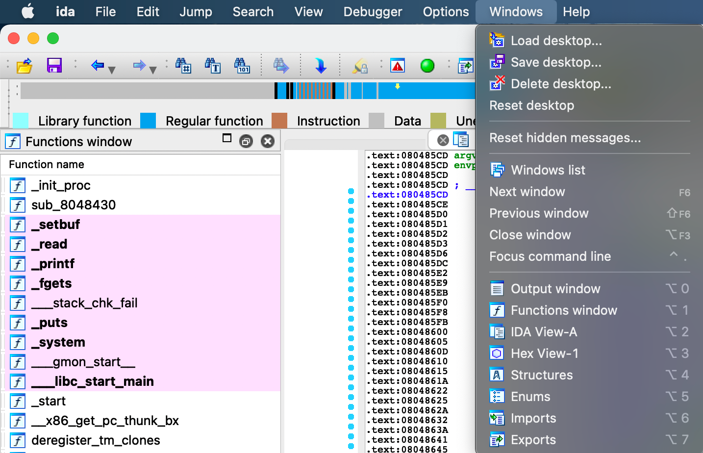
# 窗口
IDA默认会显示8个窗口，分别为函数窗口、反汇编窗口、十六进制窗口、结构体窗口、枚举窗口、导入窗口、导出窗口、输出窗口；
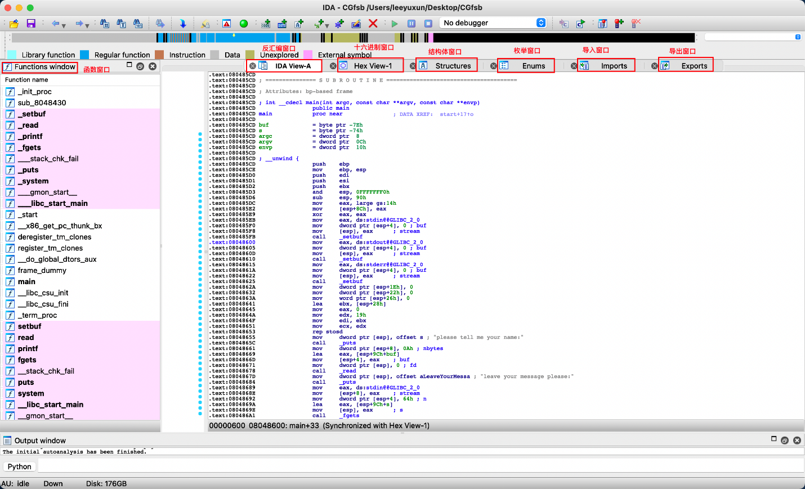
## 函数窗口
Functions window，用于列举IDA在数据库中识别的每一个函数，包括函数名、所在的段、起始地址、长度等；
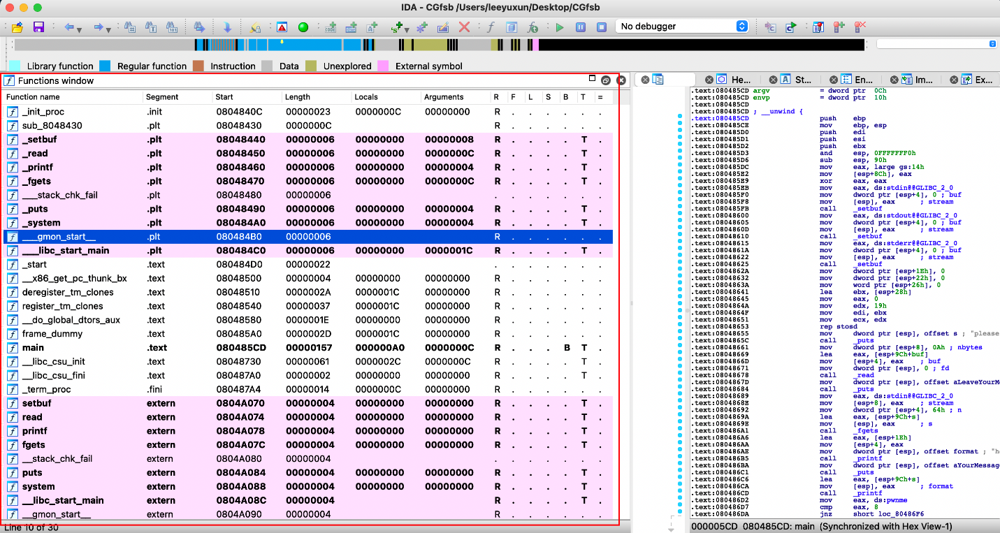
函数过滤器：右键→Modify filters/ctrl+shift+F，在弹出的筛选框中，输入信息如main，点击添加按钮Add，添加一条任何一列为main的函数信息筛选项；
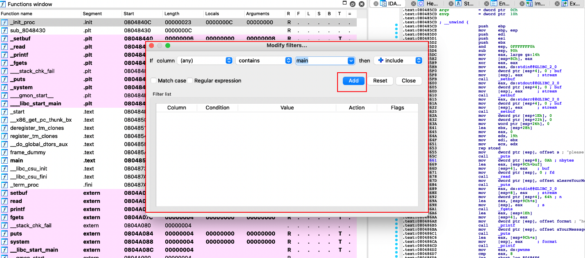
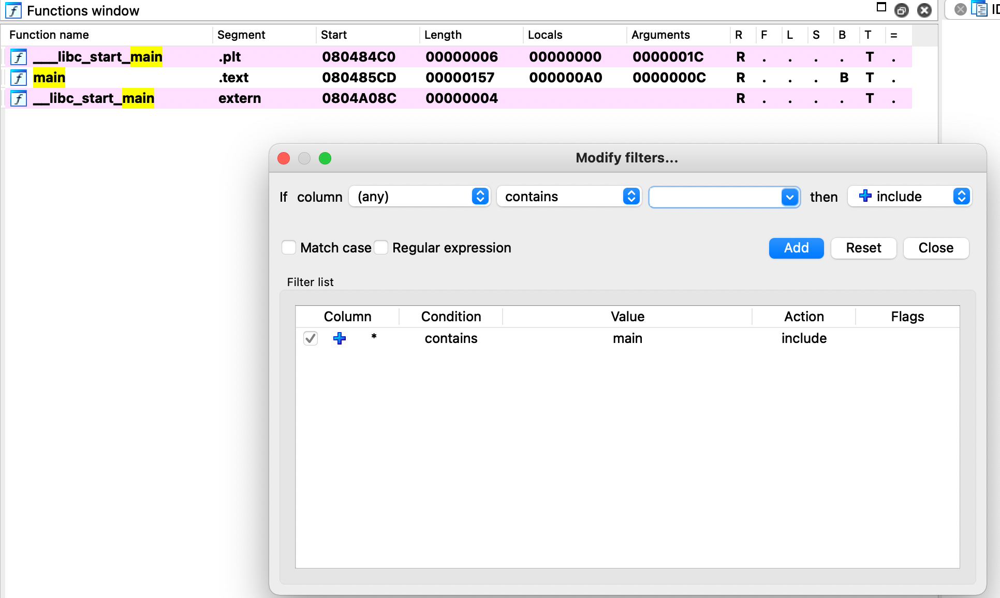
## 反汇编窗口
IDA View，反汇编窗口是IDA的最主要数据窗口，可以显示IDA对目标程序的反汇编结果，同时提供文本视图和图形视图，针对不能识别的代码段和数据段，会显示数据字节内容，并使用不同的颜色进行标注。
反汇编窗口有两种形式：分别是**图形视图**（默认）和**文本视图**；
- 在图形视图中，IDA以程序流程图的形式显示代码，将函数分解成许多基本块，从而生动显示该函数由一个块到另一个块的控制流程；
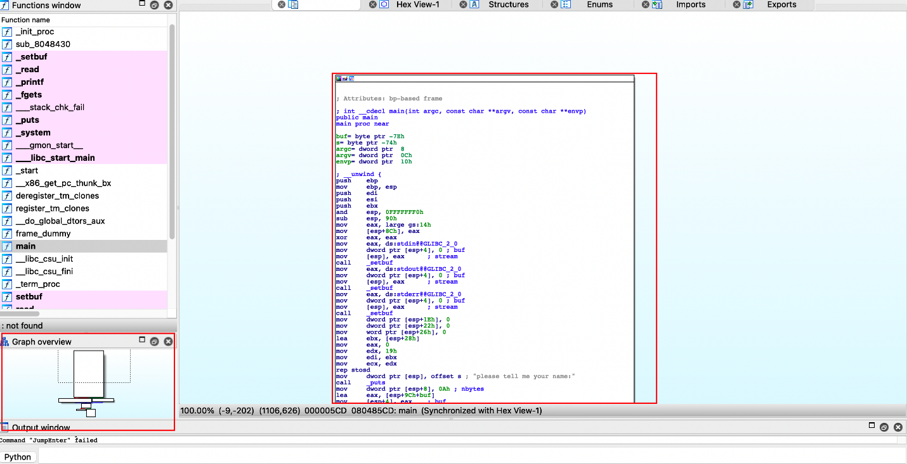
- 文本视图呈现程序的完整反汇编代码清单，只有通过文本视图才能查看一个二进制文件的数据部分；
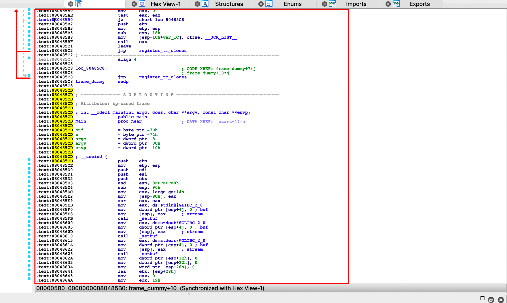
- 选择View→Open subviews→Disassembly选项，打开反汇编子窗口，就可以用多个子窗口来分析同一段程序，而不必来回翻页査看代码了。其他常用窗口，例如 “Functions” 和 “Proximity browser”，也可以使用这个菜单打开。
- 切换方式

- 快捷键：Space；
- ctrl键+鼠标滚轮调整图形的大小；
- 图形视图下右键→Proximity browser，可以切换到函数级别的窗体结构信息，查看邻近函数；
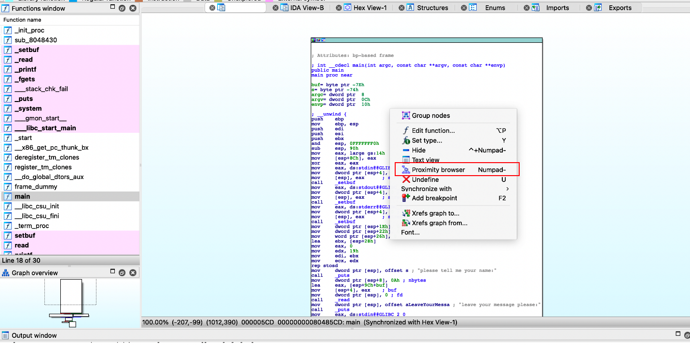

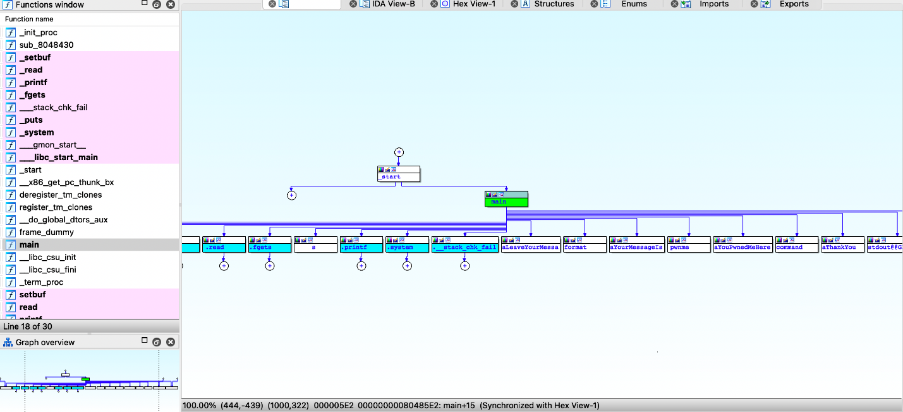
## 十六进制窗口
Hex View，用于显示程序内容和对应地址空间的十六进制数据，也可以便捷地进行代码和数据修改；
- 如果十六进制窗体中某些数据显示为问号，则表示IDA无法给出对应虚拟地址范围内的数值；
- 在十六进制窗口选中某地址数据，再切换回反汇编窗口时，可以看到对应地址的反汇编信息；
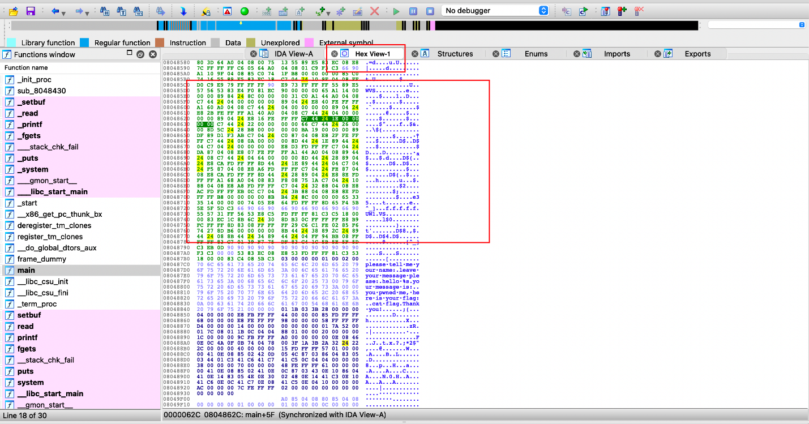
十六进制编辑：右键→Edit；
快捷键：F2；
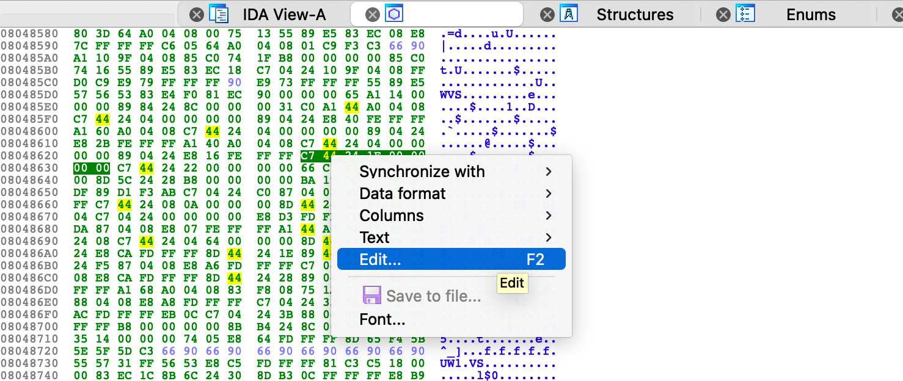
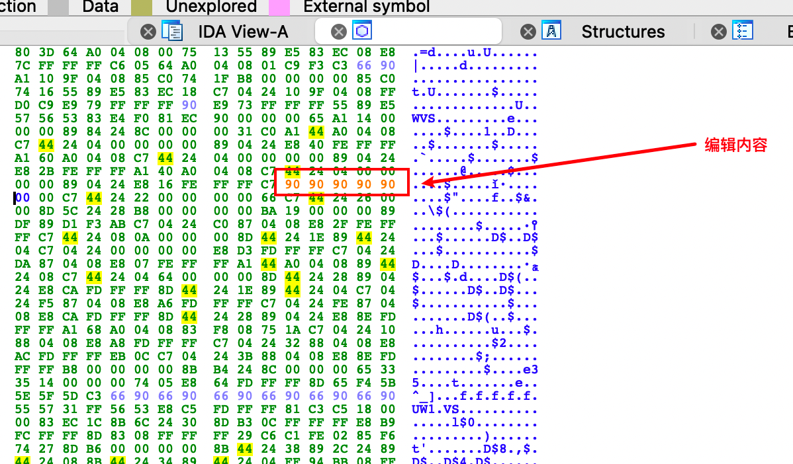
## 结构体窗口
Structures，用于显示IDA决定在被分析的二进制文件中使用的任何复杂的数据结构Struct、Union等；
窗口前4行介绍了窗口可以进行的操作：
- Ins/Del：创建/删除结构体；
- D/A/\*：创建结构体成员类型（数据/ASCII/数组）；
- N：重命名结构体或结构体成员；
- U：删除结构体成员；
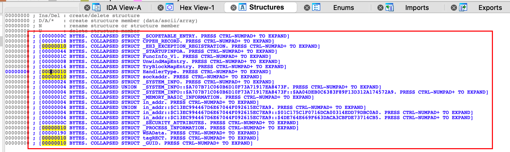
展开结构体：右键→Unhide/双击查看详细布局；
关闭结构体：右键→Hide/双击；
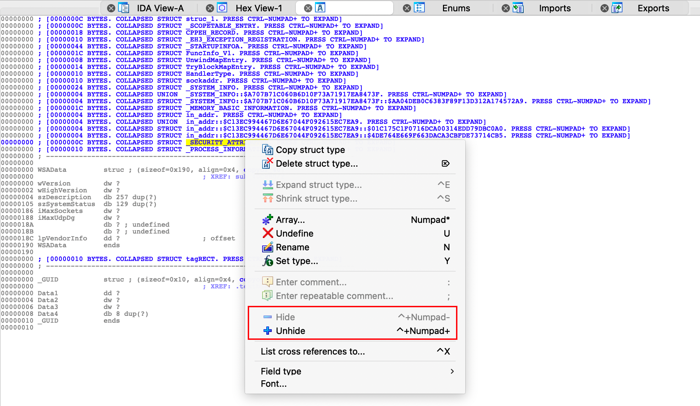
添加结构体：i
导入标准结构体Add standard struct；
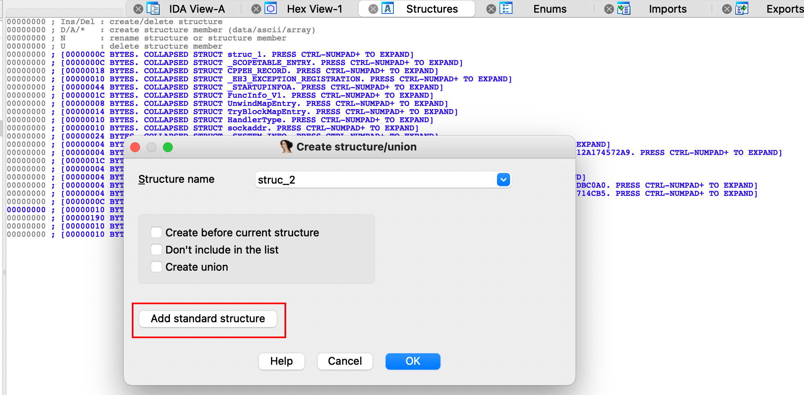
## 枚举窗口
Enums，类似结构体窗口，显示检测到的标准枚举类型；
窗口前3行介绍了窗口可以进行的操作：
- Ins/Del/ctrl+E：创建/删除/编辑枚举类型；
- N/ctrl+N：创建/编辑符号常数；
- ;/:：为当前项目做注释；
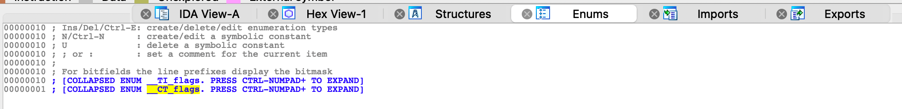
展开枚举详情：右键→Unhide/双击；
关闭枚举详情：右键→Hide/双击；
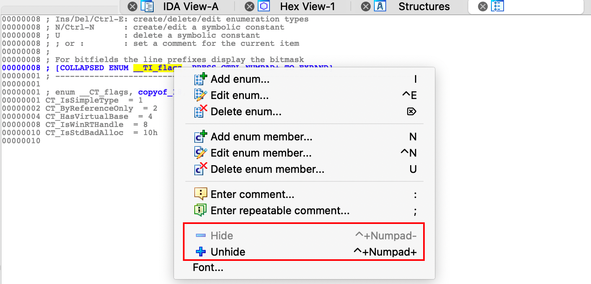
## 导入窗口
Imports，列举程序的导入函数列表，列出了可执行文件调用的所有函数包括函数名称、包含该函数的库的名称、相关函数的虚拟地址；
双击函数，将跳转到反汇编窗口的函数地址处；
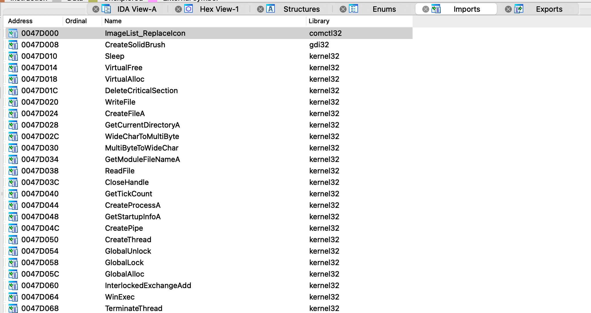
备注：针对静态链接的程序，不存在外部依赖关系，只有在改程序使用共享库时，才会用到本窗口；
## 导出窗口
Exports，列举程序的执行入口点以及任何由文件导出给其他文件使用的函数和变量，包括名称、对应的虚拟地址；
双击，将跳转到反汇编窗口的对应地址处；
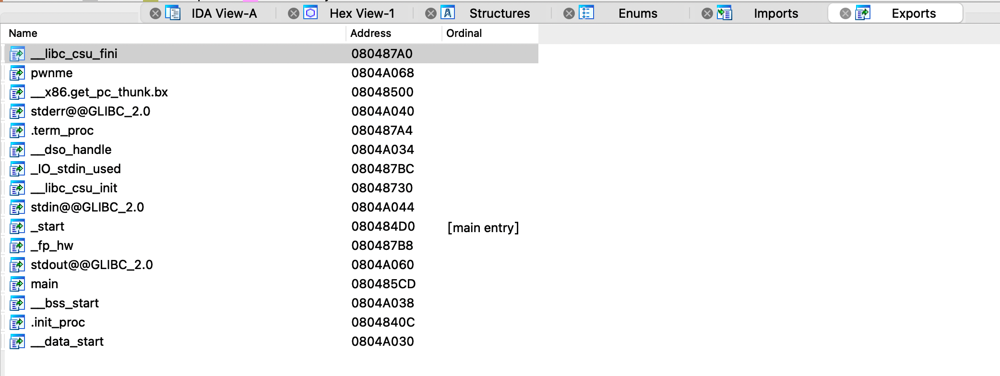
## 输出窗口
Output window，主要用于反馈文件分析进度、状态消息、错误消息等，同时还可以运行python和IDC；
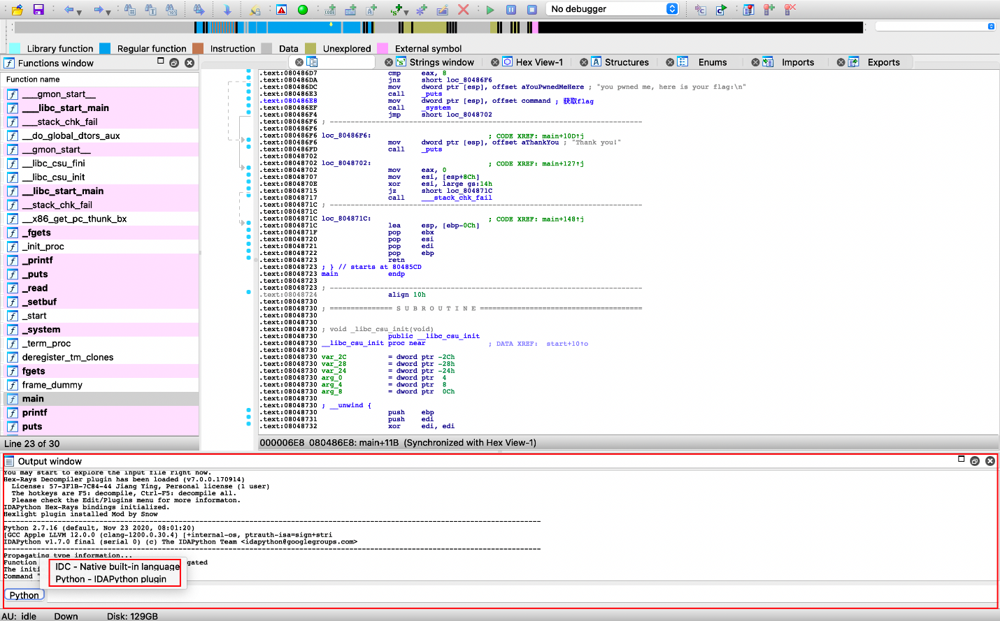
## 字符串窗口
Strings window，显示的从二进制文件中提取的一组组字符串，双击窗口中的字符串，反汇编窗口将跳转到该字符串所在的地址处，将字符串窗口与交叉引用结合使用，可以快速定位程序中任何引用该字符串的位置；
打开方式：View→Open Subviews→Strings；
快捷键：shift+F12；
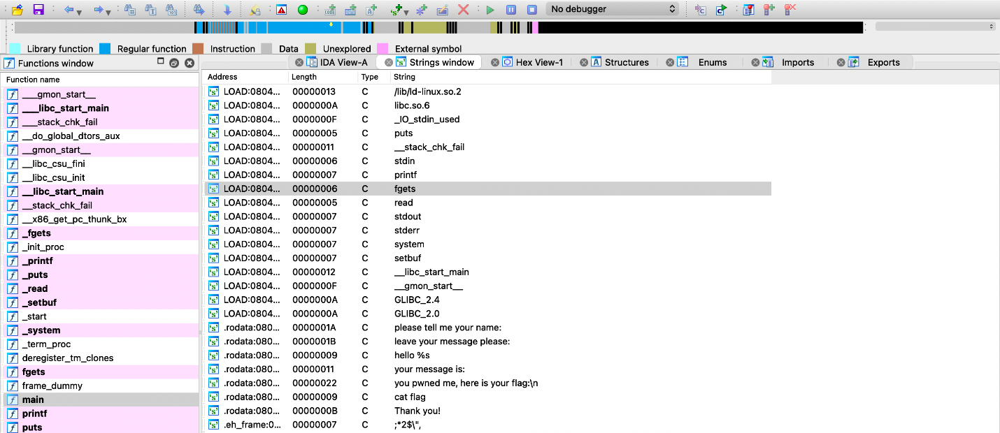
在字符串窗口右键→Setup，可以设置扫描的字符串类型；
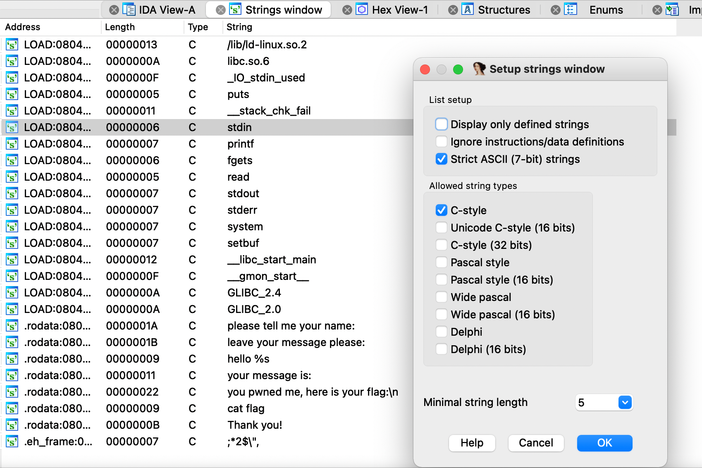
## 工具栏
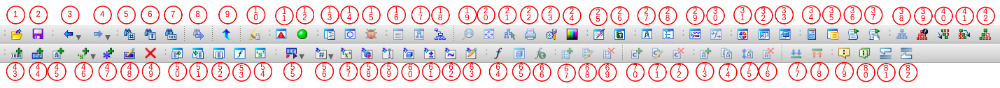
标号功能
|    |                                                                   |
|-----|--------------------------------------------------------------------|
| 1   | 加载新的文件或数据                                                 |
| 2   | 保存当前项目                                                       |
| 3   | 后退到上次保存位置                                                 |
| 4   | 前进到下一个保存位置                                               |
| 5   | 搜索立即数                                                         |
| 6   | 搜索字符字符串                                                     |
| 7   | 搜索字节序列                                                       |
| 8   | 搜索下一个项目                                                     |
| 9   | 切换向上/向下搜索                                                  |
| 10  | 锁定高亮                                                           |
| 11  | 打开问题窗口                                                       |
| 12  | 切换是否允许分析                                                   |
| 13  | 打开反编译窗口                                                     |
| 14  | 打开十六进制窗口                                                   |
| 15  | 打开调试窗口                                                       |
| 16  | 切换到文本反编译窗口                                               |
| 17  | 切换到图形反编译窗口                                               |
| 18  | 切换到函数级别的窗体结构信息                                       |
| 19  | 设置图形不放大                                                     |
| 20  | 设置合适的图形大小                                                 |
| 21  | 显示图形布局                                                       |
| 22  | 打印图形                                                           |
| 23  | 设置图形选项                                                       |
| 24  | 设置图形颜色                                                       |
| 25  | 打开签名窗口                                                       |
| 26  | 打开类窗口                                                         |
| 27  | 打开结构体窗口                                                     |
| 28  | 打开枚举窗口                                                       |
| 29  | 打开交叉引用窗口                                                   |
| 30  | 打开函数调用窗口                                                   |
| 31  | 显示段窗口                                                         |
| 32  | 显示段寄存器窗口                                                   |
| 33  | 显示选择器窗口                                                     |
| 34  | 打开计算器                                                         |
| 35  | 打开记事本对数据库做注释                                           |
| 36  | 执行脚本命令                                                       |
| 37  | 执行脚本文件                                                       |
| 38  | 绘制当前函数流程图                                                 |
| 39  | 绘制函数调用流程图                                                 |
| 40  | 绘制**到**程序的当前地址/选定地址范围的参照图                      |
| 41  | 绘制**来自**程序的当前地址/选定地址范围的参照图                    |
| 42  | 绘制**来自/至**程序的当前地址/选定地址范围的用户自定义的外部参照图 |
| 43  | 转换为指令                                                         |
| 44  | 转换为数据                                                         |
| 45  | 声明结构体变量                                                     |
| 46  | 转换为字符串                                                       |
| 47  | 转换为数组                                                         |
| 48  | 重命名当前位置                                                     |
| 49  | 转换为未定义类型                                                   |
| 50  | 显示导入窗口                                                       |
| 51  | 显示导出窗口                                                       |
| 52  | 显示名称窗口                                                       |
| 53  | 显示函数窗口                                                       |
| 54  | 显示字符串窗口                                                     |
| 55  | 数据段操作数偏移                                                   |
| 56  | 操作数转换为数字                                                   |
| 57  | 操作数转换为字符串                                                 |
| 58  | 操作数转换为段基                                                   |
| 59  | 操作数转换为符号常量                                               |
| 60  | 操作数转换为堆栈变量的偏移量                                       |
| 61  | 更改当前操作数的符号                                               |
| 62  | 对当前操作数执行位求反                                             |
| 63  | 手动输入当前操作数                                                 |
| 64  | 创建新函数或编辑函数属性                                           |
| 65  | 打开当前函数的堆栈变量窗口                                         |
| 66  | 指定当前函数的命名                                                 |
| 67  | 定义新的枚举类型                                                   |
| 68  | 编辑选中的枚举类型                                                 |
| 69  | 删除选中的枚举类型                                                 |
| 70  | 为枚举类型添加符号常量                                             |
| 71  | 编辑符号常量                                                       |
| 72  | 删除符号常量                                                       |
| 73  | 声明新的结构体/枚举类型                                            |
| 74  | 复制选中的结构体/枚举类型                                          |
| 75  | 编辑结构体类型                                                     |
| 76  | 删除结构体/枚举类型                                                |
| 77  | 向结构体中插入未定义的字符序列                                     |
| 78  | 从结构体中删除未定义的字符串                                       |
| 79  | 创建常规注释                                                       |
| 80  | 创建交互注释                                                       |
| 81  | 创建行前注释                                                       |
| 82  | 创建行后注释                                                       |
## 分布导航
显示被加载文件地址空间线性视图，不同位置代表功能如下，可根据需要快速跳转到相关代码处；
- Library function：库函数
- Regular function：规则函数
- Instruction：指令
- Data：数据
- Unexplored：未查询区域
- External symbol：外部符号

通过右键→zoom调节线性图的显示比例；
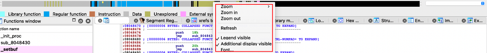
# 附录
## IDA常用快捷键
快捷键说明
|             |                                                |
|--------------|-------------------------------------------------|
| B            | 将当前指令/数据的立即操作数类型转换为二进制数   |
| C            | 数据解析成代码                                  |
| D            | 代码解析成数据                                  |
| G            | 跳转到指定地址查看                              |
| H            | 将当前指令/数据的立即操作数类型转换为十进制数   |
| Q            | 将当前指令/数据的立即操作数类型转换为十六进制数 |
| R            | 将当前指令/数据的立即操作数类型转换为字符       |
| X            | 查看函数的交叉引用                              |
| Space        | 列表视图与图形视图切换                          |
| Tab          | 在反汇编视图和伪代码视图之间切换                |
| Esc          | 跳转到返回前的地址                              |
| F5           | 生成反汇编窗口中的函数对应的伪代码              |
| ctrl+shift+W | 拍摄快照                                        |
| shift+F12    | 打开字符串窗口                                  |
| ctrl+B       | 查找下一个字节序列                              |
| opt+T        | 搜索字符串                                      |
## IDA快捷键总结
快捷键说明
|             |                                                                                                   |
|--------------|----------------------------------------------------------------------------------------------------|
| B            | 将当前指令/数据的立即操作数类型转换为二进制数                                                      |
| C            | 数据解析成代码                                                                                     |
| D            | 代码解析成数据                                                                                     |
| G            | 跳转到指定地址查看                                                                                 |
| H            | 将当前指令/数据的立即操作数类型转换为十进制数                                                      |
| K            | 将当前指令的立即操作数类型转换为堆栈变量的偏移量                                                   |
| L            | 创建对齐指令,替换链接器插入的许多无用字节，用于将代码和数据对齐到段落边界或等于2的幂的任何其他地址 |
| M            | 将当前指令/数据的立即操作数类型转换为枚举成员                                                      |
| N            | 重命名                                                                                             |
| O            | 将当前指令/数据的立即数转换为当前数据段（DS）的偏移量                                              |
| Q            | 将当前指令/数据的立即操作数类型转换为十六进制数                                                    |
| R            | 将当前指令/数据的立即操作数类型转换为字符                                                          |
| S            | 将当前指令/数据的立即操作数类型转换为段基                                                          |
| T            | 将范围选择中的所有指令立即数转换为通过结构及其可能的子联合的偏移路径                               |
| V            | 将常规寄存器重命名为一些有意义的名称                                                               |
| X            | 查看函数的交叉引用                                                                                 |
| Y            | 指定当前函数的命名                                                                                 |
| Space        | 列表视图与图形视图切换                                                                             |
| Tab          | 在反汇编视图和伪代码视图之间切换                                                                   |
| Esc          | 跳转到返回前的地址                                                                                 |
| F5           | 生成反汇编窗口中的函数对应的伪代码                                                                 |
| F6           | 显示下一个打开的窗口                                                                               |
| ctrl+A       | 查找下一个定义的字节序列                                                                           |
| ctrl+B       | 查找下一个字节序列                                                                                 |
| ctrl+D       | 查找下一条数据                                                                                     |
| ctrl+E       | 显示入口点列表                                                                                     |
| ctrl+F       | 搜索错误操作数                                                                                     |
| ctrl+G       | 跳转到指定寄存器                                                                                   |
| ctrl+I       | 查找下一个立即数                                                                                   |
| ctrl+J       | 列出到光标位置的交叉引用                                                                           |
| ctrl+K       | 打开当前函数的堆栈变量窗口                                                                         |
| ctrl+L       | 跳转到指定命名位置处                                                                               |
| ctrl+M       | 选择一个标签并跳转                                                                                 |
| ctrl+O       | 将当前指令/数据的立即数转换为当前段（CS）的偏移量                                                  |
| ctrl+P       | 跳转到选定的函数处                                                                                 |
| ctrl+Q       | 跳转到有问题的位置                                                                                 |
| ctrl+R       | 将当前指令/数据的立即数操作数转换为复数偏移量表达式                                                |
| ctrl+S       | 跳转到指定段的段头                                                                                 |
| ctrl+T       | 查找下一个字符串                                                                                   |
| ctrl+U       | 查找下一个未定义字节序列                                                                           |
| ctrl+V       | 搜索下一个无效的位置                                                                               |
| ctrl+W       | 保存                                                                                               |
| ctrl+X       | 列出光标位置到达的交叉引用                                                                         |
| ctrl+Z       | 强制零偏移                                                                                         |
| ctrl+1       | 查看窗口列表                                                                                       |
| ctrl+-       | 隐藏反汇编代码                                                                                     |
| ctrl+;       | 创建交叉注释                                                                                       |
| ctrl++       | 显示隐藏的反汇编代码                                                                               |
| ctrl+opt+P   | 查看修改的字节                                                                                     |
| ctrl+shift+W | 拍摄快照                                                                                           |
| ctrl+F5      | 创建C文件                                                                                          |
| ctrl+F9      | 加载解析C头文件                                                                                    |
| ctrl+F12     | 绘制程序中所有的函数调用流程图                                                                     |
| opt+A        | 设置字符串编码                                                                                     |
| opt+B        | 搜索字节序列                                                                                       |
| opt+C        | 查找下一条指令                                                                                     |
| opt+D        | 设置数据类型                                                                                       |
| opt+G        | 创建或更改段寄存器值                                                                               |
| opt+I        | 搜索立即数                                                                                         |
| opt+K        | 指定当前指令如何修改堆栈指针（SP）                                                                 |
| opt+L        | 从光标处开始选择                                                                                   |
| opt+M        | 添加标签                                                                                           |
| opt+P        | 编辑函数                                                                                           |
| opt+Q        | 声明新的结构体                                                                                     |
| opt+R        | 将当前指令/数据的立即数转换为任何段的偏移量                                                        |
| opt+S        | 更改除段基础以外的所有段属性                                                                       |
| opt+T        | 搜索字符串                                                                                         |
| opt+Y        | 从当前光标位置显示对联合的引用                                                                     |
| opt+.        | 将光标放置在Output window中的命令行输入上                                                          |
| opt+F1       | 自定义操作数                                                                                       |
| opt+F2       | 指定程序中指令或数据的表示形式                                                                     |
| opt+F3       | 关闭当前打开的窗口                                                                                 |
| opt+F7       | 加载用户自定义的IDC或IDA python脚本                                                                |
| opt+F9       | 查看添加的脚本                                                                                     |
| opt+F10      | 创建ASM文件                                                                                        |
| shift+E      | 转换为结构体                                                                                       |
| shift+Fn+#   | 将当前指令/数据的立即操作数类型转换为数字                                                          |
| shift+Fn+\*  | 转换为数组                                                                                         |
| shift+Fn+:   | 创建常规注释                                                                                       |
| shift+Fn+?   | 打开简单计算器                                                                                     |
| shift+Fn+\~  | 将当前操作数按位取反                                                                               |
| shift+F2     | 输入并执行以内置IDC语言或任何其他注册的extlang编写的脚本                                           |
| shift+F4     | 打开名称窗口,显示函数和参数的命名列表                                                              |
| shift+F5     | 打开签名窗口                                                                                       |
| shift+F6     | 显示上一个打开的窗口                                                                               |
| shift+F7     | 打开段窗口，显示所有段列表                                                                         |
| shift+F8     | 打开寄存器窗口，显示所有段的寄存器信息                                                             |
| shift+F9     | 打开结构体窗口                                                                                     |
| shift+F10    | 打开枚举窗口                                                                                       |
| shift+F11    | 打开类库窗口                                                                                       |
| shift+F12    | 打开字符串窗口                                                                                     |
| shift+cmd+F  | 切换独立窗口显示                                                                                   |
参考：<https://www.hex-rays.com/products/ida/support/idadoc/index.shtml>
