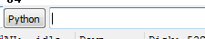
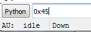
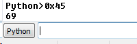
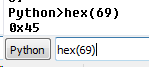
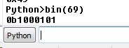
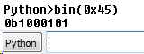
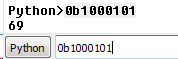
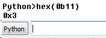
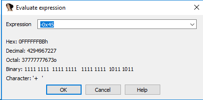
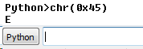

IDA界面的底部有一个可以执行Python语句的文本框。这个功能可以让IDA使用者很方便的在各种进制之间切换：

如果输入**0x45**会被解析成十六进制数，因为前缀有**0x**。按**Enter(回车)**就可以将十六进制转换为十进制。

十六进制数**0x45**的转换结果如下图：

十六进制的**0x45**转换为十进制69。如果想将再转换回去，必须使用**hex()**函数，hex(69)结果如下图所示：

要转换为二进制，可以使用**bin()**函数：

**hex(0x45)**转换为二进制的结果数是**1000101**，因为前缀有**0B**，说明这是一个二进制数。得到的二进制数还可以用同样的方法转换为十进制或十六进制。

这个功能的作用就是Python栏里中输入数字，按Enter(回车)后将结果显示为十进制，也可以使用Python函数**hex()**或**bin()**把数字分别转换成Hex(十六进制)或Binary(二进制)。

*来自 \<<https://www.cnblogs.com/17bdw/p/12286079.html>\>*
**0x02、十六进制中的正负数表示**
逆向过程中在常常会接触到十六进制，32位表示负数的十六进制数又是怎么表示的呢？
十六进制正数的补是它本身。负数的补码是它本身的值每位求反,最后再加一。在32位二进制数中，可以使用第一位来表示0（正）还是1（负）。在IDA窗口**VIEW(视图)-\>CALCULATOR(计算器)**，可以调出这个窗口。

*来自 \<<https://www.cnblogs.com/17bdw/p/12286079.html>\>*

转换字符的另一种方法是使用Python的**chr()**函数：

*来自 \<<https://www.cnblogs.com/17bdw/p/12286079.html>\>*

**Python ASCII码与字符相互转换**
print( c + " 的ASCII 码为", ord(c))
print( a , " 对应的字符为", chr(a))

*来自 \<<https://www.runoob.com/python3/python3-ascii-character.html>\>*

十进制 print()
