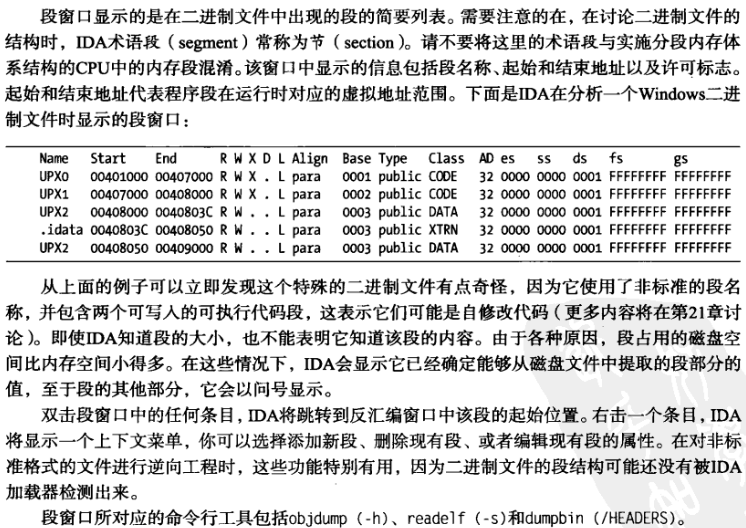

# 5 数据显示窗口 
# （view -\> open subviews打开）
主要

反汇编窗口 （options -\> general -\>graph 里的use graph view by default切换默认)

IDA图形视图 ( 可拖动 \| 分组折叠 \| 可以打开多个窗口 \| 9章更多)

IDA文本视图 ( options -\> general-\>disassembly 图形加行前缀 \| 跳转箭头分类 \| 栈帧 \| 交叉引用 )

函数窗口 ( 段 \| 地址 \| 大小 \| 变量 参阅内部文档或右键函数properties)

输出窗口

次要

十六进制窗口 ( 进制 \| 可打开多个 \| 与反汇编窗口同步 \| F2 Edit \| 全是问号 可能是bss)

导出窗口

导入窗口

结构体窗口 (8章展开

枚举窗口

其他 (默认不打开)

strings窗口 (view\>open subviews\>strings(shift F12) \| 交叉引用 单机4下 \| 每次打开都扫描 \| 右键选setup 设置扫描类型: unicode等 仅显示已定义的 忽略指令)

names窗口 ( 全局 \| 自动生成的名称 )

段窗口 ( 可编辑段 )

签名窗口 (自动识别库函数 编译器 \| 12章 自定义签名)

类型库窗口 (13章)

函数调用窗口 (9章 xrefs 交叉引用)

问题窗口 ( BOUNDS 指令不知道要跳转到哪里 \| DECISION 指令从没被引用)
