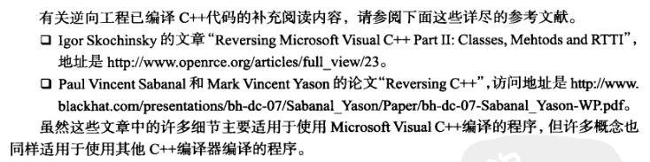

# 8 数据类型与数据结构
设置函数类型（Edit\>Functions\>Set Function Type 或Y）

函数类型的格式 （寄存器@\<eax\>）

IDA支持用户定义的调用规则。在调用规则中用户可以显式指定参数位置和返回值。例如：

int \_\_usercall func\<ebx\>(int x, int y\<esi\>);

*来自 \<<https://www.cnblogs.com/shangdawei/p/3339753.html>\>*
[IDA Help: Set function/item type (hex-rays.com)](https://hex-rays.com/products/ida/support/idadoc/1361.shtml)

识别数据结构的用法

数组成员访问

全局分配的数组 （如果用常量索引，对应的元素将变为全局变量）

栈分配的数组

堆分配的数组

结构体成员访问 （使用固定的偏移量）

控制对齐

全局 （看起来就像分散的变量）

栈

堆

结构体数组

创建IDA结构体(structures窗口）

创建一个新的结构体(或联合) (INSERT键）

编辑结构体成员 （ D 添加新字段、修改\|N 改名\|U 删除最后一个字段、如果不是最后一个取消字段但是不释放空间\|自己负责对齐\| 数字键盘+-键 折叠定义\| A \| 数字键盘的\*键 ）

用栈帧作为专用结构体

使用结构体模板 （右键常量 structure offset \|打开栈帧 再使用 ALT+Q 选择结构体）

导入新的结构体

解析C结构体声明 （View\>Open Subviews\>Local Types 通过INSERT插入新的类型 \| 将本地类型导入到Structures窗口 右键选择Synchronize to idb 或见下一节）

解析C头文件 （File\>LoadFile\>ParseCHeaderFile 会添加到标准结构体列表中，不会添加到Structures，要添加见下一节）

使用标准结构体(structures窗口 \>INSERT\> add standard structure \| 例子 PE头结构）

IDA TIL文件

TIL文件 （Types窗口 列出til View\>Open subview\>Type Libraries)

加载新的TIL文件 (INSERT)

共享TIL文件

C++逆向工程基础

this指针 （ VC++ thiscall this被传到ECX \| g++ 将this作为第一个参数压栈）

虚函数和虚表( 虚表 指向虚函数指针的表 \| 虚表指针 是多出来的！类的第一个成员）

对象生命周期 (构造函数 析构函数 \| 虚表只在上面两个函数中被直接调用）

名称改编（ Options\>Demangled Names 打开关闭注释）

运行时类型识别 （虚表前放置一个指针指向一个结构体可以看到类型信息\| RTTI信息也可能丢失）

继承关系

C++逆向工程参考文献

