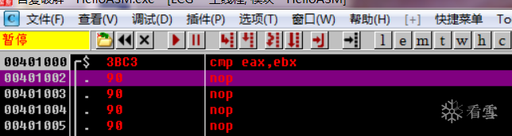
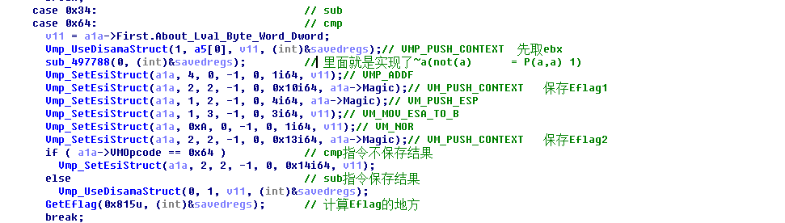
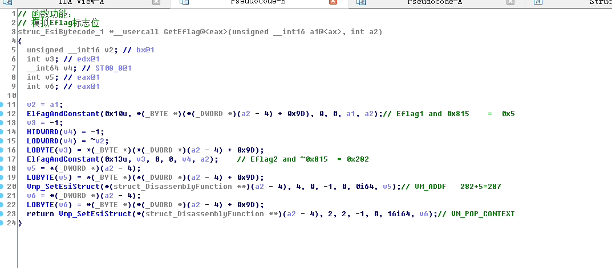
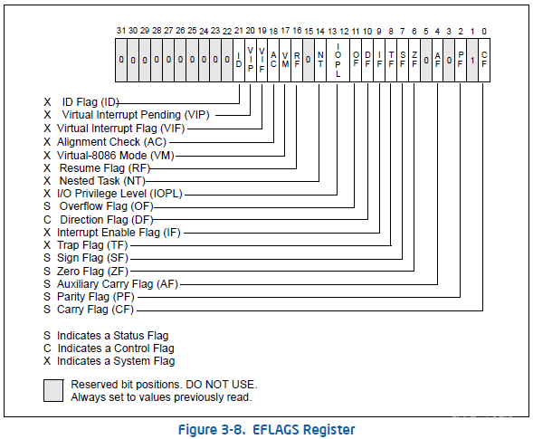
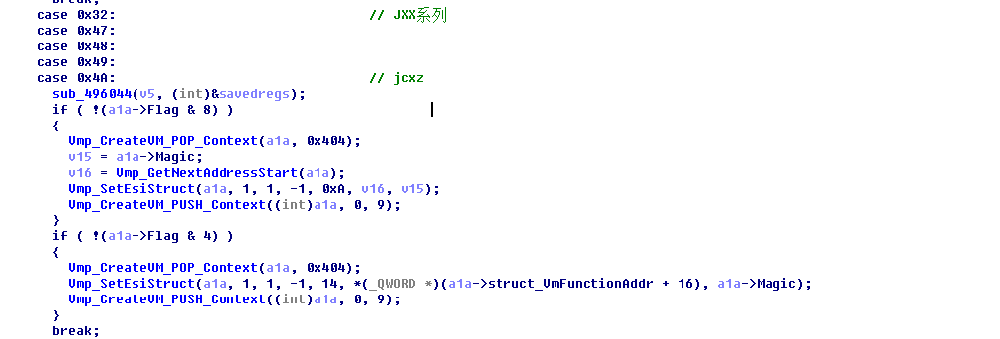
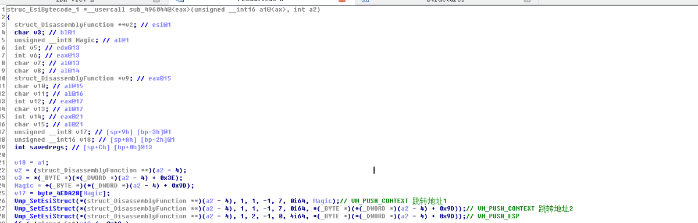
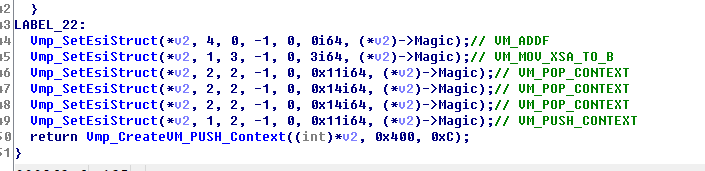
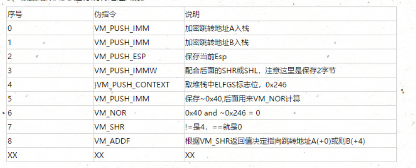

\[分享\]VMP学习笔记之万用门（七）-加壳脱壳-看雪论坛-安全社区\|安全招聘\|bbs.pediy.com
星期五, 八月 20, 2021
2:16 下午
已剪辑自: <https://bbs.pediy.com/thread-254445.htm>
如果有错误请各位指正  

第七章内容：
主题：万用门介绍
1、NOR实现逻辑运算
2、cmp实现（sub）
3、jxx实现

参考资料：
1、[破解vmp程序的关键点](https://bbs.pediy.com/thread-82618.htm)
2、[谈谈vmp的爆破](https://bbs.pediy.com/thread-224732.htm)
3、[一个VMP1.20程序的伪指令总结](https://bbs.pediy.com/thread-54535.htm)

正文：
1、万用门实现逻辑指令
理论知识：
vmp里面只有1个逻辑运算指令 not_not_and 设这条指令为P
P(a,b) = \~a & \~b

这条指令的神奇之处就是能模拟 not and or xor 4条常规的逻辑运算指令
怕忘记了，直接给出公式，后面的数字指需要几次P运算

not(a) = P(a,a) 1
and(a,b) = P(P(a,a),P(b,b)) 3
or(a,b) = P(P(a,b),P(a,b)) 2
xor(a,b) = P(P(P(a,a),P(b,b)),P(a,b)) 5

2、模拟CMP减法指令
理论知识：
参考S大的图

总结：
通过上述我们可以将操作步骤分为两个部分：
1、模拟sub减法指令
\~(\~a+b)
2、模拟Eflag标志位
int Eflag1 = (\~a+b)
int Eflag2 = \~(\~a+b)
int Eflag=（Eflag1 and 0x815） +（Eflag2 and \~0x815）

通过试验证明公式：
随便改个demo去加密看看VMP是如何实现的

假设：eax = 77523C33 ebx= 7FFD3000
模拟出正确结果：eax-ebx=F7550C33
模拟出正确标志：Elag287

2、1 模拟减法指令
公式：\~(\~a+b)
假设：eax = 0x77523C33 ebx= 0x7FFD3000
模拟出正确：eax - ebx = 0xF7550C33
0\~2 行模拟出\~a a = 0x88ADC3CC
3 行(\~A+B) (\~A+B) = 0x08AB03CC Eflag1 = 0x207
4 行保存Eflag1
5\~6 行取出 (\~A+B)的结果
7 行 \~(\~a+b) \~(\~a+b) =0xF7550C33 Eflag2 = 0x286
8 行保存Eflag2
剩下的cmp跟sub唯一区别：sub保留结果、cmp不保留结果

总结：
我们得到两个关键的数据分别是：
int Eflag1 = (\~a+b) 207
int Eflag2 = \~(\~a+b) 286

2、2 模拟Eflag标志位
公式：
int Eflag1 = (\~a+b)
int Eflag2 = \~(\~a+b)
int Eflag=（Eflag1 and 0x815） +（Eflag2 and \~0x815）
第一个ElfagAndConstant模拟出 Eflag1 and 0x815 = 0x5
第二个ElfagAndConstant模拟出 Eflag2 and \~0x815 = 0x282
然后就VM_ADDF = 0x282+0x5= 0x287
最后VM_POP_CONTEXT 保存0x287标志位

细看第一个ElfagAndConstant函数（就是模拟and指令）第二个同理
VM_PUSH_CONTEXT 取 Eflag1 = 0X207
VM_PUSH_CONTEXT 取 Eflag1 = 0X207
VM_NOR \~Eflag1 = 0XFFFFFFFFFFFFFDF8
VM_PUSH_IMM \~815 = 0X7EA
VM_NOR \~Eflag1 and \~0X7EA = 207 and 815
转了一圈发现是模拟and(a,b) = P(P(a,a),P(b,b)) 3
那么第一个（Eflag1 and 0x815） = 0x207 and 0x815 = 0x7

2、3 题外话
感谢群里小零大佬提供0x811与0x815等价
811其实就是
OF，AF，CF
而
PF，ZF，SF不管是add还是sub，or，and计算出来都是一样的

通过nor计算出PF，ZF，SF和
add出来的标志位合并一下就好了

3、模拟JXX指令
理论知识：

EFLAGS中的状态标志

EFLAGS的状态标志代表什么意思呢？它们代表的是算数指令（arithmetic instruction）的结果状态，算数指令就是大家熟悉的的加减乘除，ADD，SUB，MUL和DIV，当然还有很多其他指令暗含有这些基本的算数指令，比如cmp指令就暗含有sub操作，因此cmp也会影响状态标志。
typedef struct \_EFLAGS
{
unsigned CF : 1; // 进位或错位
unsigned Reservel1 : 1; // 对Dr0保存的地址启用 全局断点
unsigned PF : 1; // 计算结果低位包含偶数个数1时 此标志位1
unsigned Reservel2 : 1; // 对Dr0保存的地址启用 全局断点
unsigned AF : 1; // 辅助进位标志 当位3处 有进位或结尾时 该标志为1
unsigned Reservel3 : 1; // 保留
unsigned ZF : 1; // 计算结果为0时 此标志位1
unsigned SF : 1; // 符号标志 计算结果为负时 该标志位1
unsigned TF : 1; // 陷阱标志 此标志为1时 CPU每次仅会执行一条指令
unsigned IF : 1; // 中断标志 为0时禁止响应（屏蔽中断） 为1回复
unsigned DF : 1; // 方向标志
unsigned OF : 1; // 溢出标志 计算结果超过表达范围为1 否则为0
unsigned IOPL : 2; //用于标明当前任务的I/0特权级
unsigned NT : 1; // 任务嵌套标志
unsigned Reservel4 : 1; // 对Dr0保存的地址启用 全局断点
unsigned RF : 1; // 调试异常相应标志位 为1禁止相应指令断点异常
unsigned VM : 1; // 为1时启用虚拟8086模式
unsigned AC : 1; // 内存对齐检查标志
unsigned VIF : 1; // 虚拟中断标志
unsigned VIP : 1; // 虚拟中断标志
unsigned ID : 1; // cpuID检查标志
unsigned Reservel5 : 1; // 保留
}EFLAGS, \*PEFLAGS;

关系运算和条件跳转的对应

通过试验证明公式：
随便改个demo去加密看看VMP是如何实现的
jxx需要保存了两个地址信息分别是：跳转成立（401005）与跳转不成立（401004）两种

总结：
1、jxx我们需要准备两个跳转地址。
2、判断Eflag特定位数的值是否为1，然后进行相应的跳转
3、我们写的demo中ZF标志位必然是成立的，jz XXX是跳的401005

3、1 实践（ZF）
1、关于jxx处理的函数地址，只关注0x32的jxx系列

2、首先Push两个加密跳转地址，后面根据运算结果来判断使用哪个地址
具体跳转地址A还是地址B取决于前面一句cmp ebx,ebx

3、计算出Eflags右移X位 \> Size，我们的例子flags是0x40，Size_1=4,那么v8就是4次了

4、首先取Eflags标志位，再压入\~0x40入栈，最后再进行NOR（\~0x40, Eflags ）操作
可以简化成0x40 and \~ Eflags  

5、根据VM_NOR结果取决使用哪个地址：+0地址1 +4地址2

6、总结下前面流程
整理下流程（数据参考demo）可以分为三步骤：
1、保存跳转地址A和B
2、计算eflags zf的数值，返回对应的结果
公式：
ZF = 0x40 and \~ELFGS
3、根据结果ADD进行跳转地址A或B

伪代码如下：

7、OD实战数据
VM_PUSH_IMM 加密地址A入栈(401004)
0012FF88 4C69E901 加密地址A

VM_PUSH_IMM 加密地址B入栈(401005)
0012FF84 4C69F601 加密地址B
0012FF88 4C69E901 加密地址A

VM_PUSH_ESP
0012FF80 0012FF84 保存ESP，后面+0还是+4来指向加密地址A、B
0012FF84 4C69F601
0012FF88 4C69E901

VM_PUSH_IMMW 配合后面的SHR或SHL
0012FF7E FF840004 注意这个4，后面与VM_NOR的结果做运算

VM_PUSH_CONTEXT 取ELFGS标志位
0012FF7A 00000246    这里取出了Elfgs的值，前面cmp ebx,ebx执行完毕的值

PUSH_IMM
0012FF76 FFFFFFBF 保存\~0x40的值，后面要跟Elfgs运算

VM_NOR
0012FF7A 00000000 0x40 and \~0x246 = 0 ,相同0，不同0x40

VM_SHR              注意这里是区分跳转A和B的关键
0012FF7C 00000000 相同=0，不同=4
0012FF80 0012FF84
0012FF84 4C69F601
0012FF88 4C69E901

ADD_F 判断+0还是+4来指向加密跳转地址A还是B
0012FF80 0012FF84 根据SHR的结果 0(4) + 0x12FF84
0012FF84 4C69F601
0012FF88 4C69E901

VM_MOV_XSA_TO_B 取地址的值
0012FF80 4C69F601
0012FF84 4C69F601
0012FF88 4C69E901

后面的操作就是解密跳转地址，然后设置Esi的值跳到401005执行。懒的写下去了，核心都写完了。

[\[注意\] 招人！base上海，课程运营、市场多个坑位等你投递！](https://bbs.pediy.com/thread-267474.htm)
最后于 2019-9-14 18:17 被黑手鱼编辑 ，原因：
