阮一峰：RSA算法原理（一）
星期一, 八月 9, 2021
2:37 下午

已剪辑自: <https://blog.csdn.net/yiguang_820/article/details/108842637>
前提：
### 非对称加密
### 非对称应用场景
既然对称加密存在局限性，那么有没有这样一种加密方式，即便鲍勃和爱丽丝从未见过面，也能够让他们实现安全通信？答案就是采用非对称加密。
### 可行性
所谓非对称加密，说白了就是加密和解密用的密钥不一样。有很多文章会说公钥用来加密，私钥用来解密，这样就能实现安全的通信，然而可能很多朋友会有和我一样的疑问，加密和解密的密钥都不一致，还能将密文还原回去吗？答案是可以，我这里将引用知乎上一位答主的回答，代入到上述的例子中。[原回答点这里](https://www.zhihu.com/question/302292187/answer/534768362)
1.  首先鲍勃想给爱丽丝发点羞羞的内容，于是他写了第一封信，告诉爱丽丝，我想要给你发送一些内容，但是不能被除了你以外的人看到。在送信途中，不怀好意的邮差打开信知道了他们会传一些不可告人的秘密，于是邮差打算每次都拆开信看看这个秘密到底是什么。爱丽丝收到信后，于是给鲍勃写回信，告诉他密钥是（3233，17），用这个密钥加密数据后发给我就行。比如你要传输**X**给我，那你就按照这个方式加密：X 17 m o d 3233 = Y X^{17}mod3233 = YX17mod3233=Y假设你要传44，44的17次方除以3233得到的余数是678，你只需要把678传给我就行了。
2.  爱丽丝把回信写好后给邮差，邮差又悄悄打开看了信的内容，发现了这个加密方法，心想到时候我做一下逆运算，不就知道你实际想传的东西了嘛，嘿嘿嘿。
3.  鲍勃收到爱丽丝的回信后，打算给她传个520，暗送秋波。于是鲍勃按照爱丽丝提到的方法，用计算得到52 0 17 m o d 3233 = 1077 520^{17}mod3233=107752017mod3233=1077鲍勃将1077写在信中，激动地将信交给了邮差。
4.  邮差拿到信后，看着鲍勃一脸淫笑，心想这小子肯定没写啥好东西，于是偷偷拆开信，看到了信的内容是1077。邮差赶紧开始做逆运算，一个数的17次方再对3233取余是1077，那这个数是多少呢。。。邮差算了一会发现这尼玛太难算了，只能一个数字一个数字地尝试，万一这个数字很大，得算到猴年马月去。没办法，邮差只能老老实实地把信送到爱丽丝手上。
5.  爱丽丝收到了鲍勃的回信后，拿到1077，并没有开始做逆运算，而是掏出计算器，代入到这个解密公式中Y 2753 m o d 3233 = X Y^{2753}mod3233=XY2753mod3233=X计算得到107 7 2753 m o d 3233 = 520 1077^{2753}mod3233=52010772753mod3233=520，爱丽丝心领神会，脸上浮现出一抹娇红。
### 基本原理
在上面的例子中，爱丽丝将密钥给了鲍勃，也就是(3233,17)，而即便邮差知道了这个密钥，也知道了鲍勃给爱丽丝传的1077，但依旧没办法还原加密前的520。这也就是非对称加密的神奇之处。它充分利用了某些运算的不可逆性，比如上例中提到的取余运算。即便被人拦截了加密用的密钥和密文，也不能还原回原文，只有拥有私钥的人，才能够解密，也就是爱丽丝的2753这个数字。所以在非对称加密中，公钥（也就是上例中的17）可以公开，任何人都可以拥有，而私钥（2753）则必须妥善保存，不能泄露。
### 问题
### 问题一: 17，3233，2753是怎么来的
([原回答点击这里](https://www.zhihu.com/question/302292187/answer/534768362)）3233其实是两个质数的积，3233 = 61 ∗ 53 3233 = 61 \* 533233=61∗53。17和2753的生成必须用到这两个质数（其实是用到60和52这两个数，或者更准确的说它们的乘积3120，其中60 = 61 − 1 60=61-160=61−1和52 = 53 − 1 52=53-152=53−1）找到这样一对数字需要满足两个条件：
1.  两个数互质，所以一般来说第一个数直接找个质数比较好算，比如17。
2.  两个数的乘积除于3120余1，比如( 17 ∗ 2753 ) m o d 3120 = 1 (17 \* 2753) mod 3120 = 1(17∗2753)mod3120=1，这样的数自然可以找到好多对，我们选其中一对就可以了，比如这里选了17，2753。
### 问题二：有可能根据17和3233推测出2753吗？
理论上来说可以，前提是把3233分解成两个质数3233 = 61 ∗ 53 3233=61\*533233=61∗53，不过现在只是分解3233而已，一个数一个数地算也花不了太多时间，但是当数字特别大的时候，分解质因数就很困难了，目前没有什么直接的方法可以对大数进行质因数分解。
### 数学原理
今天看到一篇好文章，关于加密算法，收藏了觉得不过瘾，还是自己贴一遍，也能加深一下印象。
原文链接：http://www.ruanyifeng.com/blog/2013/06/rsa_algorithm_part_one.html
作者个人主页：http://www.ruanyifeng.com/home.html
下面进入正题（以下内容来自上面的作者）：
如果你问我，哪一种[算法](http://zh.wikipedia.org/wiki/%E7%AE%97%E6%B3%95)最重要？
我可能会回答["公钥加密算法"](http://zh.wikipedia.org/wiki/%E5%85%AC%E9%92%A5%E5%AF%86%E7%A0%81%E5%AD%A6)。

正文：
因为它是计算机通信安全的基石，保证了加密数据不会被破解。你可以想象一下，信用卡交易被破解的后果。
进入正题之前，我先简单介绍一下，什么是"公钥加密算法"。
**一、一点历史**
1976年以前，所有的加密方法都是同一种模式：
　　（1）甲方选择某一种加密规则，对信息进行加密；
　　（2）乙方使用同一种规则，对信息进行解密。
由于加密和解密使用同样规则（简称"密钥"），这被称为["对称加密算法"](http://zh.wikipedia.org/zh-cn/%E5%AF%B9%E7%AD%89%E5%8A%A0%E5%AF%86)（Symmetric-key algorithm）。
这种加密模式有一个最大弱点：甲方必须把加密规则告诉乙方，否则无法解密。保存和传递密钥，就成了最头疼的问题。

1976年，两位美国计算机学家Whitfield Diffie 和 Martin Hellman，提出了一种崭新构思，可以在不直接传递密钥的情况下，完成解密。这被称为["Diffie-Hellman密钥交换算法"](http://en.wikipedia.org/wiki/Diffie%E2%80%93Hellman_key_exchange)。这个算法启发了其他科学家。人们认识到，加密和解密可以使用不同的规则，只要这两种规则之间存在某种对应关系即可，这样就避免了直接传递密钥。
这种新的加密模式被称为"非对称加密算法"。
　　（1）乙方生成两把密钥（公钥和私钥）。公钥是公开的，任何人都可以获得，私钥则是保密的。
　　（2）甲方获取乙方的公钥，然后用它对信息加密。
　　（3）乙方得到加密后的信息，用私钥解密。
如果公钥加密的信息只有私钥解得开，那么只要私钥不泄漏，通信就是安全的。

1977年，三位数学家Rivest、Shamir 和 Adleman 设计了一种算法，可以实现非对称加密。这种算法用他们三个人的名字命名，叫做[RSA算法](http://zh.wikipedia.org/zh-cn/RSA%E5%8A%A0%E5%AF%86%E7%AE%97%E6%B3%95)。从那时直到现在，RSA算法一直是最广为使用的"非对称加密算法"。毫不夸张地说，只要有计算机网络的地方，就有RSA算法。
这种算法非常[可靠](http://en.wikipedia.org/wiki/RSA_Factoring_Challenge)，密钥越长，它就越难破解。根据已经披露的文献，目前被破解的最长RSA密钥是768个二进制位。也就是说，长度超过768位的密钥，还无法破解（至少没人公开宣布）。因此可以认为，1024位的RSA密钥基本安全，2048位的密钥极其安全。
下面，我就进入正题，解释RSA算法的原理。文章共分成两部分，今天是第一部分，介绍要用到的四个数学概念。你可以看到，RSA算法并不难，只需要一点[数论知识](http://jeremykun.com/2011/07/30/number-theory-a-primer/)就可以理解。

**二、互质关系**
如果两个正整数，除了1以外，没有其他公因子，我们就称这两个数是[互质关系](http://zh.wikipedia.org/zh-cn/%E4%BA%92%E7%B4%A0)（coprime）。比如，15和32没有公因子，所以它们是互质关系。这说明，不是质数也可以构成互质关系。
关于互质关系，不难得到以下结论：
　　1. 任意两个质数构成互质关系，比如13和61。
　　2. 一个数是质数，另一个数只要不是前者的倍数，两者就构成互质关系，比如3和10。
　　3. 如果两个数之中，较大的那个数是质数，则两者构成互质关系，比如97和57。
　　4. 1和任意一个自然数是都是互质关系，比如1和99。
　　5. p是大于1的整数，则p和p-1构成互质关系，比如57和56。
　　6. p是大于1的奇数，则p和p-2构成互质关系，比如17和15。
**三、欧拉函数**
　　请思考以下问题：
任意给定正整数n，请问在小于等于n的正整数之中，有多少个与n构成互质关系？（比如，在 1 到 8 之中，有多少个数与 8 构成互质关系？）
　　计算这个值的方法就叫做[欧拉函数](http://zh.wikipedia.org/wiki/%E6%AC%A7%E6%8B%89%E5%87%BD%E6%95%B0)，以φ(n)表示。在 1 到 8 之中，与 8 形成互质关系的是1、3、5、7，所以 φ(n) = 4。
　　φ(n) 的计算方法并不复杂，但是为了得到最后那个公式，需要一步步讨论。
　　**第一种情况**
　　如果n=1，则 φ(1) = 1 。因为 1 与任何数（包括自身）都构成互质关系。
　　**第二种情况**
　　如果n是质数，则 φ(n)=n-1 。因为质数与小于它的每一个数，都构成互质关系。比如 5 与1、2、3、4 都构成互质关系。
　　**第三种情况**
　　如果n是质数的某一个次方，即 n = p^k (p为质数，k为大于 1 的整数)，则
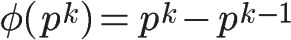
　　比如 φ(8) = φ(2^3) =2^3 - 2^2 = 8 -4 = 4。
　　这是因为只有当一个数不包含质数p，才可能与n互质。而包含质数p的数一共有p^(k-1) 个，即1×p、2×p、3×p、...、p^(k-1)×p，把它们去除，剩下的就是与n互质的数。
　　上面的式子还可以写成下面的形式：
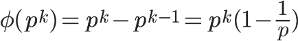
　　**第四种情况**
　　如果n可以分解成两个互质的整数之积，
n = p1 × p2
　　则
φ(n) = φ(p1p2) = φ(p1)φ(p2)
　　即积的欧拉函数等于各个因子的欧拉函数之积。比如，φ(56)=φ(8×7)=φ(8)×φ(7)=4×6=24。
　　这一条的证明简单说是这样的：如果a与 p1 互质(a\<p1)，b与 p2 互质(b\<p2)，则 a×p2+b×p1 肯定与 p1p2 互质。由于a一共有φ(p1) 种取值可能，b一共有φ(p2) 个取值可能，所以φ(p1p2) 就等于φ(p1)φ(p2)。
　　**第五种情况**
　　因为任意一个大于 1 的正整数，都可以写成一系列质数的积。
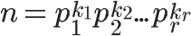
　　根据第 4 条的结论，得到
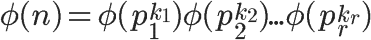
　　再根据第 3 条的结论，得到
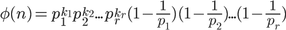
　　也就等于
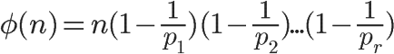
　　这就是欧拉函数的通用计算公式。比如，1323 的欧拉函数，计算过程如下：
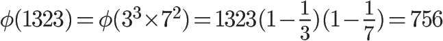
　　**四、欧拉定理**
　　欧拉函数的用处，在于[欧拉定理](http://zh.wikipedia.org/wiki/%E6%AC%A7%E6%8B%89%E5%AE%9A%E7%90%86_(%E6%95%B0%E8%AE%BA))。"欧拉定理"指的是：
如果两个正整数a和n互质，则n的欧拉函数 φ(n) 可以让下面的等式成立：

　　也就是说，a的φ(n)次方被n除的余数为1。或者说，a的φ(n)次方减去1，可以被n整除。比如，3 和 7 互质，而 7 的欧拉函数φ(7) 等于6，所以 3 的 6 次方（729）减去1，可以被 7 整除（728/7=104）。
　　欧拉定理的证明比较复杂，这里就省略了。我们只要记住它的结论就行了。
　　欧拉定理可以大大简化某些运算。比如，7 和 10 互质，根据欧拉定理，
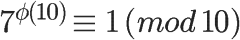
　　已知 φ(10) 等于4，所以马上得到 7 的 4 倍数次方的个位数肯定是1。
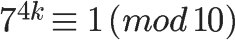
　　因此，7 的任意次方的个位数（例如 7 的 222 次方），心算就可以算出来。
　　欧拉定理有一个特殊情况。
假设正整数a与质数p互质，因为质数p的φ(p)等于p-1，则欧拉定理可以写成
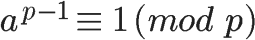
　　这就是著名的[费马小定理](http://zh.wikipedia.org/wiki/%E8%B4%B9%E9%A9%AC%E5%B0%8F%E5%AE%9A%E7%90%86)。它是欧拉定理的特例。
　　欧拉定理是 RSA 算法的核心。理解了这个定理，就可以理解 RSA。
　　**五、模反元素**
　　还剩下最后一个概念：
如果两个正整数a和n互质，那么一定可以找到整数b，使得 ab-1 被n整除，或者说 ab 被n除的余数是1。
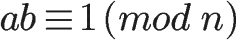
这时，b就叫做a的["模反元素"](http://zh.wikipedia.org/wiki/%E6%A8%A1%E5%8F%8D%E5%85%83%E7%B4%A0)。
　　比如，3 和 11 互质，那么 3 的模反元素就是4，因为 (3 × 4)-1 可以被 11 整除。显然，模反元素不止一个， 4 加减 11 的整数倍都是 3 的模反元素 {...，-18,-7,4,15,26,...}，即如果b是a的模反元素，则 b+kn 都是a的模反元素。
　　欧拉定理可以用来证明模反元素必然存在。
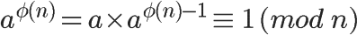
　　可以看到，a的 φ(n)-1 次方，就是a的模反元素。
　　==========================================
　　好了，需要用到的数学工具，全部介绍完了。RSA 算法涉及的数学知识，就是上面这些，下一次我就来介绍公钥和私钥到底是怎么生成的。
-----------------------------------------------------------
作者写的深入浅出，可是这个数学公式我还得好好消化一下。
