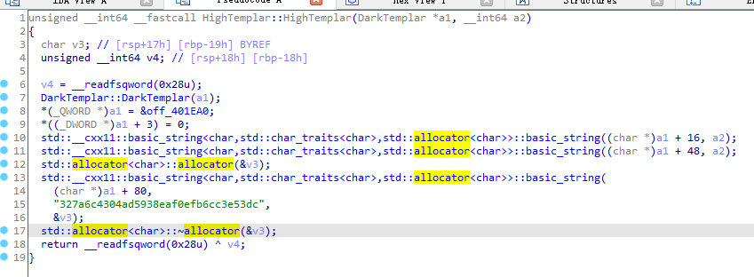

为什么这个是printf
std::operator\<\<\<std::char_traits\<char\>\>(&std::cout, "Enter the valid key!\n", envp);
为什么这个是scanf到v42
std::operator\>\>\<char,std::char_traits\<char\>\>(&edata, v42);
这在干嘛？
std::allocator\<char\>::allocator(&v38);
string::string?
std::string::string(v39, v42, &v38);
这个波浪线在干嘛？
std::string::\~string((std::string \*)v40);

std::string::\~string((std::string \*)v39);

std::allocator\<char\>::\~allocator(&v38);

这段在干嘛

C++ basic_string（字符串类模板）详解
*来自 \<<http://c.biancheng.net/view/1439.html>\>*
这个v3为什么是这样allocator？？？这是初始化了吗？？
