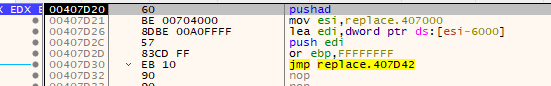
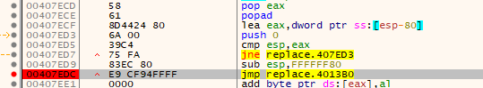

脱壳
2021年8月6日
9:17

# 找到程序入口
利用保存现场，堆栈平衡

程序开始执行时，已有的栈内容一般不宜更改，壳程序一般会保存现场，等到原程序运行前恢复。

比如UPX开头会有一个pushad，将所有寄存器压入栈，然后程序运行前popad。

只要在pushad之后在栈顶设置断点，popad时就会触发断点。

内存断点

在UPX1，设置内存执行断点

多次内存断点，解压代码又执行代码？？

这个壳是一个hying的旧版，我们用他来实验一下我们内存断点法。

*来自 \<<https://bbs.pediy.com/thread-20366.htm?source=1>\>*

选择菜单的选项-\>调试选项-\>异常
1.  勾选所有的忽略异常
2.  按下ALT+M, 打开内存镜像, 找到程序的第一个.rsrc, 按 F2 下断点, 然后按SHIFT+F9运行到断点
3.  再按ALT+M, 打开内存镜像, 找到程序的第一个.rsrc上面的.text(在示例中是00401000处), 按 F2 下断点. 然后按SHIFT+F9（或者是在没异常情况下按 F9）

*来自 \<<https://ctf-wiki.org/reverse/windows/unpack/memory/>\>*

跨段jmp

查找特殊指令

ctrl+f 查找 popad
1.  ctrl+l 跳转到下一个匹配处
2.  找到匹配处, 确认是壳解压完毕即将跳转到 OEP 部分, 则设下断点运行到该处
3.  只适用于极少数压缩壳

*来自 \<<https://ctf-wiki.org/reverse/windows/unpack/direct-oep/>\>*

# dump内存
# x64DBG 插件 scylla
IAT Autosearch》Get Imports》Imports里如果有红叉，就delete》Dump》Fix Dump（修复导入表）

# 重建输入表
手动查找IAT

查看函数调用

来到IAT所在内存

如果IAT加密了，就在IAT处设置内存写断点，查看加密过程

**\[原创\]浅谈程序脱壳后的优化**

*来自 \<<https://bbs.pediy.com/thread-28402.htm>\>*

