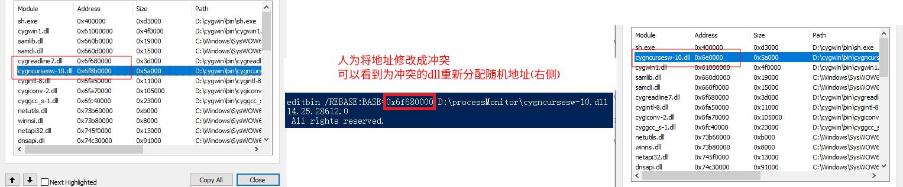

而cygreadline7.dll地址被占用的原因非常具有戏剧化，大家都知道，一般电脑中都装有杀毒软件，杀毒软件为了监控程序的合法性，一般会在运行程序上挂载一些dll用来检查程序的行为，问题就出现在这个杀毒软件的dll上，该dll默认使能了ASLR，开始ASLR为其分配了一个加载地址，该地址并没有和cygwin的dll存在冲突，在开始运行很好，直到某一天杀毒软件更新，同时该监控的dll也更新了，地址空间变大了，导致ASLR为该dll重新分配了加载地址，而新的地址正好与cygreadline7.dll的ImageBase冲突了，而杀毒软件的dll先于cygreadline7.dll加载，导致windows只能为cygreadline7.dll分配动态地址，最终导致父子动态地址不一致。
以上过程可以通过微软提供的ProcessMonitor工具抓取信息得到，该工具在windows上调试非常强大，可以看到各种信息，在出现问题后，正是借助与它才能得到问题完整的信息链条，微软做工具还是有一套。

解决方法

*来自 \<<https://kaige86.com/post/windows-dll.html>\>*
Process Monitor中文手册

*来自 \<<https://blog.csdn.net/whatday/article/details/8758380>\>*

