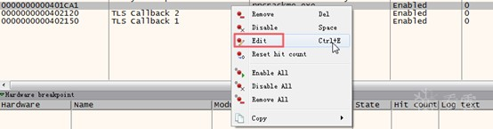
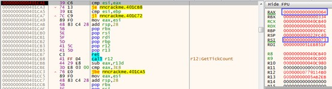
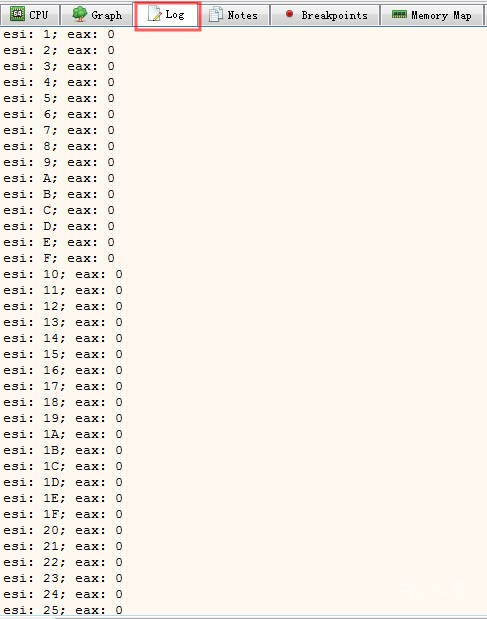

上午
已剪辑自: <https://bbs.pediy.com/thread-251385.htm>
x64dbg是逆向分析win64程序的利器，它的地位类似于OllyDbg。最近遇上了怎样在x64dbg设置条件断点的问题，网上搜索了一遍仅看到x64dbg的使用手册，没有图文并茂的说明文档，琢磨了一番搞明白了，现写出来分享给大家。
1、 条件断点
在想要设置断点的指令处按F2设置断点，然后在断点窗口选中该断点，右键选择“Edit”

在Break Condition写入中断条件，如下图中写的：(esi == 73) && (eax==64)
**注：此处的73，64都为16进制数。**

设置后运行将在满足条件的指令处停下来。

2、 条件记录断点
条件记录断点就是没有中断条件，仅将关注的数据记录下来。
如下图所示，设置break condition为0，Log text设置需要记录的数据，同时将silent项选上。

设置完运行后，在Log窗口就可以看到记录的数据。

[\[注意\] 招人！base上海，课程运营、市场多个坑位等你投递！](https://bbs.pediy.com/thread-267474.htm)
