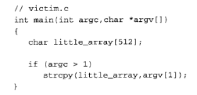
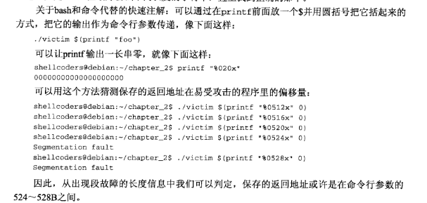
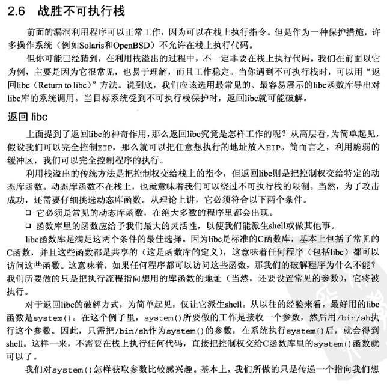
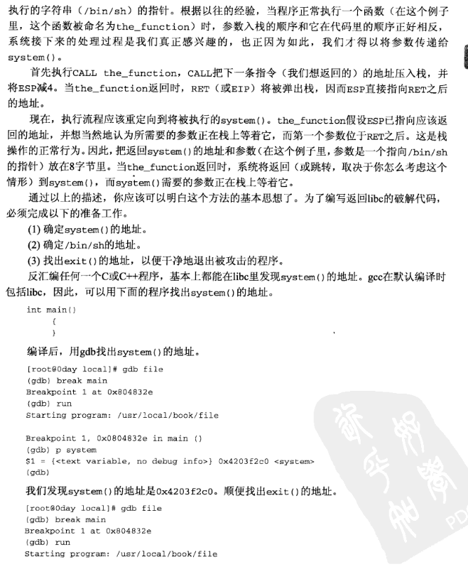
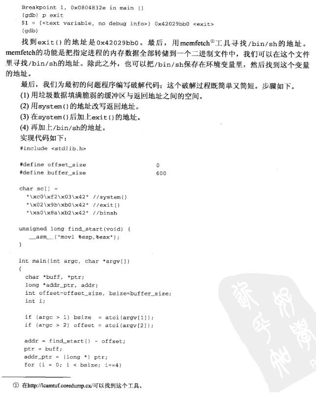
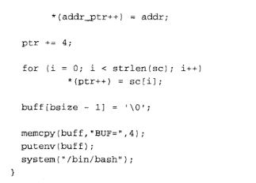

【读厚 CSAPP】III Attack Lab

*来自 \<<https://wdxtub.com/csapp/thick-csapp-lab-3/2016/04/16/>\>*

fs:0x28
在x86_64上，不再使用分段寻址，但是FS和GS寄存器都可以用作基本指针地址，以便访问特殊的操作系统数据结构。因此，您看到的是一个与FS寄存器中保存的值偏移的值，而不是对FS寄存器的内容进行位操作。

具体而言，正在Linux上的FS:0x28存储一个特殊的哨兵堆栈保护值，并且该代码正在执行堆栈保护检查。例如，如果您进一步查看代码，则会看到FS:0x28的值存储在堆栈中，然后调用堆栈的内容，并使用XOR的原始值执行FS:0x28。如果两个值相等，则意味着由于XOR对两个相同值进行运算导致零值而已设置了零位，则我们跳转到test例程，否则我们跳转到一个特殊的函数来指示表示堆栈已以某种方式损坏，并且存储在堆栈上的哨兵值已更改。

*来自 \<<https://www.coder.work/article/1560436>\>*

vim以16进制查看和修改文件。vim在命令模式下输入:%!xxd转换成16进制格式，:%!xxd -r可以回到正常格式。更多可以输入可在shell命令行下输入xxd --help进行查看。

*来自 \<<https://zixuephp.net/article-475.html>\>*
[Use vim to search by hex code](https://stackoverflow.com/questions/2266383/use-vim-to-search-by-hex-code)

*来自 \<<https://stackoverflow.com/questions/2266383/use-vim-to-search-by-hex-code>\>*

**生成shellcode**
**gcc -c code.s**

**objdump -d code.o \>code.d**
**利用 Shell printf 命令 输入512长度的0**
*来自 \<<https://www.runoob.com/linux/linux-shell-printf.html>\>*

nop
为什么offset=0？？？

[Shellcoders02sampleprogram07.c](../../../../resources/Shellcoders02sampleprogram07.c)
战胜不可执行栈

？？？这个代码

