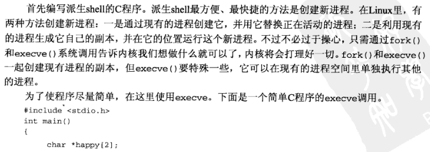
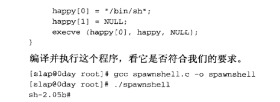
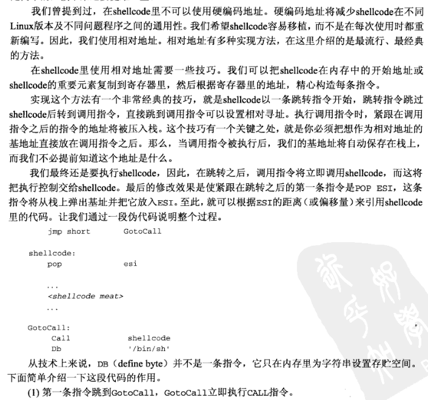
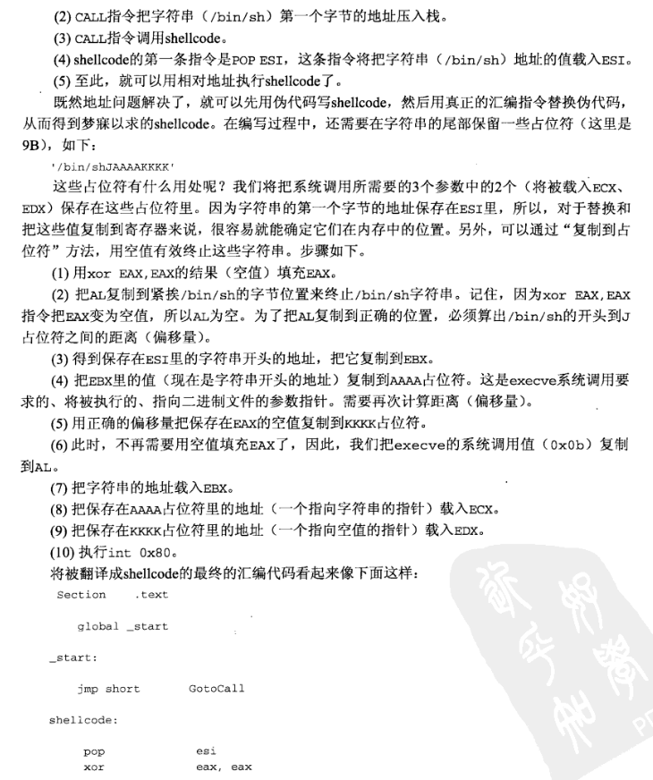
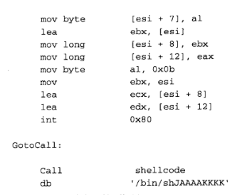

# 系统调用
系统调用的执行方式分为调用libc包装库和软中断两种

例子 exit(0) 的汇编

例子 exit()的shellcode

系统调用追踪器（strace）
# 删除空值
shellcode里有'\0'，字符串会中止

方法一 使用其他指令替代，（如让mov 0,%eax 变成 xor %eax,%eax ）例子
# 例子 派生shell的shellcode
步骤

一 通过创建新进程派生shell

二 反汇编

三 删除空值

分析execve

分析main

剩下自己来

四 使用相对地址

五反汇编得到
