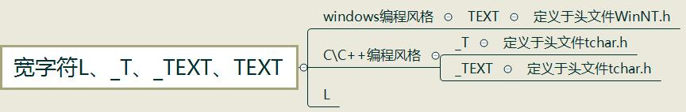
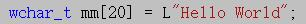
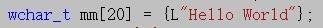
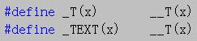
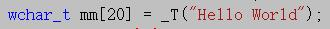
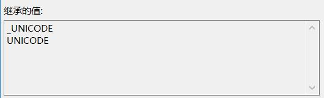
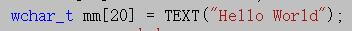

在分析前先对三者做一个简单的分类

\_T、\_TEXT、TEXT三者都是根据编译器的环境进行ANSI/UNICODE变换的,\_T和_TEXT是根据_UNICODE来确定宏，而TEXT是根据UNICODE来确定宏，
（\_UNICODE宏用于C运行期头文件，而UNICOED则用于Windows头文件，当编译源代码模块时，**通常必须同时定义这两个宏**）

*来自 \<<https://www.cnblogs.com/lanhaicode/p/10661428.html>\>*
**第一种：L" "**
在字符串前加一个大写字母L表示，告诉编译器这个字符串按照**宽字符**来存储，每个字符占**2个字节**
格式为

或者

，L的特点就是无论以什么方式编译，一律按照Unicode来编译（即每个字符占两个字节），这里说每个字符占两个字节，是因为**Unicode字符集一般是指UTF-16编码的Unicode**，但Unicode字符集不等于每个字符占两个字符

*来自 \<<https://www.cnblogs.com/lanhaicode/p/10661428.html>\>*

**第二种：\_T()和_TEXT()**
\_T和_TEXT都在头文件**tchar.h**中定义，在字符串之间加**\_TEXT**或者是**\_T**的效果是一样的，与L不同的是，如果项目使用了Unicode字符集（定义了UNICODE宏），则自动在字符串前面加上L，否则字符串不变
（意思是如果编译环境使用的多字符节字符集 或者是 未设置，那么字符串不变），\_T和_TEXT是根据_UNICODE来确定宏的
在tchar.h中可以找到如下的宏定义

使用格式：（注意：圆括号是不能省略的）

*来自 \<<https://www.cnblogs.com/lanhaicode/p/10661428.html>\>*

**第三种：TEXT()**
需要注意的是如果只#include\<WinNT.h\>编译器是会报错的，需要在#include\<WinNT.h\>前加上#include \<Windows.h\>才能使用TEXT，TEXT是根据UNICODE来确定宏的，因为当编译环境使用Unicode字符集时，
因为预编译宏包含了**\_UNICODE**和**UNICODE**

，所以在使用Unicode字符集的环境下_T、\_TEXT、TEXT都可以使用
使用格式:

*来自 \<<https://www.cnblogs.com/lanhaicode/p/10661428.html>\>*
