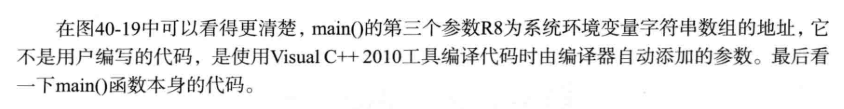
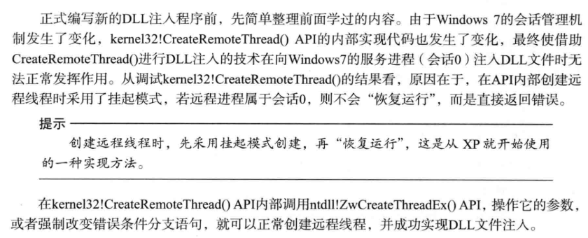

问题：
64位上述程序都可运行吗？

Vs2017 和vc2010 的逆向

64位数据
Wow64
# X64处理器
内存

通用寄存器

Jmp/call

函数调用约定

栈&栈帧

例子

源代码

32位

64位
# PE32+
IMAGE_NT_HEADERS

IMAGE_FILE_HEADER

IMAGE_OPTIONAL_HEADER

IMAGE_THUNK_DATA VA变为8字节ULONGLONG

IMAGE_TLS_DIRECTORY VA变为8字节ULONGLONG

# 64位调试
找main函数（32位）

基于控制台：会先调用GetCommandLine()，先把参数argc、argv存储到栈

应用程序使用的API

找字符串

（64位）

# ASLR
<table>
<colgroup>
<col style="width: 75%" />
<col style="width: 11%" />
<col style="width: 12%" />
</colgroup>
<thead>
<tr class="header">
<th></th>
<th>ASLR</th>
<th>无ASLR</th>
</tr>
</thead>
<tbody>
<tr class="odd">
<td>.reloc节区</td>
<td>有</td>
<td>无</td>
</tr>
<tr class="even">
<td>
IMAGE_FILE_HEADER

\Characteristics

IMAGE_FILE_RELOCS_STRIPPED（0x1)
</td>
<td>无</td>
<td>有</td>
</tr>
<tr class="odd">
<td>
IMAGE_OPTIONAL_HEADER

\DLL Characteristics

IMAGE_DLLCHARACTERISTICS_DYNAMIC_BASE(0x40)
</td>
<td>有</td>
<td>无</td>
</tr>
</tbody>
</table>

# 内核6中的会话
CreateRemoteThread不再实用内核6的服务进程

会话

会话0隔离
# 内核6中的DLL注入
调试CreateRemoteThread

新的注入程序

InjDll.exe DLL注入专用工具

