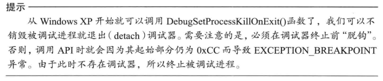
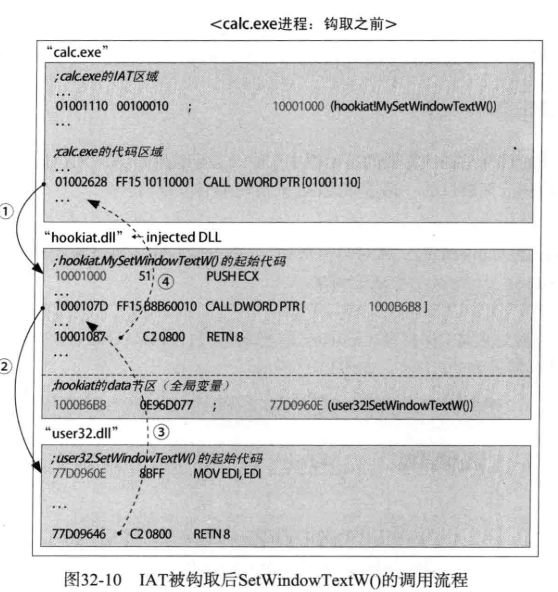
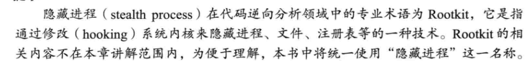
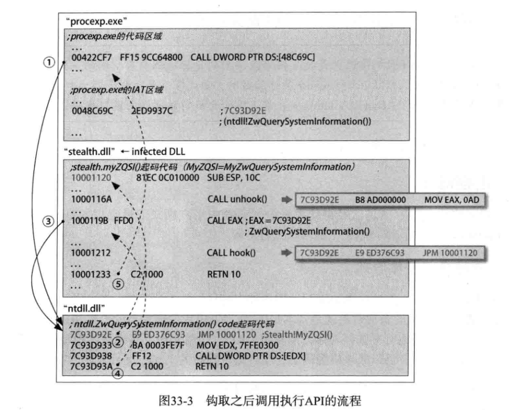
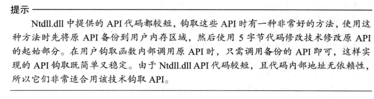
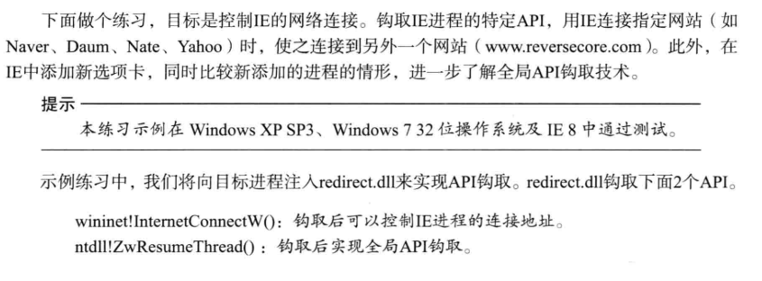

# 调试法
**萌新逆向学习笔记——API钩取**
*来自 \<<https://www.jianshu.com/p/900bd67bc0be>\>*
问题：

修改参数的长度：修改栈顶指针？修改栈？

dll也可以这样调试吗？

只读代码段怎么办？

附加成功什么时候触发？触发多少次？

注册成为调试者

接收调试事件？

设置断点（0xCC) onCreateProEvent

中断发生 onExceptionEvent

中断确认

改变上下文（用于修改传入API的参数）

修复断点

结束中断

再加钩

# Dll注入，修改IAT，计算器显示中文

# 选定API SetWindowTextW()
DllMain

修改iat

替代的函数

# Dll注入，修改API代码，隐藏进程

钩取能检测进程的API来隐藏进程

全局钩取API

怎么给所有进程挂钩？又怎么脱钩？

遍历所有进程？？？

如果用的是同一内存空间，那么改了API，应该全都会改呀？

多进程切换怎么办？
## 方法一：非全局
HideProc.cpp 将dll注入所有进程

stealth.dll

共享进程名

DllMain

挂钩

脱钩

新ZwQuerySystemInformation，将隐藏进程从查找得到的进程链表删去
## 
## 方法二：全局
钩取CreateProcess解决未来进程。钩ZwResumeThread更低级。

复制stealth2.dll文件到%SYSTEM%文件夹中。HideProc.cpp同上
## DllMain
## NewCreateProcessA
## 
## 热补丁
API起始代码有7字节无意义指令，为了打补丁

二次跳转

复制stealth3.dll文件到%SYSTEM%文件夹中。HideProc.cpp同上

挂钩

脱钩

NewCreateProcessA

# 高级全局API钩取
选择IE的API InternetConnectW

高级的全局API钩取 ZwResumeThread

ntdll!ZwResumeThread()

DllMain

NewInternetConnectW

NewZwResumeThread

