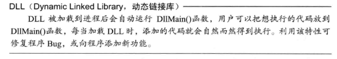
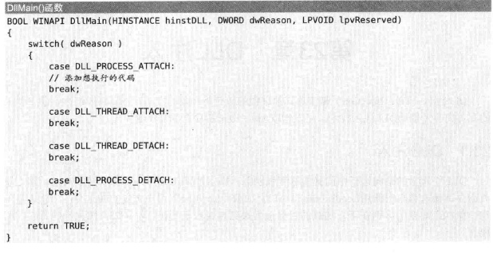
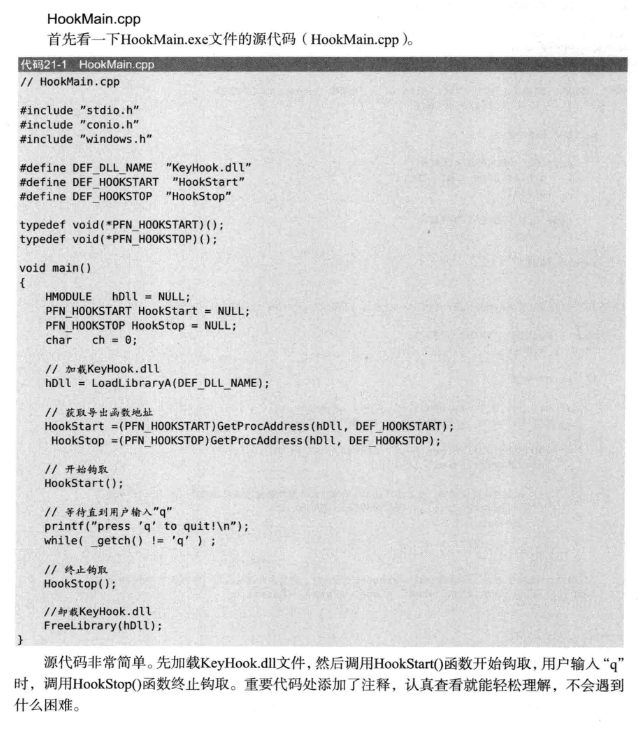
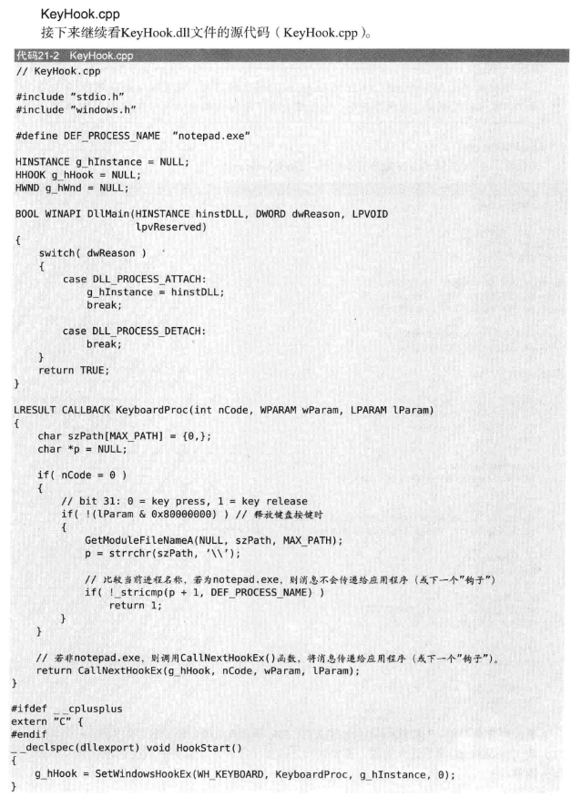
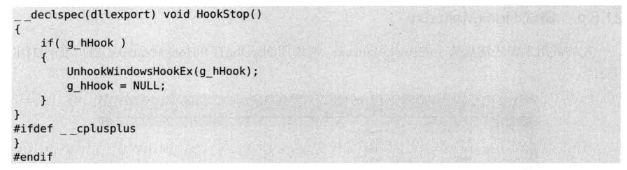
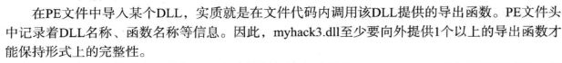

DLL注入方法：

大多数OS核心DLL会被加载到固定位置。如Kernel32.dll （有LoadLibraryA（）和GetProcAddress（））（但有些系统进程如smss.exe不会加载Kernel32.dll）

windows消息钩取

运行HookMain给notepad.exe注入dll

CreateRemoteThread()

修改注册表AppInit_DLLs

DLL卸载 FreeLibrary

修改PE加载DLL

可否用代码实现？

导入目录表IDT（Import Directory Table）添加一项

修改IAT节区可写

dll文件结构

代码注入

汇编注入

怎么获取函数的大小

不知道这个行不行，#pragmacode_seg(\["section-name"\[,"section-class"\]\])

采用和汇编一样的方法，强制函数和变量放在同一section的区域相邻的位置，然后用变量的地址-函数的地址。

我没试过，lz可以碰碰运气

*来自 \<<https://bbs.csdn.net/topics/190129559>\>*

**
