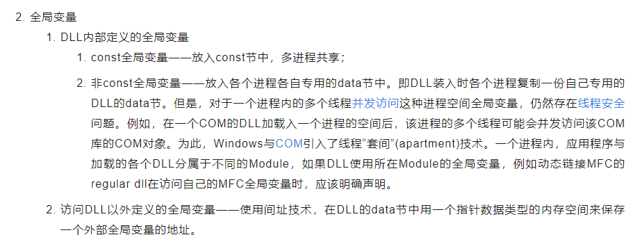

Dll中没有**\_\_declspec(dllexport)**的全局变量是什么变量？共不共享？？

全局数据共享段？
//---------------------------------------------------------------------------

//在DLL中的工程中，假设为MouseHook.bpr(产生MouseHook.DLL)

//1.在Unit1.cpp的最前面（#include\<windows.h\>之前)加上

//#pragmaoption-zRSHSEG//改变缺省数据段名

//#pragmaoption-zTSHCLASS//改变缺省数据类名

//2.新建一工程同名的纯文本文件MouseHook.def,其内容只要

//一行：

//SEGMENTSSHSEGCLASS'SHCLASS'SHARED

//并将此文件用Project-\>AddProject增加到工程中；

//3.在你的程序代码的前面定义的全局变量都将是DLL共享的，

//在Unit1.cpp中，例如：

//下面的程序将产生有三个导出函数的MouseHook.DLL

//纯文本文件MouseHook.def的内容如下:

//SEGMENTSSHSEGCLASS'SHCLASS'SHARED

*来自 \<<https://bbs.csdn.net/topics/20111141>\>*
在DLL中利用#pragma data_seg指令创建共享内存，加载该DLL的进程，共享内存。只要一个进程修改了内存中的数据，则其他进程对应内存的数据也会改变

*来自 \<<https://blog.csdn.net/Y_sl_itachi/article/details/112862761>\>*
**

Dll的加载过程，数据段怎么处理？

[dll加载过程全局变量会先初始化- maolike - 博客园](https://www.google.com.hk/url?sa=t&rct=j&q=&esrc=s&source=web&cd=&ved=2ahUKEwiyifnO1_DvAhWZ7HMBHfN8DzoQFjAFegQICxAD&url=https%3A%2F%2Fwww.cnblogs.com%2Flikemao%2Fp%2F11226437.html&usg=AOvVaw11RFsa1h2wYeXpSrFimq-y)

拓展
可以得知的是windows中不同模块引用的静态链接里的全局变量是不同的变量。

而linux是同一个变量，但是都会赋初值，也就会抹去别的模块的更改？

C++又一坑:动态链接库中的全局变量

*来自 \<<https://blog.csdn.net/lionzl/article/details/64171095>\>*

如果exe中有同名的全局变量呢？

