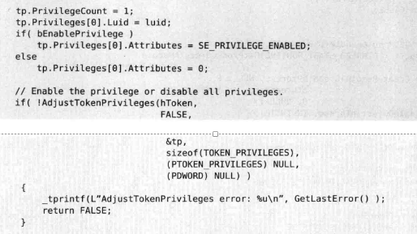
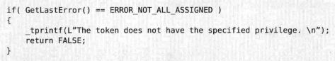

我们有很多操作需要用到OpenProcess函数，而为了使程序有权限使用这个函数，我们经常利用AdjustTokenPrivileges提升权限（准确的说不是提升，而是将访问令牌中禁用的权限启用)
这段代码在xp上没有问题，但如果在windows 7 或者vista上，如果程序以标准用户启动，AdjustTokenPrivileges将会调用失败，以管理员省份启动没有问题。
这是因为在Windows 7上，标准用户权限很少，没有Debug权限，更无从谈起启用Debug权限，用户可以以管理员和标准用户两种方式启用控制台，输入命令whoami /ALL
来查看两种权限下权限的不同

*来自 \<<https://www.cnblogs.com/wuyuan2011woaini/p/5340357.html>\>*
[**OpenProcessToken令牌函数使用方法**](https://www.cnblogs.com/mengfanrong/p/5185850.html)

*来自 \<<https://www.cnblogs.com/mengfanrong/p/5185850.html>\>*

得到进程访问令牌句柄
BOOL OpenProcessToken(

HANDLE ProcessHandle,  
DWORD DesiredAccess,  
PHANDLE TokenHandle

)；

第一个參数是要改动訪问权限的进程句柄。

第二个參数指定你要进行的操作类型。

如要改动令牌为 TOKEN_ADJUST_PRIVILEGES

所有权限可以写TOKEN_ALL_ACCESS

去查看一个令牌特权可以用TOKEN_QUERY

第三个參数就是返回的訪问令牌指针；&tToken

通过这个函数我们就能够得到当前进程的訪问令牌的句柄（指定函数的第一个參数为GetCurrentProcess()就能够了）

得到权限相应的LUID值
BOOL LookupPrivilegevalue(

LPCTSTR lpSystemName, // system name

LPCTSTR lpName, // privilege name

PLUID lpLuid // locally unique identifier

);

第一个參数是系统的名称。假设是本地系统仅仅要指明为NULL就能够了，

第二个參数就是指明了权限的名称，如“SeDebugPrivilege”。

在Winnt.h中还定义了一些权限名称的宏，如：

\#define SE_BACKUP_NAME TEXT("SeBackupPrivilege")

\#define SE_RESTORE_NAME TEXT("SeRestorePrivilege")

\#define SE_SHUTDOWN_NAME TEXT("SeShutdownPrivilege")

\#define SE_DEBUG_NAME TEXT("SeDebugPrivilege")

第三个參数就是返回LUID的指针。

改动令牌

BOOL AdjustTokenPrivileges(

HANDLE TokenHandle, // handle to token  
BOOL DisableAllPrivileges, // disabling option  
PTOKEN_PRIVILEGES NewState, // privilege information  
DWORD BufferLength, // size of buffer  
PTOKEN_PRIVILEGES PreviousState, // original state buffer  
PDWORD ReturnLength // required buffer size

);

第一个參数是訪问令牌的句柄。

第二个參数决定是进行权限改动还是除能（Disable）全部权限；

第三个參数指明要改动的权限，是一个指向TOKEN_PRIVILEGES结构的指针，该结构包括一个数组。数据组的每一个项指明了权限的类型和要进行的操作;

第四个參数是结构PreviousState的长度。假设PreviousState为空，该參数应为NULL；sizeof(TOKEN_PRIVILEGES)

第五个參数也是一个指向TOKEN_PRIVILEGES结构的指针，存放改动前的訪问权限的信息，可空。

最后一个參数为实际PreviousState结构返回的大小。

typedef struct \_TOKEN_PRIVILEGES {  
DWORD PrivilegeCount;  
LUID_AND_ATTRIBUTES Privileges\[\];  
} TOKEN_PRIVILEGES, \*PTOKEN_PRIVILEGES;

PrivilegeCount指的数组原素的个数，

接着是一个LUID_AND_ATTRIBUTES类型的数组，

typedef struct \_LUID_AND_ATTRIBUTES {  
LUID Luid;  
DWORD Attributes;  
} LUID_AND_ATTRIBUTES, \*PLUID_AND_ATTRIBUTES

第一个參数就是指权限的类型，是一个LUID的值，LUID就是指locallyuniqueidentifier，我想GUID大家是比較熟悉的，和GUID的要求保证全局唯一不同，LUID仅仅要保证局部唯一，就是指在系统的每一次执行期间保证是唯一的就能够了。另外和GUID同样的一点。LUID也是一个64位的值，相信大家都看过GUID那一大串的值。权限相应的LUID值通过LookupPrivilegevalue得到。

第二个參数就指明了我们要进行的操作类型。有三个可选项：SE_PRIVILEGE_ENABLED、SE_PRIVILEGE_ENABLED_BY_DEFAULT、SE_PRIVILEGE_USED_FOR_ACCESS。

要使能一个权限就指定Attributes为SE_PRIVILEGE_ENABLED。

检查错误

