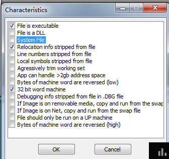

**Characteristics**
2021年2月3日
9:18

**Characteristics**
**它描述了PE文件的一些属性信息，比如是否可执行，是否是一个动态连接库等。该值可以是一个也可以是多个值的和，具体定义如下:**
<table>
<colgroup>
<col style="width: 58%" />
<col style="width: 11%" />
<col style="width: 30%" />
</colgroup>
<thead>
<tr class="header">
<th><strong>宏定义</strong></th>
<th><strong>数值</strong></th>
<th><strong>描述</strong></th>
</tr>
</thead>
<tbody>
<tr class="odd">
<td>IMAGE_FILE_RELOCS_STRIPPED</td>
<td>0x0001</td>
<td>
从文件中删除了重定位信息

（选1可关闭ASLR（地址空间随机化））
</td>
</tr>
<tr class="even">
<td>IMAGE_FILE_EXECUTABLE_IMAGE</td>
<td>0x0002</td>
<td>该文件是可执行的</td>
</tr>
<tr class="odd">
<td>IMAGE_FILE_LINE_NUMS_STRIPPED</td>
<td>0x0004</td>
<td>COFF行号从文件中删除</td>
</tr>
<tr class="even">
<td>IMAGE_FILE_LOCAL_SYMS_STRIPPED</td>
<td>0x0008</td>
<td>COFF符号表条目从文件中删除</td>
</tr>
<tr class="odd">
<td>IMAGE_FILE_AGGRESIVE_WS_TRIM</td>
<td>0x0010</td>
<td>废弃</td>
</tr>
<tr class="even">
<td>IMAGE_FILE_LARGE_ADDRESS_AWARE</td>
<td>0x0020</td>
<td>该应用程序可以处理大于2GB的地址</td>
</tr>
<tr class="odd">
<td>IMAGE_FILE_BYTES_REVERSED_LO</td>
<td>0x0080</td>
<td>废弃</td>
</tr>
<tr class="even">
<td>IMAGE_FILE_32BIT_MACHINE</td>
<td>0x0100</td>
<td>32位机器</td>
</tr>
<tr class="odd">
<td>IMAGE_FILE_DEBUG_STRIPPED</td>
<td>0x0200</td>
<td>调试信息已删除并单独存储在另一个文件中</td>
</tr>
<tr class="even">
<td>IMAGE_FILE_REMOVABLE_RUN_FROM_SWAP</td>
<td>0x0400</td>
<td>如果在移动介质中,拷到交换文件中运行</td>
</tr>
<tr class="odd">
<td>IMAGE_FILE_NET_RUN_FROM_SWAP</td>
<td>0x0800</td>
<td>如果在网络中,拷到交换文件中运行</td>
</tr>
<tr class="even">
<td>IMAGE_FILE_SYSTEM</td>
<td>0x1000</td>
<td>该文件是一个系统文件</td>
</tr>
<tr class="odd">
<td>IMAGE_FILE_DLL</td>
<td>0x2000</td>
<td>该文件是一个文件是一个动态链接库</td>
</tr>
<tr class="even">
<td>IMAGE_FILE_UP_SYSTEM_ONLY</td>
<td>0x4000</td>
<td>该文件应仅在单处理器计算机上运行</td>
</tr>
<tr class="odd">
<td>IMAGE_FILE_BYTES_REVERSED_HI</td>
<td>0x8000</td>
<td>废弃</td>
</tr>
</tbody>
</table>

*来自 \<<https://bbs.pediy.com/thread-252795.htm>\>*

