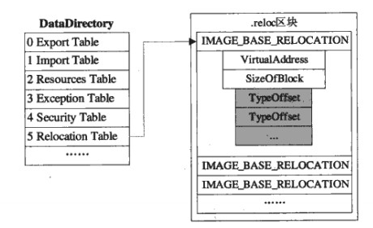
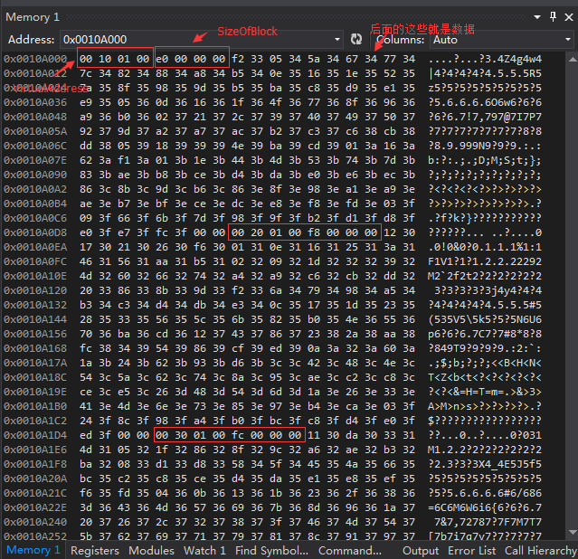
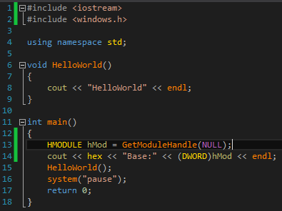
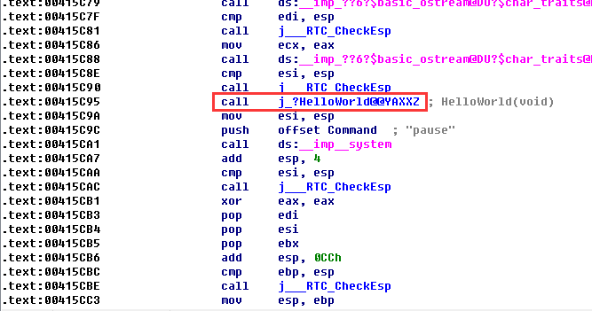
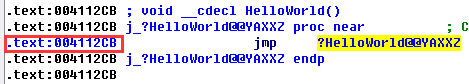
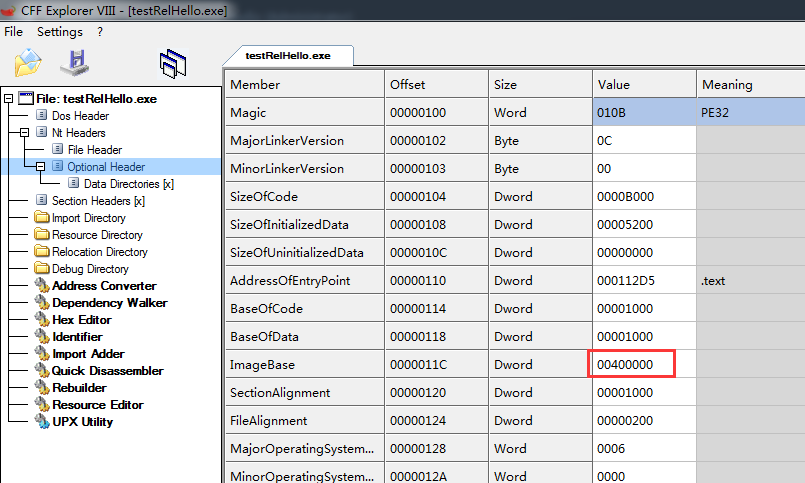
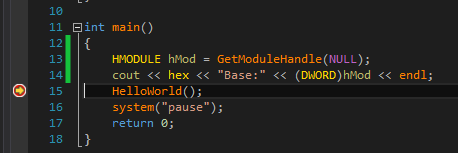
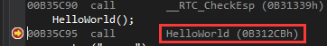
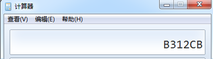

PE结构之重定位表 - \_No.47 - 博客园
星期四, 二月 4, 2021
3:58 下午

已剪辑自: <https://www.cnblogs.com/predator-wang/p/4962775.html>

- 什么是重定位：
重定位就是你本来这个程序理论上要占据这个地址，但是由于某种原因，这个地址现在不能让你占用，你必须转移到别的地址，这就需要基址重定位。你可能会问，不是说过每个进程都有自己独立的虚拟地址空间吗？既然都是自己的，怎么会被占据呢？对于EXE应用程序来说，是这样的。但是动态链接库就不一样了，我们说过动态链接库都是寄居在别的应用程序的空间的，所以出现要载入的基地址被应用程序占据了或者被其它的DLL占据了，也是很正常的，这时它就不得不进行重定位了。
- 哪些数据需要重定位：
:00401000 55 push ebp  
:00401001 8BEC mov ebp, esp  
:0040100383C4FC add esp, FFFFFFFC  
:00401006 A1FC0F4000 mov eax, dword ptr \[**00400FFC**\] ；mov eax,dwVar  
:0040100B 8B45FC mov eax, dword ptr \[ebp-04\] ；mov eax,@dwLocal  
:0040100E 8B4508 mov eax, dword ptr \[ebp+08\] ；mov eax,\_dwParam  
:00401011 C9 leave  
:00401012 C20400 ret 0004  
:00401015 68D2040000 push 000004D2  
:0040101A E8E1FFFFFF call 00401000 ；invoke Proc1,1234
其中地址为00401006h处的mov eax,dword ptr \[00400ffc\]就是一句需要重定位的指令，当整个程序的起始地址位于00400000h处的时候，这句代码是正确的，但00400000h只是它自己期望的起始地址，也许exe希望把这个DLL加载到00500000h处，那么句指令必须变成mov eax,dword ptr \[**00500ffc**\]才是正确的。这就意味着它需要重定位。即地址变成了00400ffch+(00500000h-00400000h)。这些数据被表示成\[00400FFC\],其实FFC只是数据相对于程序自身首地址的一个偏移量，程序假设自己就是从400000处开始加载然后从偏移FFC处可以取到数据，但是，实际加载之后，有时候并不是从400000开始。
所以，重定位的算法可以描述为：将直接寻址指令中的双字地址加上模块实际装入地址与模块建议装入地址之差。为了进行这个运算，需要有3个数据，首先是需要修正的机器码地址；其次是模块的建议装入地址；最后是模块的实际装入地址。在这3个数据中，模块的建议装入地址已经在PE文件头中定义了，即**OptionalHeader中的ImageBase，**而模块的实际装入地址是Windows装载器确定的，到装载文件的时候自然会知道。
事实上，PE文件的重定位表中保存的就是一大堆需要修正的代码的地址。
- 重定位表的位置：
重定位表一般会被单独存放在一个可丢弃的以“.reloc”命名的节中，但是和资源一样，这并不是必然的，因为重定位表放在其他节中也是合法的，惟一可以肯定的是，如果重定位表存在的话，它的地址肯定可以在PE文件头中的数据目录中找到。
我们可以这样得到一个重定位表：

即利用OptionalHeader中的DataDirectory。
- 重定位表的结构：

pNewOptionalHead.DataDirectory\[IMAGE_DIRECTORY_ENTRY_BASERELOC\].VirtualAddress + pbBase指向的就是IMAGE_BASE_RELOCATION数组的第一个元素。
每个IMAGE_BASE_RELOCATION元素包含了VirtualAddress、SizeOfBlock，后边跟着数目不定的重定位项。如下图所示：

虽然重定位表中的有用数据是那些需要重定位机器码的地址指针，但为了节省空间，PE文件对存放的方式做了一些优化。
在正常的情况下，每个32位的指针占用4个字节，如果有n个重定位项，那么重定位表的总大小是4×n字节大小。
直接寻址指令在程序中还是比较多的，在比较靠近的重定位表项中，32位指针的高位地址总是相同的，如果把这些相近表项的高位地址统一表示，那么就可以省略一部分的空间，当按照一个内存页来分割时，在一个页面中寻址需要的指针位数是12位（一页等于4096字节，等于2的12次方），假如将这12位凑齐16位放入一个字类型的数据中，并用一个附加的双字来表示页的起始指针，另一个双字来表示本页中重定位项数的话，那么占用的总空间会是4＋4＋2×n字节大小，计算一下就可以发现，当某个内存页中的重定位项多于4项的时候，后一种方法的占用空间就会比前面的方法要小。  
PE文件中重定位表的组织方法就是采用类似的按页分割的方法，从PE文件头的数据目录中得到重定位表的地址后，这个地址指向的就是顺序排列在一起的很多重定位块，每一块用来描述一个内存页中的所有重定位项。
**每个重定位块以一个IMAGE_BASE_RELOCATION结构开头，后面跟着在本页面中使用的所有重定位项，每个重定位项占用16位的地址（也就是一个word）**，结构的定义是这样的：  

VirtualAddress字段是当前页面起始地址的RVA值，本块中所有重定位项中的12位地址加上这个起始地址后就得到了真正的RVA值。SizeOfBlock字段定义的是当前重定位块的大小，从这个字段的值可以算出块中重定位项的数量，由于SizeOfBlock＝4＋4＋2×n，（4字节VritualAddress,4字节SizeOfBlock,每个重定位项2字节），也就是sizeof IMAGE_BASE_RELOCATION＋2×n，所以**重定位项的数量n就等于(SizeOfBlock－sizeof IMAGE_BASE_RELOCATION)÷2**。  
IMAGE_BASE_RELOCATION结构后面跟着的n个**字**就是重定位项，**每个重定位项的16位数据位中的低12位就是需要重定位的数据在页面中的地址，剩下的高4位也没有被浪费，它们被用来描述当前重定位项的种类**。

虽然高4位定义了多种重定位项的属性，但实际上在PE文件中只能看到0和3这两种情况。
所有的重定位块最终以一个VirtualAddress字段为0的IMAGE_BASE_RELOCATION结构作为结束，读者现在一定明白了为什么可执行文件的代码总是从装入地址的1000h处开始定义的了（比如装入00400000h处的.exe文件的代码总是从00401000h开始，而装入10000000h处的.dll文件的代码总是从10001000h处开始），要是代码从装入地址处开始定义，那么第一页代码的重定位块的VirtualAddress字段就会是0，这就和重定位块的结束方式冲突了。
**但凡涉及到直接寻址的指令都需要进行重定位处理**
把内存中需要重定位的数据按页的大小0x1000分为若干个块，而这个VirtualAddress就是每个**块**的起始RVA。**如上图第一个重定位项是33f2，去掉高位的3，得到3f2，再加上这个重定位块的VirtualAddress,00011000，就得到000113f2。只知道块的RVA当然还不行，我们要知道每一个需要重定位数据的具体地址。在程序没有被真正加载（得到真实的起始地址）之前，就用ImageBase作为基址（这时的ImageBase是00400000），相加得到004113f2。下边例子中的004112CB就是这样得到的**。
PE文件的重定位表中保存的就是一大堆需要修正的代码。

- 举例：
写一个小程序testRelHello.exe，里边调用了HelloWorld()函数：

用IDA查看：

这里没表示成\[0004XXXX\]，而是用j\_?HelloWorld@@YAXXZ代替了，但是双击跟进发现：

实际就是\[**004112CB**\]。
下面我们查看testRelHello的PE结构中的OptionalHeader.ImageBase的值：

即每次testRelHello都希望自身被加载到00400000处。
现在，我们利用GetModuleHandle()函数，运行testRelHello，看看实际上会被加载到哪里：

我在运行之前先设好断点：

现在在VS中查看其汇编代码：

对HelloWorld()的调用就变成了call \[0B312CB\]，而不再是\[004112CB\]。这就是因为进行了重定位。
现在我们计算：004112CB+B20000-400000，结果等于：

这就是对HelloWorld()函数进行重定位的一个过程。
参考：
<http://www.blogfshare.com/pe-relocate.html>
<http://www.51testing.com/html/87/300987-823223.html>
<http://blog.sina.com.cn/s/blog_a9303fd90101bwxj.html>
<http://blog.csdn.net/cosmoslife/article/details/17270475>
转载请声明出处：<http://www.cnblogs.com/predator-wang/p/4962775.html>

