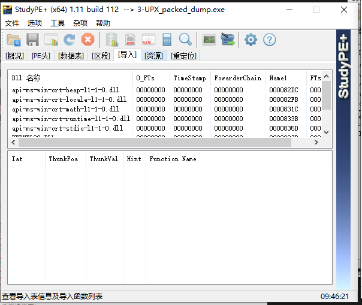
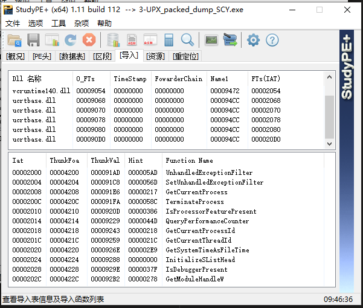
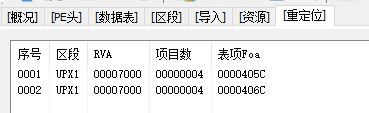
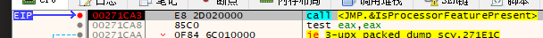
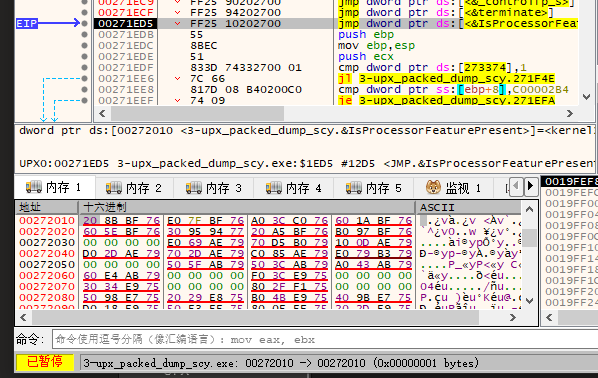
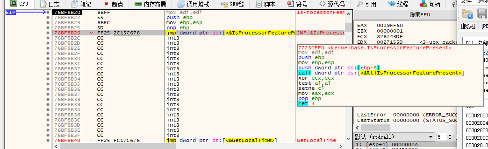

脱壳后为什么要修复导入表信息？
因为导入表还是之前upx导入的函数

为什么要修复重定位信息？
能正常运行说明没有地址错，是重定位表漏了一些项。

可能是：

原程序的全局变量（无

call的跳转导入函数地址（无

跳转导入函数调用的IAT的地址（这不可能没有重定位呀

IAT表内的函数地址

哦，我懂了，重定位定的是UPX程序

导入表调用全过程（当前默认基址为270000，不知道为啥会是这个）

相对地址

00272010是IAT表项地址

那解压后是怎么重定位的？导入表呢？
