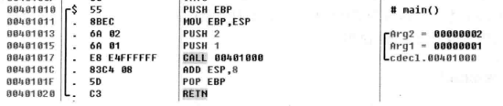
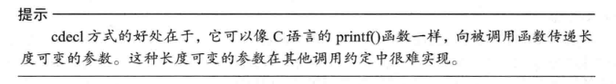
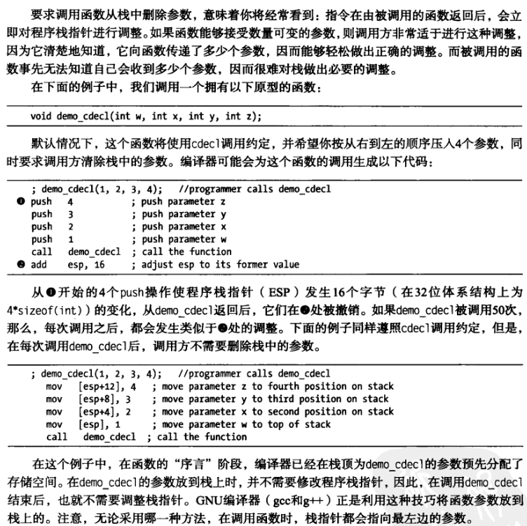
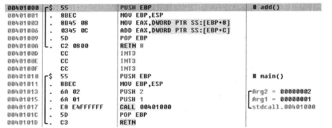
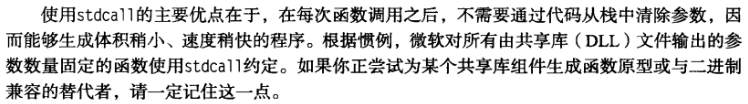
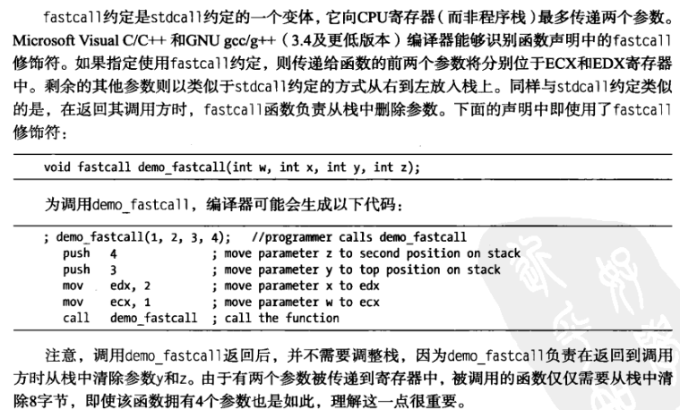
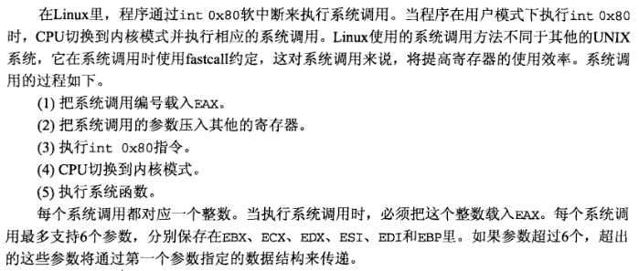
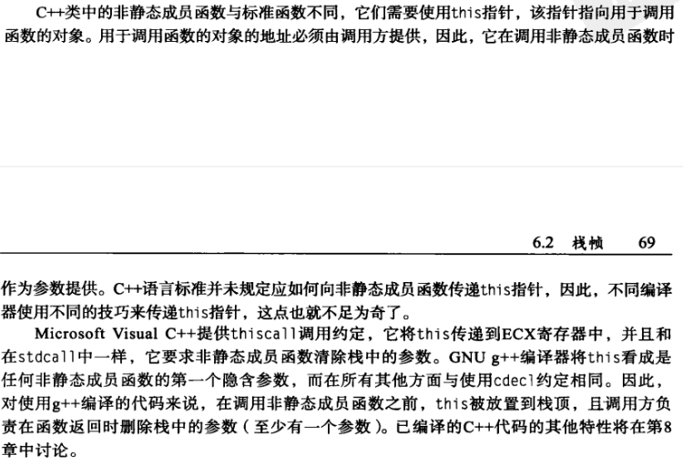

函数调用约定（32位）
2021年2月2日
9:47

cdecl
调用者处理栈 从右到左入栈

c语言默认

stdcall
被调用者处理

其他语言兼容

fastcall
寄存器传参

\_usercall 是编译器开过完全优化以后，会以任意寄存器作为参数传递

*来自 \<<https://blog.csdn.net/zhangmiaoping23/article/details/22382407>\>*

thiscall c++
\_\_thiscall调用方式和\_\_cdecl,\_\_stdcall有什么区别

首先，\_\_thiscall是关于类的一种调用方式，它与其他调用方式的最大区别是：

\_\_thiscall对每个函数都增加了一个类指针参数

 class aa

 {

 void bb(int cc);

 };

 实际上bb的函数原形是void bb（aa &this, int cc);

由主调用函数进行参数压栈并且恢复堆栈，实参的压栈顺序是从右到左，最后由主调函数进行堆栈恢复。

*来自 \<<https://blog.csdn.net/yc_8301/article/details/1814744>\>*

**
