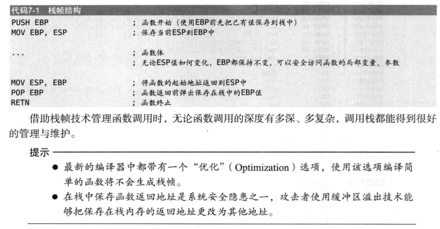
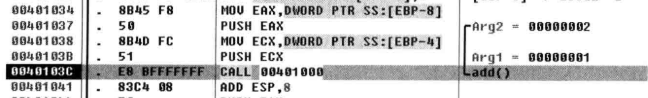
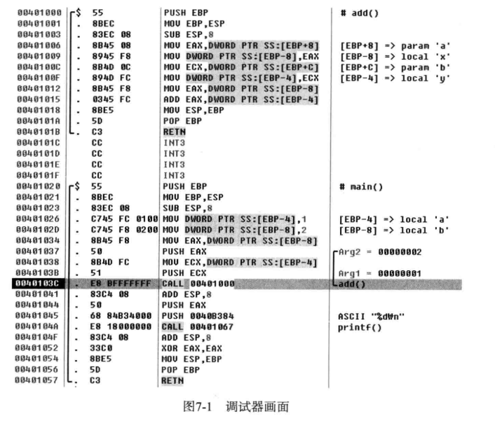
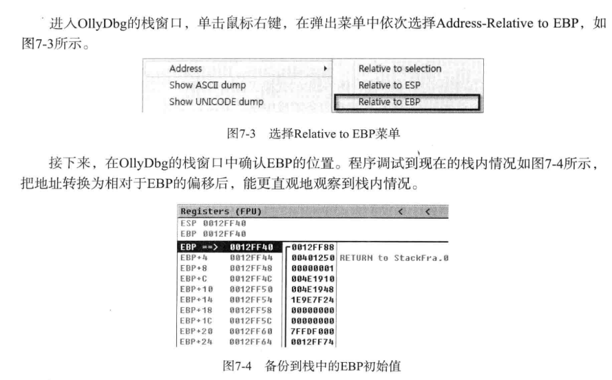
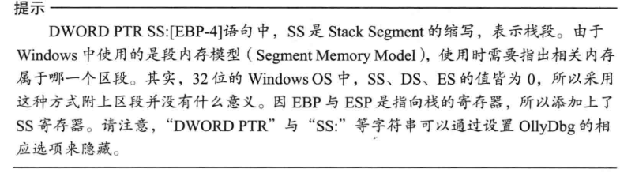
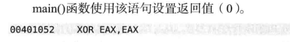

- 
所以push就不用pop啦，EBP一键恢复栈顶
# 例子
- 
函数调用完就删除参数

- 
此时栈
<table>
<colgroup>
<col style="width: 30%" />
<col style="width: 38%" />
<col style="width: 31%" />
</colgroup>
<thead>
<tr class="header">
<th>
main

EBP-4=1

(a)
</th>
<th>
main

EBP-8=2

(b)
</th>
<th></th>
</tr>
</thead>
<tbody>
<tr class="odd">
<td>
EAX=2

(b)
</td>
<td>
ECX=1

(a)
</td>
<td></td>
</tr>
<tr class="even">
<td>地址</td>
<td>存mainEBP</td>
<td></td>
</tr>
<tr class="odd">
<td>
add

EBP-4

(y)
</td>
<td>
add

EBP-8

(x)
</td>
<td>add的ebp</td>
</tr>
<tr class="even">
<td></td>
<td></td>
<td></td>
</tr>
</tbody>
</table>

- 

- 

- 
