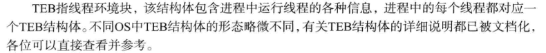
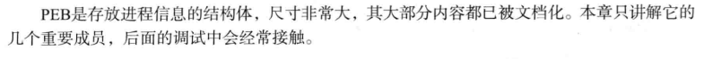

# TLS回调函数
TLS
# tls回调函数
# TlsTest.exe 注册TLS回调函数 测试调用条件
# 调试tls，直接打开无法调试，因为tls在ep之前
修改PE 添加TLS回调函数

目标
# 找到空位（加长最后一节区）
改PE头

改节区头里的sizeofrawdata和Characteristics
# IMAGE_DATA_DIRECTORY\[9\]
# IMAGE_TLS_DIRECTORY
# 编写TLS回调函数
# TEB
TEB 线程环境块

TEB结构体定义

TEB结构体成员

重要成员

NtTib（0）SEH

ProcessEnvironmentBlock（30） PEB

TEB访问方法 通过OS提供的API

Ntdll.NtCurrentTeb 只返回FS:\[18\]地址值

FS段寄存器 FS\[0\]:SEH FS\[18\]:TEB FS\[30\]:PEB

# PEB
PEB 进程环境块

# PEB访问方式
# PEB结构体的定义
# PEB结构体成员 略 windbg查看
PEB重要成员

BeingDebugged（2） Uchar

ImageBaseAddress（8）Ptr32 Void

Ldr（c）Ptr32 \_PEB_LDR_DATA 得到模块基地址

ProcessHeap(18) Ptr32 Void

NtGlobalFlag(68) Uint48
# 
# SEH
SEH Windows提供的异常处理机制

练习1 触发异常，通过SEH处理，检测调试者

OS的异常处理方法

异常种类
# SEH详细说明
SEH链

异常处理函数的定义 (传入异常的信息、上下文，返回处理结果）

TEB.NtTib.ExceptionList

SEH安装方法

练习2 详解练习1的代码

设置OllyDbg选项

发生异常，调试器不暂停，把异常发给被调试者，有没有哇

忽略KERNEL32中发生的内存非法访问异常

向被调试者派送异常

其他异常处理

结果：没啥差别，没有暂停了

shift+f7/f8/f9 直接运行，把异常发给被调试者
# IA-32指令
常用术语

IA-32指令格式

指令解析手册

下载IA-32用户手册

打印指令解析手册

指令解析练习

操作码映射

操作数

ModR/M

Group

前缀

双字节操作码

移位值&立即数

SIB

这样直接写指令生成bin文件，ida能识别吗？
