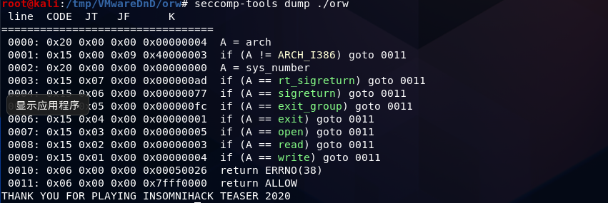

# 在进程外查看
seccomp可以通过系统调用ptrctl(2)或者通过系统调用seccomp(2)开启，前提是内核配置中开启了CONFIG_SECCOMP和CONFIG_SECCOMP_FILTER。

seccomp支持两种模式：SECCOMP_MODE_STRICT和SECCOMP_MODE_FILTER。在SECCOMP_MODE_STRICT模式下，进程不能使用read(2)，write(2)，\_exit(2)和sigreturn(2)以外的其他系统调用。在SECCOMP_MODE_FILTER模式下，可以利用BerkeleyPacket Filter配置哪些系统调用及它们的参数可以被进程使用。

- 0：SECCOMP_MODE_DISABLED
- 1：SECCOMP_MODE_STRICT，严格模式，只能使用read write exit sigreturn四个系统调用
- 2：SECCOMP_MODE_FILTER，过滤模式，可以配置允许或不允许使用那些系统调用

*来自 \<<https://xuanxuanblingbling.github.io/ctf/pwn/2019/10/15/sandbox/>\>*

如何查看是否使用了seccomp

通常有两种方法：

利用prctl(2)的PR_GET_SECCOMP的参数获取当前进程的seccomp状态。返回值0表示没有使用seccomp;返回值2表示使用了seccomp并处于SECCOMP_MODE_FILTER模式；其他情况进程会被SIGKILL信号杀死。

从Linux3.8开始，可以利用/proc/\[pid\]/status中的Seccomp字段查看。如果没有seccomp字段，说明内核不支持seccomp。

<https://blog.csdn.net/mashimiao/article/details/73607485>

➜cat /proc/pid/status \| grep Seccomp

Seccomp:0

*来自 \<<https://xuanxuanblingbling.github.io/ctf/pwn/2019/10/15/sandbox/>\>*

# seccomp系列函数
seccomp_rule_add(3) 规则 使用文档

int seccomp_rule_add(scmp_filter_ctx ctx, uint32_t action, int syscall, unsigned int arg_cnt, ...);

action SCMP_ACT_开头 [libseccomp/seccomp.h.in at main · seccomp/libseccomp (github.com)](https://github.com/seccomp/libseccomp/blob/main/include/seccomp.h.in)

syscall [https://syscalls.w3challs.com](https://syscalls.w3challs.com/)
**
*来自 \<<https://blog.csdn.net/ATOOHOO/article/details/88668691>\>*

scmp_filter_ctx v1 = seccomp_init(0LL); // kill

seccomp_rule_add(v1, 2147418112LL, 2LL, 0LL); // open allow

seccomp_rule_add(v1, 2147418112LL, 0LL, 0LL); // read allow

seccomp_rule_add(v1, 2147418112LL, 1LL, 0LL); // write allow

seccomp_rule_add(v1, 2147418112LL, 60LL, 0LL);// exit allow

seccomp_rule_add(v1, 2147418112LL, 231LL, 0LL);// exit_group

return seccomp_load(v1);

libseccomp

早期的seccomp采用prctl来实现，后来seccomp被封装成libseccomp库。

早期的libseccomp安装
| sudo apt install libseccomp-dev libseccomp2 seccomp |
|-----------------------------------------------------|
现在已经全都整合成了seccomp
<table>
<colgroup>
<col style="width: 21%" />
<col style="width: 78%" />
</colgroup>
<thead>
<tr class="header">
<th>
1

2

3
</th>
<th>
find /usr/include/ -name seccomp.h

/usr/include/seccomp.h

/usr/include/linux/seccomp.h
</th>
</tr>
</thead>
<tbody>
</tbody>
</table>
注意区分，linux目录下的seccomp.h是原始版本。而linux目录外的seccomp.h则是libseccomp。

<http://wh4lter.icu/2020/04/20/seccomp/#libseccomp>

gcc -g test5.c -o test5 -lseccomp

*来自 \<<http://wh4lter.icu/2020/04/20/seccomp/#seccomp-tools>\>*

# prctl函数
# BDF
# seccomp-tools
## 安装
kali自带的ruby和gem，版本够了，直接安装

sudo gem install seccomp-tools
*来自 \<<http://wh4lter.icu/2020/04/20/seccomp/#seccomp-tools>\>*
## 使用
seccomp-tools是Github上的一个开源的工具，具体的细节，在Github上可以查阅。这里，我们做一个简单的介绍。

dump：将bpf规则从可执行文件中dump下来。

seccomp-tools dump ./可执行文件名 \[-f\]\[inspect\] \[raw\] \[xxd\]

disasm：将bpf规则反汇编出来

seccomp-tools disasm ./可执行文件名.bpf

asm：运用这个模块，我们可以写一个asm脚本，然后执行seccomp-tools asm \[asm脚本名\]

*来自 \<<https://www.cnblogs.com/L0g4n-blog/p/12839171.html>\>*

## 多线程多个过滤规则

## 查看过滤规则

# 绕过
<http://wh4lter.icu/2020/04/20/seccomp/#bypass>

# 参考
[从prctl函数开始学习沙箱规则 - Riv4ille - 博客园 (cnblogs.com)](https://www.cnblogs.com/L0g4n-blog/p/12839171.html)

seccomp

*来自 \<<http://wh4lter.icu/2020/04/20/seccomp/#Abstract>\>*

[BPF的使用 (360doc.com)](http://www.360doc.com/content/06/1026/17/13362_241408.shtml)

