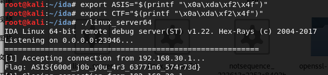
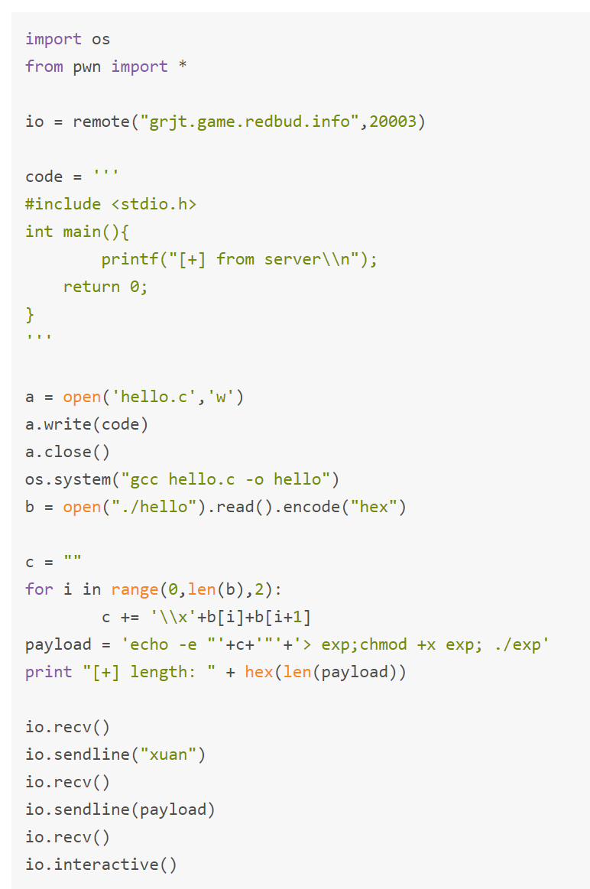

# 输出赋值给变量
\#!/bin/bash

string="hello world!"

result=\$(echo \$string)

echo \$result

# printf输入任意字符

# echo写入二进制文件
*来自 \<<https://xuanxuanblingbling.github.io/ctf/pwn/2019/10/15/sandbox/>\>*
## echo是内建的命令
➜ which echo  
echo: shell built-in command

原来echo是一个shell内建命令，参考：[Bash-Builtins](https://www.gnu.org/savannah-checkouts/gnu/bash/manual/bash.html#Bash-Builtins)。而且之前不太明白powershell和cmd区别，网友说了一堆我也没看明白，[PowerShell 与 cmd 有什么不同？](https://www.zhihu.com/question/22611859)，现在有些明白了，就是shell或者cmd东西不仅仅是一个可以运行可执行程序的一个壳，而且自己实现了一些功能的，比如shell的内建命令和shell脚本的运行。在《程序员的自我修养》中是有一节是写一个简易的shell，那才是一个纯纯的壳。

另外虽然没有给ls，但还是能通过一些shell的技巧来列目录，比如：

➜echo \*

bin lib lib64

## echo写入二进制文件并执行

